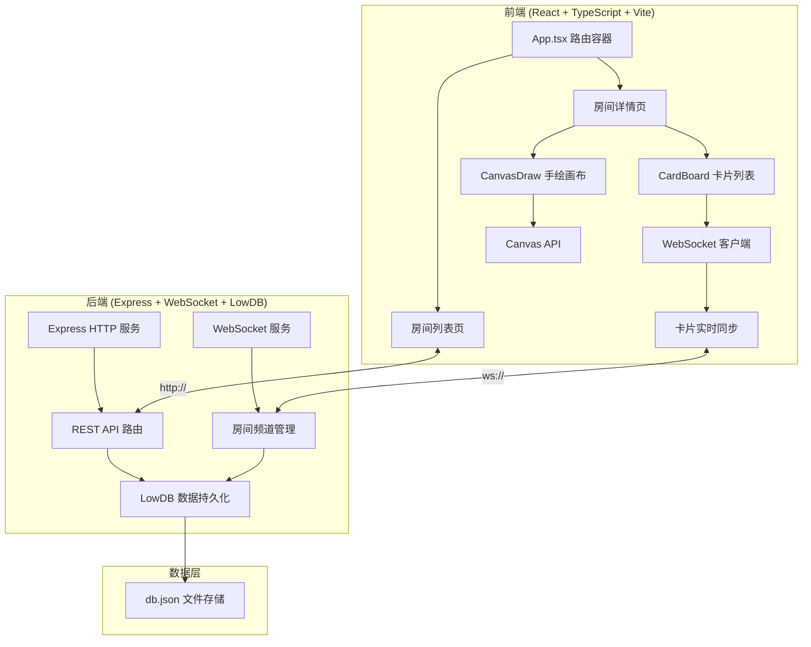
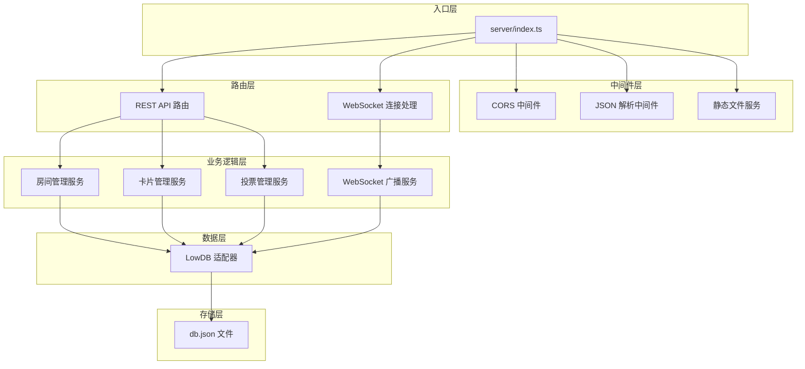
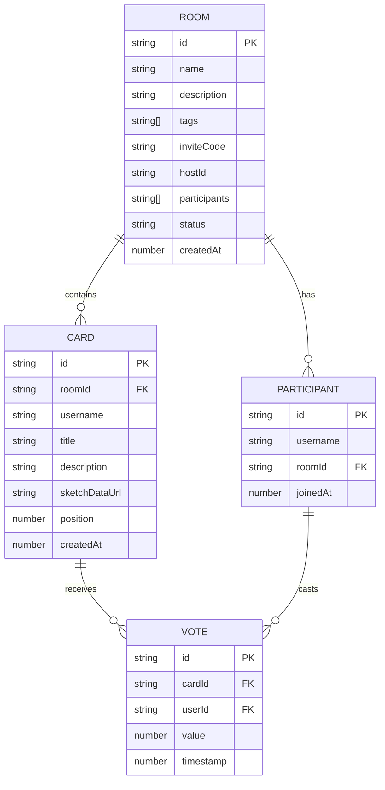

## 1. 架构设计



## 2. 技术描述

- **前端框架**: React 18 + TypeScript
- **构建工具**: Vite 5
- **路由管理**: React Router DOM 6
- **HTTP客户端**: Axios
- **WebSocket**: ws (浏览器原生API)
- **状态管理**: React useState/useReducer (轻量级场景)
- **样式方案**: CSS Modules + CSS Variables (不使用Tailwind，按用户指定颜色方案)
- **后端框架**: Express 4
- **WebSocket服务**: ws 库
- **数据持久化**: LowDB (文件型JSON数据库)
- **ID生成**: uuid
- **跨域**: cors 中间件

## 3. 路由定义

| 路由路径 | 页面/组件 | 用途 |
|----------|-----------|------|
| `/` | 房间列表页 | 展示所有房间，创建/加入房间入口 |
| `/room/:id` | 房间详情页 | 卡片协作墙、手绘画布、投票功能 |

## 4. API 定义

### 4.1 TypeScript 类型定义

```typescript
// 房间类型
interface Room {
  id: string;
  name: string;
  description: string;
  tags: string[];
  inviteCode: string;
  hostId: string;
  participants: string[];
  status: 'brainstorming' | 'voting' | 'finished';
  createdAt: number;
  cards: Card[];
}

// 卡片类型
interface Card {
  id: string;
  roomId: string;
  username: string;
  title: string;
  description: string;
  sketchDataUrl: string | null;
  position: number;
  createdAt: number;
  votes: Vote[];
}

// 投票类型
interface Vote {
  cardId: string;
  userId: string;
  value: 1 | -1;
  timestamp: number;
}

// WebSocket 消息类型
type WSMessage = 
  | { type: 'CARD_CREATE'; payload: Card }
  | { type: 'CARD_MOVE'; payload: { cardId: string; newPosition: number } }
  | { type: 'VOTE_CAST'; payload: Vote }
  | { type: 'VOTING_START'; payload: { roomId: string } }
  | { type: 'VOTING_END'; payload: { roomId: string } }
  | { type: 'SYNC_STATE'; payload: Room };
```

### 4.2 REST API 接口

| 方法 | 路径 | 描述 | 请求体 | 响应 |
|------|------|------|--------|------|
| POST | `/api/create-room` | 创建新房间 | `{ name, description, tags, hostName }` | `{ roomId, inviteCode }` |
| GET | `/api/rooms` | 获取房间列表 | - | `Room[]` |
| GET | `/api/rooms/:id` | 获取房间详情 | - | `Room` |
| POST | `/api/rooms/:id/join` | 加入房间 | `{ username }` | `{ success, room }` |
| POST | `/api/rooms/:id/vote` | 提交投票 | `{ cardId, userId, value }` | `{ success, card }` |
| POST | `/api/rooms/:id/start-voting` | 开始投票 | `{ hostId }` | `{ success }` |
| POST | `/api/rooms/:id/end-voting` | 结束投票 | `{ hostId }` | `{ success, rankedCards }` |
| GET | `/api/rooms/:id/export` | 导出投票结果 | - | JSON 文件下载 |

## 5. 服务器架构



## 6. 数据模型

### 6.1 实体关系图



### 6.2 LowDB 数据结构

```json
{
  "rooms": [
    {
      "id": "uuid",
      "name": "房间名",
      "description": "主题描述",
      "tags": ["UI设计", "功能优化"],
      "inviteCode": "ABC123",
      "hostId": "user-uuid",
      "participants": ["user1-id", "user2-id"],
      "status": "brainstorming",
      "createdAt": 1234567890,
      "cards": [
        {
          "id": "card-uuid",
          "roomId": "room-uuid",
          "username": "张三",
          "title": "创意标题",
          "description": "详细描述...",
          "sketchDataUrl": "data:image/png;base64,...",
          "position": 0,
          "createdAt": 1234567890,
          "votes": [
            { "cardId": "card-uuid", "userId": "user-id", "value": 1, "timestamp": 1234567890 }
          ]
        }
      ]
    }
  ]
}
```

### 6.3 文件结构

```
auto45/
├── package.json
├── vite.config.ts
├── index.html
├── tsconfig.json
├── db.json                 # LowDB 数据文件
├── src/
│   ├── main.tsx           # React 入口
│   ├── App.tsx            # 路由容器
│   ├── types/             # 类型定义
│   │   └── index.ts
│   ├── components/
│   │   ├── CardBoard.tsx  # 卡片列表与拖拽
│   │   ├── CanvasDraw.tsx # 手绘画布
│   │   ├── IdeaCard.tsx   # 单个卡片组件
│   │   ├── RoomCard.tsx   # 房间卡片组件
│   │   └── CreateRoomModal.tsx
│   ├── pages/
│   │   ├── RoomList.tsx   # 房间列表页
│   │   └── RoomDetail.tsx # 房间详情页
│   ├── hooks/
│   │   ├── useWebSocket.ts
│   │   └── useLocalStorage.ts
│   └── utils/
│       ├── api.ts
│       └── generateInviteCode.ts
└── server/
    └── index.ts           # Express + WS 服务器
```
