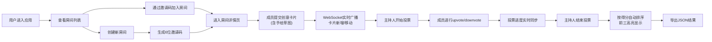

## 1. 产品概述
创意头脑风暴与灵感投票应用，解决小团队线下讨论时点子记录混乱、后续跟进困难、无法高效凝聚共识的问题。通过实时协作的创意卡片墙、可视化投票机制和手绘草图功能，帮助团队高效完成头脑风暴并快速达成共识。

## 2. 核心功能

### 2.1 用户角色
| 角色 | 参与方式 | 核心权限 |
|------|----------|----------|
| 主持人 | 创建房间者 | 开始/结束投票、导出结果、管理房间 |
| 参与者 | 通过邀请码加入 | 提交创意卡片、投票、查看实时同步 |

### 2.2 功能模块
1. **房间列表页**：展示所有房间网格卡片，创建新房间，加入房间
2. **房间详情页**：实时协作卡片列表、手绘画布、投票功能区
3. **创意卡片系统**：卡片创建、拖拽排序、手绘草图、实时同步
4. **投票系统**：upvote/downvote、实时进度、结果排序与高亮

### 2.3 页面详情
| 页面名称 | 模块名称 | 功能描述 |
|----------|----------|----------|
| 房间列表页 | 房间卡片网格 | 显示房间名、标签、创建时间、参与者数量，悬停动画效果 |
| 房间列表页 | 创建房间表单 | 房间名称、主题描述、标签选择，生成6位邀请码 |
| 房间列表页 | 加入房间入口 | 通过邀请码快速加入房间 |
| 房间详情页 | 卡片列表区 | 可滚动创意卡片墙，支持拖拽排序，实时同步 |
| 房间详情页 | 手绘画布区 | Canvas绘图工具，支持画笔、直线、圆形、橡皮擦，8色选择器 |
| 房间详情页 | 投票功能区 | 开始/结束投票按钮，upvote/downvote操作，进度条显示 |
| 房间详情页 | 结果导出 | JSON格式导出房间信息、所有卡片及得分排序 |

## 3. 核心流程

## 4. 用户界面设计

### 4.1 设计风格
- **主色调**：背景 `#1a1a2e`，卡片 `#16213e`，文字 `#e0e0e0`
- **强调色**：金色 `#ffd700`、银色 `#c0c0c0`、铜色 `#cd7f32`（前三名高亮）
- **进度条渐变**：红色 `#ff4757` → 黄色 `#ffa502` → 绿色 `#2ed573`
- **字体**：使用 'Space Mono' 或 'JetBrains Mono' 等现代等宽字体搭配 'Inter' 无衬线字体
- **按钮风格**：圆角8px，深色填充，悬停时微上浮+发光边框
- **布局风格**：桌面端左右分栏（卡片列表+画布），移动端堆叠布局
- **动画**：卡片悬停上浮、投票脉冲、前三名边框脉冲发光效果

### 4.2 页面设计概述
| 页面名称 | 模块名称 | UI元素 |
|----------|----------|--------|
| 房间列表页 | Hero区域 | 大标题、副标题、创建房间主按钮 |
| 房间列表页 | 房间网格 | 响应式网格（桌面3列、平板2列、移动1列），卡片悬停上浮阴影 |
| 房间列表页 | 创建模态框 | 表单输入、标签选择器、提交按钮 |
| 房间详情页 | 顶部栏 | 房间名、邀请码显示、参与者头像、投票状态 |
| 房间详情页 | 卡片列表 | 垂直排列可滚动，卡片包含用户名、标题、描述、缩略图、拖拽手柄 |
| 房间详情页 | 手绘画布 | 工具栏（工具选择、颜色、清除、生成缩略图），画布区域自适应 |
| 房间详情页 | 投票模式 | 卡片显示进度条、投票按钮、百分比和人数 |
| 房间详情页 | 结果展示 | 前三名金/银/铜边框，脉冲动画，自动排序 |

### 4.3 响应性
- **桌面端**（>1024px）：左右分栏布局，卡片区60%宽度，画布区40%宽度
- **平板端**（768px-1024px）：保持分栏，画布缩小
- **移动端**（<768px）：卡片区全宽，画布缩小到屏幕宽度，垂直堆叠布局
- **触摸优化**：拖拽区域增大，按钮最小44x44px，画布支持触摸绘图

### 4.4 性能要求
- WebSocket广播延迟 ≤ 300ms
- Canvas绘图响应流畅（≥60fps）
- 拖拽操作帧率 ≥ 30fps
- 首屏加载时间 < 2s
