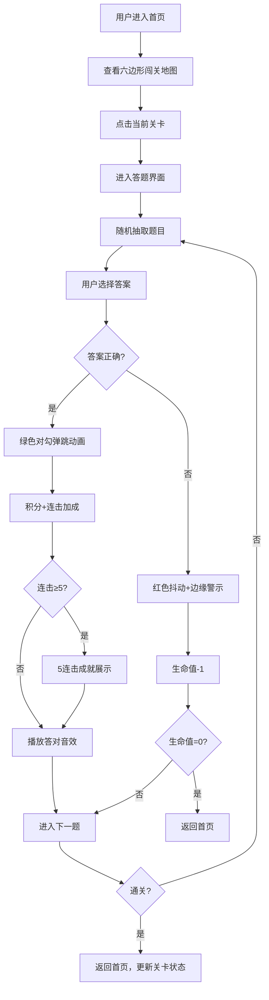

## 1. 产品概述

趣味知识问答闯关游戏，用户通过回答不同主题的题目挑战闯关，融合生命值、积分、连击等游戏化元素，打造沉浸式答题体验。

- 核心价值：将知识问答与闯关游戏结合，通过丰富的视觉反馈和游戏机制提升用户参与度
- 目标用户：喜欢趣味答题、休闲游戏的用户群体

## 2. 核心特性

### 2.1 用户角色

| 角色 | 注册方式 | 核心权限 |
|------|----------|----------|
| 普通用户 | 无需注册 | 体验完整闯关答题流程 |

### 2.2 功能模块

1. **首页（闯关地图）**：六边形网格地图、关卡状态管理、生命值显示、积分显示
2. **答题页面**：题目展示、选项交互、动画反馈、连击系统、音效系统

### 2.3 页面详情

| 页面名称 | 模块名称 | 功能描述 |
|-----------|-------------|---------------------|
| 首页 | 六边形闯关地图 | CSS绘制六边形网格路径，显示关卡状态（已通关/当前/未解锁） |
| 首页 | 生命值系统 | 三颗爱心，答错减少，带碎裂动画 |
| 首页 | 积分系统 | 累计积分显示，数字滚动动画 |
| 答题页 | 题目卡片 | 文字+配图，300x200固定尺寸，骨架屏占位，滑入滑出动画 |
| 答题页 | 选项交互 | 四个圆形选项按钮，正确/错误动画反馈 |
| 答题页 | 连击系统 | 连续答对5题触发成就展示，金色粒子效果 |
| 答题页 | 音效系统 | Web Audio API生成清脆音效，答对播放 |

## 3. 核心流程

用户进入首页 → 查看六边形闯关地图 → 点击当前关卡 → 进入答题界面 → 随机抽取题目 → 选择答案 → 动画反馈（正确/错误）→ 积分/生命值更新 → 连击判定 → 下一题/返回地图

## 4. 用户界面设计

### 4.1 设计风格

- **主色调**：霓虹暗色调，深紫到深蓝径向渐变背景
- **强调色**：青蓝（#00d4ff）、品红（#ff00ff）、金色、亮红色
- **按钮风格**：圆形按钮，2px发光边框，悬停上浮+光晕变亮
- **字体**：使用Orbitron（显示字体）+ Rajdhani（正文字体），霓虹渐变文字效果
- **布局**：卡片式布局，荧光投影阴影，六边形网格地图
- **动画**：呼吸发光、脉冲放大、边缘光晕、碎裂抖动、粒子飘散

### 4.2 页面设计概述

| 页面名称 | 模块名称 | UI元素 |
|-----------|-------------|-------------|
| 首页 | 六边形地图 | 金色已通关（呼吸发光）、脉冲当前关（光晕扩散）、半透明灰色未解锁 |
| 首页 | 状态栏 | 三颗发光爱心（碎裂动画）、积分数字（平滑滚动） |
| 答题页 | 题目卡片 | 300x200图片（渐变色骨架屏）、霓虹渐变文字、滑入滑出300ms |
| 答题页 | 选项按钮 | 四个圆形水平排列，正确变绿+对勾弹跳，错误变红+抖动（5px, 60fps） |
| 答题页 | 连击成就 | 全屏半透明暗色遮罩、金色闪烁勋章、金色粒子向上飘散、2秒自动消失 |

### 4.3 响应式设计

- **桌面端**：六边形网格地图，水平排列选项按钮
- **移动端**：垂直排列的圆角卡片列表，按钮和字体自适应屏幕
- **触摸优化**：最小点击区域48x48px，触摸反馈动画

### 4.4 性能要求

- 所有动画不低于40fps
- 首次内容渲染（FCP）≤1.5秒
- 音效播放不影响UI流畅度
