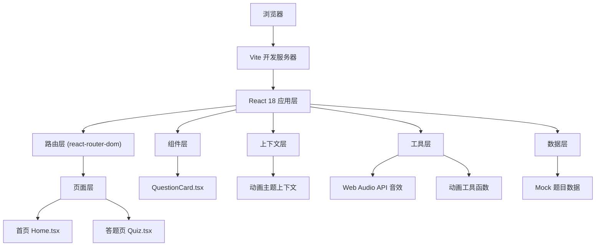
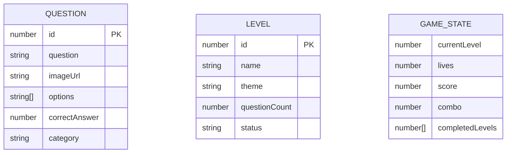

## 1. 架构设计



## 2. 技术说明

- **前端框架**：React 18 + TypeScript
- **构建工具**：Vite 5
- **路由管理**：react-router-dom 6
- **HTTP客户端**：axios（预留用于未来API扩展）
- **样式方案**：CSS Modules + CSS Variables + 内联关键帧动画
- **音效系统**：Web Audio API（原生合成音效，无外部文件）
- **数据来源**：内置Mock题目数据

## 3. 路由定义

| 路由 | 用途 |
|-------|---------|
| / | 首页 - 六边形闯关地图 |
| /quiz/:level | 答题页 - 指定关卡的答题界面 |

## 4. 数据模型

### 4.1 数据模型定义



### 4.2 TypeScript 类型定义

```typescript
interface Question {
  id: number;
  question: string;
  imageUrl: string;
  options: string[];
  correctAnswer: number;
  category: string;
}

interface Level {
  id: number;
  name: string;
  theme: string;
  questionCount: number;
  status: 'locked' | 'current' | 'completed';
}

interface GameState {
  currentLevel: number;
  lives: number;
  score: number;
  combo: number;
  completedLevels: number[];
}

interface AnimationContextType {
  isMobile: boolean;
  theme: 'neon-dark';
}
```

## 5. 核心组件结构

### 5.1 App.tsx
- 全局布局
- 路由配置
- 动画主题上下文提供者
- 响应式检测

### 5.2 pages/Home.tsx
- 六边形网格地图（CSS绘制）
- 关卡状态管理
- 生命值显示（爱心碎裂动画）
- 积分显示（数字滚动动画）
- 移动端适配（垂直卡片列表）

### 5.3 pages/Quiz.tsx
- 题目随机抽取逻辑
- 答案验证
- 积分计算（连击加成）
- 生命值管理
- 连击成就展示
- 音效播放
- 选项动画反馈

### 5.4 components/QuestionCard.tsx
- 题目图片展示（300x200）
- 渐变色骨架屏占位
- 滑入滑出动画（300ms ease-in-out）
- 题目文字霓虹效果

## 6. 性能优化策略

1. **FCP优化**：
   - 内联关键CSS
   - 字体预加载
   - 代码分割

2. **动画性能**：
   - 使用transform和opacity属性
   - will-change提示浏览器优化
   - CSS动画优先于JS动画
   - requestAnimationFrame用于JS驱动动画

3. **内存管理**：
   - 及时清理事件监听器
   - 组件卸载时取消动画帧
   - 音效资源复用

## 7. 动画实现方案

| 动画效果 | 实现方式 | 时长 |
|-----------|----------|------|
| 六边形呼吸发光 | CSS @keyframes | 2s 循环 |
| 当前关脉冲放大 | CSS @keyframes | 1.5s 循环 |
| 爱心碎裂 | CSS @keyframes + transform | 400ms |
| 积分数字滚动 | requestAnimationFrame | 500ms |
| 题目滑入滑出 | CSS transition | 300ms |
| 对勾弹跳消散 | CSS @keyframes | 600ms |
| 选项抖动 | JS requestAnimationFrame | 300ms |
| 边缘警示条 | CSS animation | 500ms |
| 粒子飘散 | Canvas + requestAnimationFrame | 2s |
| 悬停上浮 | CSS transition | 200ms |
