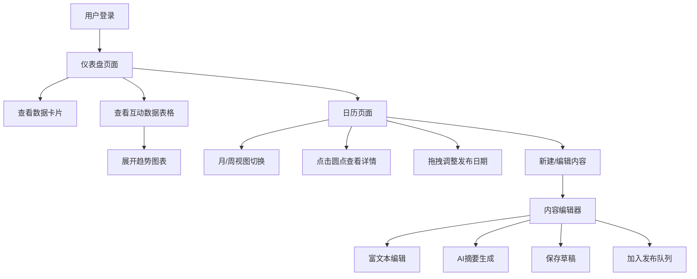

## 1. 产品概述

多平台内容发布管理应用，帮助个人创作者统筹管理微博、微信公众号、抖音、B站等多个社交媒体平台的内容发布计划，并集中分析各平台互动数据，解决手动重复发布、时间难以统筹、数据分散的痛点。

- **核心问题**：多平台内容发布效率低、发布计划混乱、互动数据分散难以分析
- **目标用户**：个人内容创作者、自媒体运营者
- **产品价值**：一站式内容规划与数据分析，提升创作效率与运营效果

## 2. 核心功能

### 2.1 用户角色
| 角色 | 登录方式 | 核心权限 |
|------|----------|----------|
| 创作者用户 | 账号密码登录 | 管理发布计划、编辑内容、查看数据分析 |

### 2.2 功能模块
1. **仪表盘**：数据概览卡片、互动数据表格、趋势图表
2. **日历视图**：月/周视图切换、发布计划展示、拖拽调整、详情卡片
3. **内容编辑**：富文本编辑器、AI摘要生成、草稿管理、发布队列

### 2.3 页面详情
| 页面名称 | 模块名称 | 功能描述 |
|----------|----------|----------|
| 仪表盘 | 数据卡片 | 本周发布数、总互动量、待发布草稿数，带数字滚动动画 |
| 仪表盘 | 互动数据表格 | 按平台分组，展示点赞/评论/分享/平均互动率 |
| 仪表盘 | 趋势图表 | Canvas绘制折线图，7天数据变化，渐变填充与圆点标记 |
| 日历 | 月/周视图 | 30天内发布计划展示，彩色圆点标识平台 |
| 日历 | 详情卡片 | 点击圆点展开，显示完整内容和倒计时，缩放动画 |
| 日历 | 拖拽调整 | 拖拽圆点改变发布日期，半透明吸附高亮，平滑过渡 |
| 编辑器 | 富文本编辑 | 标题、正文、图片插入、@提及功能 |
| 编辑器 | AI摘要 | 一键生成100字以内摘要，实时字数统计与警告 |
| 编辑器 | 草稿/队列 | 保存草稿或加入发布队列，顶部成功提示toast |

## 3. 核心流程

### 3.1 发布计划管理流程
用户登录后进入仪表盘查看数据概览 → 切换到日历视图查看/规划发布 → 点击新建或编辑进入内容编辑器 → 编辑内容并生成AI摘要 → 保存草稿或加入发布队列 → 返回日历查看更新

### 3.2 数据分析流程
用户登录进入仪表盘 → 查看顶部三个核心数据卡片 → 浏览各平台互动数据表格 → 点击表格行展开7天趋势图 → 切换不同平台查看对比数据

## 4. 用户界面设计

### 4.1 设计风格
- **主色调**：深蓝 #1a2332、白色 #ffffff
- **平台色**：微博橙 #E6162D、公众号绿 #07C160、抖音蓝 #00A8E8、B站粉 #FB7299
- **设计风格**：干净简洁的极简主义
- **卡片样式**：8px圆角、柔和阴影 rgba(0,0,0,0.08)，悬停加深阴影并上移2px
- **按钮样式**：圆角胶囊形状，主按钮主色调渐变，悬停亮度提高10%
- **动画效果**：300ms缓动动画，数字滚动1.5秒，交叉淡入淡出
- **布局结构**：左侧固定导航栏240px + 顶部状态栏 + 右侧主内容区

### 4.2 页面设计概览
| 页面名称 | 模块名称 | UI元素 |
|----------|----------|--------|
| 仪表盘 | 数据卡片 | 渐变背景、数字滚动动画、图标装饰、悬停提升效果 |
| 仪表盘 | 数据表格 | 斑马纹行、点击展开箭头、行悬停高亮 |
| 仪表盘 | 趋势图表 | Canvas折线、渐变填充、圆点标记、淡入切换动画 |
| 日历 | 视图切换 | 胶囊切换按钮、当前月份标题、左右翻页箭头 |
| 日历 | 日历网格 | 星期标题行、日期单元格、彩色圆点标记 |
| 日历 | 详情卡片 | 从圆点缩放展开、平台色标题、倒计时显示、操作按钮 |
| 编辑器 | 编辑区域 | 标题输入框、富文本工具栏、正文编辑区 |
| 编辑器 | 侧边栏 | AI摘要按钮、摘要文本框、字数统计、操作按钮组 |
| 全局 | 导航栏 | Logo、导航链接、用户头像、激活态高亮 |
| 全局 | 状态栏 | 当前日期、天气信息、通知图标 |

### 4.3 响应式设计
- **桌面端**（>768px）：左侧固定导航栏 + 顶部状态栏 + 主内容区
- **移动端**（≤768px）：导航栏折叠为底部Tab栏，日历切换为列表视图
- **触控优化**：增大点击区域，适配手势操作

### 4.4 动效设计
- **页面切换**：淡入淡出 + 轻微位移
- **列表操作**：添加/删除/更新 300ms 缓动动画
- **卡片悬停**：阴影加深 + Y轴-2px 位移
- **数字动画**：从0滚动到目标值，1.5秒缓动
- **拖拽交互**：半透明吸附高亮、平滑过渡
- **详情展开**：从圆点缩放展开动画
