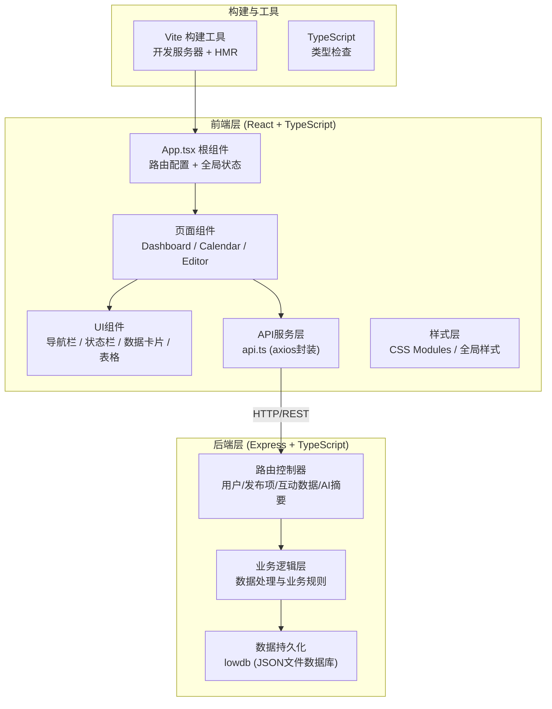
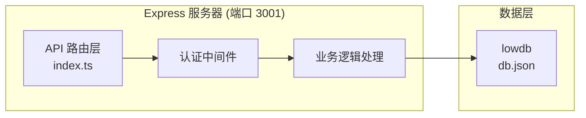
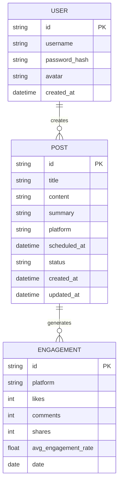

## 1. 架构设计



## 2. 技术描述

- **前端框架**：React 18 + TypeScript
- **构建工具**：Vite 5
- **路由管理**：react-router-dom v6
- **HTTP客户端**：axios
- **日期处理**：moment
- **拖拽库**：react-beautiful-dnd
- **图表库**：recharts (备用方案，主要使用Canvas自绘)
- **状态管理**：React Hooks (useState, useEffect, useContext)
- **样式方案**：CSS Modules + CSS Variables
- **后端框架**：Express 4
- **数据存储**：lowdb (本地JSON文件数据库)
- **唯一ID生成**：uuid
- **跨域处理**：cors

## 3. 路由定义

| 前端路由 | 页面组件 | 功能描述 |
|----------|----------|----------|
| /dashboard | Dashboard.tsx | 数据仪表盘，展示数据卡片与互动分析 |
| /calendar | Calendar.tsx | 日历视图，管理发布计划 |
| /editor | Editor.tsx | 内容编辑器，新建/编辑发布内容 |
| /editor/:id | Editor.tsx | 编辑指定ID的发布项 |
| /login | Login.tsx | 用户登录页面 |
| / | - | 重定向到 /dashboard |

## 4. API 定义

### 4.1 类型定义

```typescript
// 用户
interface User {
  id: string;
  username: string;
  avatar: string;
}

// 平台类型
type Platform = 'weibo' | 'wechat' | 'douyin' | 'bilibili';

// 发布项状态
type PostStatus = 'draft' | 'queued' | 'published';

// 发布项
interface Post {
  id: string;
  title: string;
  content: string;
  summary: string;
  platform: Platform;
  scheduledAt: string; // ISO datetime
  status: PostStatus;
  createdAt: string;
  updatedAt: string;
}

// 互动数据
interface EngagementData {
  platform: Platform;
  likes: number;
  comments: number;
  shares: number;
  avgEngagementRate: number;
}

// 日度互动趋势
interface DailyTrend {
  date: string;
  likes: number;
  comments: number;
  shares: number;
}

// 仪表盘统计
interface DashboardStats {
  weeklyPosts: number;
  totalEngagement: number;
  pendingDrafts: number;
}
```

### 4.2 接口列表

| 方法 | 路径 | 描述 | 请求体 | 响应 |
|------|------|------|--------|------|
| POST | /api/auth/login | 用户登录 | { username, password } | { user, token } |
| GET | /api/posts | 获取发布项列表 | query: status, platform | Post[] |
| GET | /api/posts/:id | 获取单个发布项 | - | Post |
| POST | /api/posts | 创建发布项 | Partial<Post> | Post |
| PUT | /api/posts/:id | 更新发布项 | Partial<Post> | Post |
| DELETE | /api/posts/:id | 删除发布项 | - | { success: true } |
| GET | /api/dashboard/stats | 获取仪表盘统计 | - | DashboardStats |
| GET | /api/engagement | 获取互动数据 | - | EngagementData[] |
| GET | /api/engagement/trend | 获取7天趋势 | query: platform | DailyTrend[] |
| POST | /api/ai/summary | AI生成摘要 | { content } | { summary } |

## 5. 服务器架构图



## 6. 数据模型

### 6.1 数据模型定义



### 6.2 lowdb 数据结构

```json
{
  "users": [
    {
      "id": "uuid",
      "username": "string",
      "password": "string",
      "avatar": "string"
    }
  ],
  "posts": [
    {
      "id": "uuid",
      "title": "string",
      "content": "string",
      "summary": "string",
      "platform": "weibo|wechat|douyin|bilibili",
      "scheduledAt": "ISO datetime",
      "status": "draft|queued|published",
      "createdAt": "ISO datetime",
      "updatedAt": "ISO datetime"
    }
  ],
  "engagement": [
    {
      "date": "YYYY-MM-DD",
      "platform": "weibo|wechat|douyin|bilibili",
      "likes": 0,
      "comments": 0,
      "shares": 0
    }
  ]
}
```

### 6.3 初始数据

系统预置一个测试用户（admin / admin123）和若干示例发布项、互动数据，便于开发测试。
