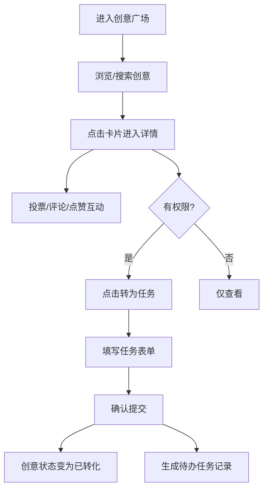

## 1. 产品概述

团队创意点子孵化器——一个面向团队内部的创意收集与孵化平台，让成员天马行空的想法得以沉淀、讨论并转化为实际任务。通过社交化的互动机制（点赞、投票、评论）激发团队创造力，同时打通创意到执行的链路。

- 核心价值：降低创意表达门槛，建立创意筛选机制，实现创意到任务的无缝转化
- 目标用户：产品团队、研发团队、设计团队等需要持续创新的组织

## 2. 核心功能

### 2.1 用户角色

| 角色 | 说明 | 核心权限 |
|------|------|----------|
| 普通用户 | 团队成员 | 浏览创意、发布创意、点赞/投票、评论回复 |
| 管理员 | 团队负责人 | 普通用户权限 + 将创意转化为任务 |
| 创意作者 | 创意发布者 | 普通用户权限 + 编辑自己的创意 + 将自己的创意转为任务 |

### 2.2 功能模块

1. **创意广场页**：瀑布流卡片展示、排序切换、全局搜索、侧边栏热度排行榜
2. **创意详情页**：Markdown 内容渲染、评论时间线、投票交互、转为任务入口
3. **任务创建模块**：模态框表单、创意状态联动、任务独立存储

### 2.3 页面详情

| 页面名称 | 模块名称 | 功能描述 |
|----------|----------|----------|
| 创意广场 | 瀑布流卡片 | 展示创意标题、描述、作者、标签（彩色药丸）、点赞数、投票进度条 |
| 创意广场 | 排序工具栏 | 热度/最新/随机三种排序，切换带动画过渡 |
| 创意广场 | 全局搜索栏 | 按标题和标签模糊搜索，实时过滤并高亮匹配关键字 |
| 创意广场 | 热度排行榜 | 侧边栏展示 Top10，带排名徽章和火焰图标，点击跳转详情 |
| 创意详情 | 内容展示区 | Markdown 渲染、图片/链接附件、作者信息 |
| 创意详情 | 投票区 | 投票按钮+粒子动画、票数显示、已投票状态 |
| 创意详情 | 评论时间线 | 评论列表、点赞、嵌套回复、即时插入动画 |
| 创意详情 | 转为任务 | 角色权限控制、模态框表单、创意状态变更 |
| 任务创建模态框 | 表单 | 任务标题、截止日期、负责人下拉、优先级标签 |

## 3. 核心流程

用户登录后进入创意广场，浏览或搜索创意 → 点击卡片进入详情页 → 可进行投票、评论、点赞互动 → 作者或管理员可将创意转为任务 → 填写任务信息并确认 → 创意状态更新为"已转化"，任务模块生成记录。

## 4. 用户界面设计

### 4.1 设计风格

- **主色调**：深蓝 `#1e1b4b` → 紫罗兰 `#7c3aed` 的垂直渐变作为全局背景
- **强调色**：亮紫 `#a78bfa`、青绿 `#34d399`（成功/已转化）、橙红 `#f97316`（高优先级）
- **卡片风格**：半透明白色（`rgba(255,255,255,0.08)`）+  backdrop-filter 磨砂玻璃 + 12px 圆角
- **按钮风格**：渐变填充、圆角 8px、hover 提升 2px、active 下沉
- **字体**：标题使用 'Space Grotesk' 或 'Poppins'，正文使用系统无衬线
- **图标**：lucide-react 图标库，配合火焰、徽章等视觉符号
- **动效**：所有过渡统一使用 `0.3s ease`，卡片进入交错淡入上滑，悬停阴影放大

### 4.2 页面设计概述

| 页面名称 | 模块名称 | UI 元素 |
|----------|----------|---------|
| 创意广场 | 顶部搜索栏 | 渐变背景、搜索图标、输入框带聚焦发光 |
| 创意广场 | 排序切换器 | Pill 形状 segmented control，选中项渐变填充 |
| 创意广场 | 瀑布流卡片 | 磨砂玻璃、彩色标签药丸、进度条动画、悬停上浮 |
| 创意广场 | 排行榜侧边栏 | 排名徽章（金/银/铜渐变）、火焰图标、hover 高亮 |
| 创意详情 | 内容区 | Markdown 排版优雅、代码块高亮、图片圆角阴影 |
| 创意详情 | 投票按钮 | 大尺寸渐变按钮、粒子飘散 canvas 动画 |
| 创意详情 | 评论时间线 | 左侧竖线、头像浮动、回复缩进嵌套 |
| 创意详情 | 输入动效 | 空提交抖动 shake、新评论即时滑入 |

### 4.3 响应式

- **桌面（≥1200px）**：三列瀑布流 + 左侧排行榜侧栏（固定宽度 280px）
- **平板（768–1199px）**：两列瀑布流 + 排行榜折叠为顶部横向滚动
- **手机（<768px）**：单列瀑布流 + 排行榜折叠为抽屉或顶部列表
- 触控目标最小 44×44px，手势滑动支持

### 4.4 动效细节

- 卡片进入：`translateY(30px) opacity(0)` → 正常，`animation-delay` 按索引 × 60ms 交错
- 悬停卡片：`scale(1.02) translateY(-4px)`，阴影从 `0 4px 20px` 变为 `0 12px 40px`
- 投票粒子：canvas 绘制 20–30 个彩色圆点，随机方向扩散 + 重力衰减
- 排序切换：卡片先淡出（staggered）→ 重排 → 再淡入
- 新评论插入：高度从 0 展开 + 淡入 + 左侧边框高亮闪烁
