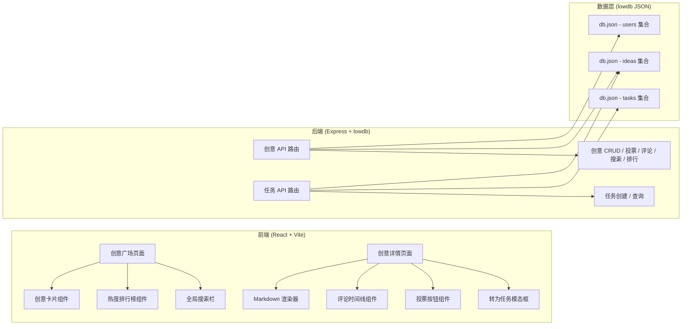
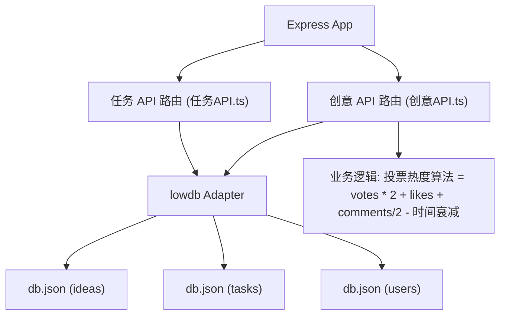
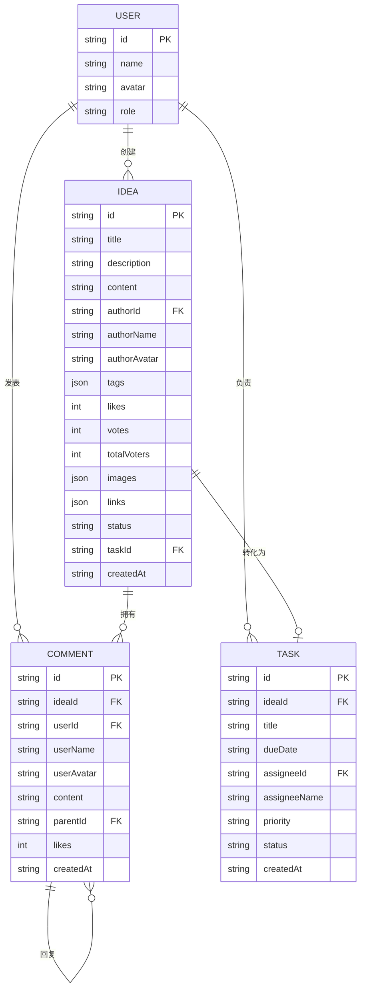

## 1. 架构设计



## 2. 技术说明

- **前端**：React 18 + TypeScript + Vite 5 + React Router v6 + axios + marked（Markdown 渲染）+ moment
- **状态管理**：React Hooks（useState/useEffect）+ 轻量 Context，避免引入额外依赖
- **样式方案**：原生 CSS + CSS Modules（避免 Tailwind 带来的视觉同质化），使用 CSS 变量管理主题
- **后端**：Express 4 + TypeScript + lowdb（JSON 文件持久化）+ uuid + cors
- **数据持久化**：lowdb 操作本地 `db.json`，创意与任务分集合存储，通过 ideaId 关联
- **构建工具**：Vite 5，配置 `/api` 代理到 Express 后端

## 3. 路由定义

| 前端路由 | 页面组件 | 说明 |
|----------|----------|------|
| `/` | 创意广场页 | 瀑布流 + 搜索 + 排行榜 |
| `/ideas/:id` | 创意详情页 | Markdown + 评论 + 投票 + 转任务 |

| API 路由 | 方法 | 说明 |
|----------|------|------|
| `/api/ideas` | GET | 获取创意列表，支持 `sort`（hot/latest/random）和 `q`（搜索）参数 |
| `/api/ideas/:id` | GET | 获取单个创意详情（含评论） |
| `/api/ideas` | POST | 创建新创意 |
| `/api/ideas/:id/vote` | POST | 对创意投票 |
| `/api/ideas/:id/like` | POST | 对创意点赞 |
| `/api/ideas/:id/comments` | POST | 发表评论 |
| `/api/ideas/:id/comments/:commentId/like` | POST | 评论点赞 |
| `/api/ideas/:id/comments/:commentId/reply` | POST | 回复评论 |
| `/api/ideas/trending` | GET | 获取 Top10 热度排行 |
| `/api/tasks` | GET | 获取任务列表 |
| `/api/tasks` | POST | 创建任务（同时更新关联创意状态） |
| `/api/users` | GET | 获取团队成员列表（用于负责人下拉） |

## 4. API 数据类型定义

```typescript
interface User {
  id: string;
  name: string;
  avatar: string;
  role: 'user' | 'admin';
}

interface Tag {
  name: string;
  color: string;
}

interface Comment {
  id: string;
  userId: string;
  userName: string;
  userAvatar: string;
  content: string;
  createdAt: string;
  likes: number;
  likedByMe: boolean;
  replies: Comment[];
  parentId: string | null;
}

interface Idea {
  id: string;
  title: string;
  description: string;
  content: string;
  authorId: string;
  authorName: string;
  authorAvatar: string;
  tags: Tag[];
  likes: number;
  likedByMe: boolean;
  votes: number;
  votedByMe: boolean;
  totalVoters: number;
  images: string[];
  links: string[];
  comments: Comment[];
  createdAt: string;
  status: 'draft' | 'active' | 'converted';
  taskId: string | null;
}

interface Task {
  id: string;
  ideaId: string;
  title: string;
  dueDate: string;
  assigneeId: string;
  assigneeName: string;
  priority: 'high' | 'medium' | 'low';
  createdAt: string;
  status: 'pending' | 'in_progress' | 'done';
}
```

## 5. 服务端架构



## 6. 数据模型

### 6.1 ER 图



### 6.2 初始数据

启动服务时自动在 `server/db.json` 中初始化：
- 3–5 个团队成员用户（含 1 个 admin）
- 6–8 条示例创意（覆盖不同标签、状态、投票数）
- 若干示例评论和回复
- 1–2 条已转化的示例任务

## 7. 项目文件结构

```
├── package.json
├── vite.config.ts
├── tsconfig.json
├── index.html
├── src/
│   ├── main.tsx
│   ├── App.tsx
│   ├── styles/
│   │   ├── global.css
│   │   └── variables.css
│   ├── 创意广场模块/
│   │   ├── 创意卡片组件.tsx
│   │   └── 创意广场容器.tsx
│   ├── 创意广场模块/
│   │   └── 创意详情容器.tsx
│   ├── 任务模块/
│   │   └── 任务创建模态框.tsx
│   ├── components/
│   │   ├── 热度排行榜.tsx
│   │   ├── 全局搜索栏.tsx
│   │   ├── 评论时间线.tsx
│   │   ├── 投票按钮.tsx
│   │   └── Markdown渲染器.tsx
│   ├── hooks/
│   │   └── useInfiniteScroll.ts
│   ├── utils/
│   │   ├── api.ts
│   │   └── format.ts
│   ├── types/
│   │   └── index.ts
│   └── store/
│       └── useAuthStore.ts
└── server/
    ├── index.ts
    ├── 创意API.ts
    ├── 任务API.ts
    ├── db.ts
    └── seed.ts
```
