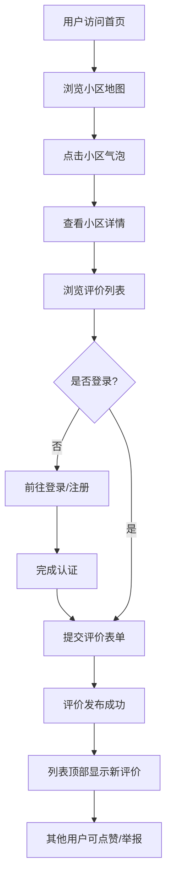

## 1. 产品概述

本产品是一个帮助租房者真实评价小区周边环境的众包平台，解决传统租房平台仅展示房源内部照片、缺乏小区周边真实居住体验反馈的痛点。

- **核心问题**：租房决策缺乏小区周边环境（噪音、交通、生活配套）的真实透明反馈
- **目标用户**：城市租房人群、购房人群
- **核心价值**：通过众包评价，提供真实、全面、可信赖的小区居住体验信息

## 2. 核心功能

### 2.1 用户角色

| 角色 | 注册方式 | 核心权限 |
|------|----------|----------|
| 普通用户 | 用户名/密码注册 | 浏览小区、发表评价、点赞评价、举报评价 |

### 2.2 功能模块

1. **首页**：小区地图（60%）、评价列表（40%）、顶部搜索导航栏
2. **小区详情页**：综合雷达图、平均分数、评价数量、评价时间流
3. **评价提交页**：三维度星级评分、文字评价、图片上传（最多3张，支持裁剪压缩）
4. **登录/注册页**：用户身份认证

### 2.3 页面详情

| 页面名称 | 模块名称 | 功能描述 |
|-----------|-------------|---------------------|
| 首页 | 地图组件 | Leaflet地图渲染，小区气泡标记（大小随评价数变化），点击弹出信息卡 |
| 首页 | 评价列表 | 评价卡片流，支持图片懒加载、点赞、举报 |
| 小区详情页 | 雷达图 | Canvas绘制五维度雷达图，渐变填充，数据变化平滑过渡动画 |
| 小区详情页 | 评分展示 | 大号数字滚动显示平均总分，评价数量统计 |
| 评价提交页 | 星级评分 | 三星级评分系统，星星悬停放大、点击填充动画 |
| 评价提交页 | 图片上传 | 支持裁剪压缩预览，最多上传3张 |
| 评价列表 | 点赞功能 | 点赞数实时更新，按钮放大回弹动画 |
| 评价列表 | 举报功能 | 一键举报不当内容 |

## 3. 核心流程

用户访问首页 → 浏览地图上的小区气泡 → 点击小区查看详情 → 浏览评价列表 → 登录/注册 → 提交评价（评分+文字+图片）→ 评价显示在列表顶部（淡入上滑动画）

## 4. 用户界面设计

### 4.1 设计风格

- **主色调**：青绿色 `#2D9B8E`，清爽可信赖
- **背景色**：白色 `#FFFFFF`
- **卡片色**：暖灰色 `#F5F2EC`
- **按钮风格**：圆角胶囊按钮，点击有缩放反馈
- **字体**：使用现代无衬线字体，标题粗体，正文常规
- **布局**：顶部导航栏 + 左侧地图（60%）+ 右侧列表（40%）
- **动效**：微交互动画（悬停、点击、过渡）

### 4.2 页面设计概览

| 页面名称 | 模块名称 | UI元素 |
|-----------|-------------|-------------|
| 首页 | 地图组件 | 气泡标记（带评价数）、点击放大、信息卡片弹出 |
| 首页 | 评价列表 | 圆角卡片、柔和阴影、图片懒加载淡入动画 |
| 小区详情页 | 雷达图 | Canvas绘制、渐变填充、五维度、平滑过渡 |
| 小区详情页 | 评分展示 | 大号数字滚动动画 |
| 评价提交页 | 星级评分 | 悬停放大、点击填充动画 |
| 评价提交页 | 图片上传 | 裁剪预览、压缩处理 |

### 4.3 响应式

- **桌面端**：左右布局（地图60% + 列表40%）
- **移动端**：上下布局（地图在上，列表在下）
- **触摸优化**：按钮最小44px高度，列表项足够间距

### 4.4 性能要求

- 页面首次加载时间 ≤ 2秒
- 评价提交后1秒内展示成功反馈
- 图片懒加载优化
- 动画流畅60fps
