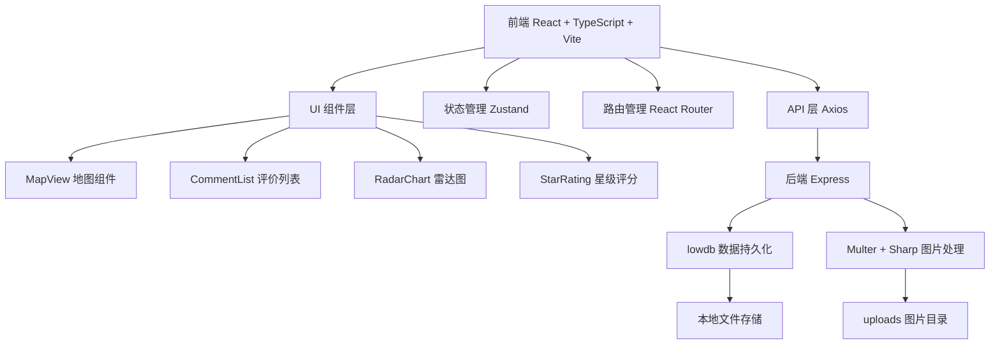
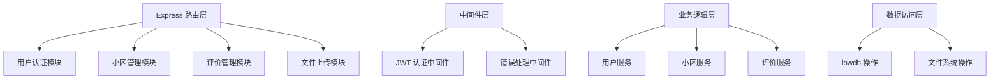
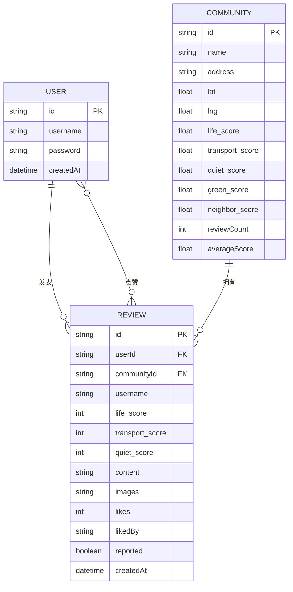

## 1. 架构设计



## 2. 技术描述

- **前端**：React@18 + TypeScript + Vite + React Router + Zustand + Axios + Leaflet
- **后端**：Express@4 + lowdb + Multer + Sharp + JWT + bcryptjs
- **数据库**：lowdb（JSON文件存储）
- **地图**：Leaflet + @react-leaflet/core + react-leaflet
- **图片处理**：Multer上传 + Sharp压缩裁剪
- **构建工具**：Vite（开发服务器 + 代理配置）

## 3. 路由定义

| 路由 | 用途 |
|-------|---------|
| `/` | 首页（地图 + 评价列表） |
| `/login` | 登录页 |
| `/register` | 注册页 |
| `/community/:id` | 小区详情页 |
| `/community/:id/review` | 评价提交页 |

## 4. API 定义

```typescript
// 类型定义
interface User {
  id: string;
  username: string;
  password: string; // 加密存储
  createdAt: string;
}

interface Community {
  id: string;
  name: string;
  address: string;
  lat: number;
  lng: number;
  scores: {
    life: number;
    transport: number;
    quiet: number;
    green: number;
    neighbor: number;
  };
  reviewCount: number;
  averageScore: number;
}

interface Review {
  id: string;
  userId: string;
  communityId: string;
  username: string;
  scores: {
    life: number;
    transport: number;
    quiet: number;
  };
  content: string;
  images: string[];
  likes: number;
  likedBy: string[];
  reported: boolean;
  createdAt: string;
}

// API 端点
GET    /api/auth/register      // 注册
POST   /api/auth/login         // 登录
GET    /api/communities     // 小区列表/搜索
GET    /api/communities/:id  // 小区详情
GET    /api/reviews?communityId=:id  // 评价列表
POST   /api/reviews        // 提交评价
POST   /api/reviews/:id/like    // 点赞
POST   /api/reviews/:id/report  // 举报
POST   /api/upload         // 图片上传
```

## 5. 服务端架构



## 6. 数据模型

### 6.1 ER图



### 6.2 db.json 初始数据

```json
{
  "users": [],
  "communities": [
    {
      "id": "1",
      "name": "阳光花园",
      "address": "北京市朝阳区建国路88号",
      "lat": 39.9042,
      "lng": 116.4074,
      "scores": {
        "life": 4.2,
        "transport": 4.5,
        "quiet": 3.8,
        "green": 4.0,
        "neighbor": 4.1
      },
      "reviewCount": 156,
      "averageScore": 4.12
    }
  ],
  "reviews": []
}
```
