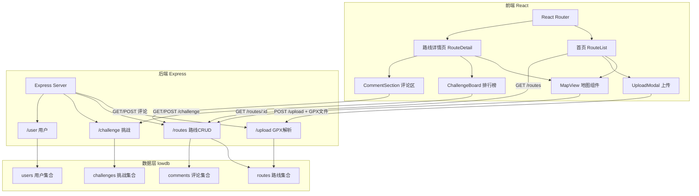
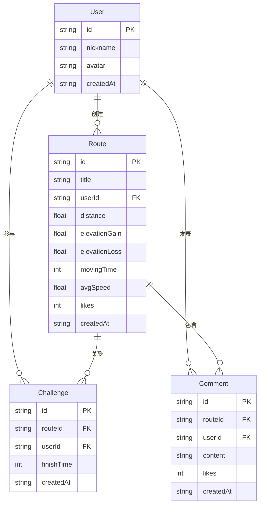

## 1. 架构设计



## 2. 技术说明
- 前端：React@18 + TypeScript + TailwindCSS@3 + Vite
- 初始化工具：vite-init（react-express-ts模板）
- 后端：Express@4 + TypeScript（ESM格式）
- 数据库：lowdb（JSON文件持久化）
- 地图：Leaflet + react-leaflet
- GPX解析：fast-xml-parser
- 文件上传：multer
- 状态管理：zustand

## 3. 路由定义
| 路由 | 用途 |
|------|------|
| / | 首页，路线列表展示 |
| /route/:id | 路线详情页，地图+信息面板+挑战+评论 |

## 4. API定义

### 4.1 路线相关
```
POST   /api/upload          # 上传GPX文件，解析并存储路线
GET    /api/routes           # 获取路线列表（支持sort参数: distance/time/likes）
GET    /api/routes/:id       # 获取单条路线详情（含GeoJSON坐标）
POST   /api/routes/:id/like  # 点赞路线
```

### 4.2 挑战相关
```
POST   /api/challenge                 # 提交挑战记录（routeId, userId, time）
GET    /api/challenge/:routeId         # 获取指定路线的挑战排行榜
```

### 4.3 评论相关
```
POST   /api/routes/:id/comments        # 提交评论
POST   /api/comments/:id/like          # 评论点赞
```

### 4.4 用户相关
```
GET    /api/user/:id                   # 获取用户基本信息
POST   /api/user                       # 创建用户（昵称注册）
```

### 4.5 TypeScript类型定义
```typescript
interface Route {
  id: string;
  title: string;
  userId: string;
  coordinates: [number, number][];
  distance: number;
  elevationGain: number;
  elevationLoss: number;
  movingTime: number;
  avgSpeed: number;
  likes: number;
  createdAt: string;
}

interface Challenge {
  id: string;
  routeId: string;
  userId: string;
  finishTime: number;
  createdAt: string;
}

interface Comment {
  id: string;
  routeId: string;
  userId: string;
  nickname: string;
  avatar: string;
  content: string;
  likes: number;
  createdAt: string;
}

interface User {
  id: string;
  nickname: string;
  avatar: string;
  createdAt: string;
}
```

## 5. 服务器架构图

```mermaid
flowchart LR
    "Controller 路由处理" --> "Service 业务逻辑" --> "Repository 数据访问" --> "lowdb JSON存储"
```

## 6. 数据模型

### 6.1 数据模型定义



### 6.2 数据存储格式
- lowdb JSON文件：`db.json`，包含routes、challenges、users、comments四个集合
- GPX文件上传后存储在 `uploads/` 目录
- 坐标数据直接嵌入路线记录中（数据量<100条无需分离）

## 7. 文件结构与调用关系

```
项目根目录/
├── package.json                    # 依赖管理，npm run dev同时启动前后端
├── vite.config.ts                  # Vite配置，代理/api到Express后端
├── tsconfig.json                   # TS严格模式，ES2020
├── index.html                      # 入口页面，标题"骑迹"
├── db.json                         # lowdb数据文件
├── uploads/                        # GPX上传目录
├── shared/
│   └── types.ts                    # 前后端共享类型定义
├── src/
│   ├── main.tsx                    # React入口
│   ├── App.tsx                     # 路由配置
│   ├── index.css                   # 全局样式+动画keyframes
│   ├── frontend/
│   │   ├── MapView.tsx             # Leaflet地图组件 ← 接收routes/:id API数据
│   │   ├── ChallengeBoard.tsx      # 挑战排行榜 ← 调用challenge/:routeId API
│   │   ├── RouteCard.tsx           # 路线卡片组件 ← 接收路线列表数据
│   │   ├── CommentSection.tsx      # 评论区组件 ← 调用评论API
│   │   └── UploadModal.tsx         # 上传对话框 ← 调用upload API
│   ├── pages/
│   │   ├── Home.tsx                # 首页 ← 调用GET /routes
│   │   └── RouteDetail.tsx         # 详情页 ← 调用routes/:id
│   ├── stores/
│   │   └── appStore.ts             # zustand全局状态
│   └── utils/
│       └── api.ts                  # axios封装
├── api/
│   ├── server.ts                   # Express服务器入口
│   ├── routes/
│   │   ├── routeRoutes.ts          # 路线API路由 → routeService
│   │   ├── challengeRoutes.ts      # 挑战API路由 → challengeService
│   │   └── userRoutes.ts           # 用户API路由 → userService
│   ├── services/
│   │   ├── routeService.ts         # 路线业务逻辑 → gpxParser + db
│   │   ├── challengeService.ts     # 挑战业务逻辑 → db
│   │   └── userService.ts          # 用户业务逻辑 → db
│   ├── utils/
│   │   ├── gpxParser.ts            # GPX解析（fast-xml-parser）
│   │   └── db.ts                   # lowdb初始化与封装
│   └── middleware/
│       └── upload.ts               # multer上传中间件
```

数据流向：
- 前端页面 → api.ts(axios) → Vite代理 → Express路由 → Service → Repository(lowdb) → db.json
- GPX上传：UploadModal → POST /api/upload(multer) → gpxParser解析 → routeService存储 → 返回路线数据
- 地图渲染：RouteDetail → GET /api/routes/:id → MapView(react-leaflet) → 渲染多段线+标记
- 挑战提交：ChallengeBoard → POST /api/challenge → challengeService存储 → 状态更新刷新排行榜
- 评论：CommentSection → POST /api/routes/:id/comments → 状态更新刷新评论列表
