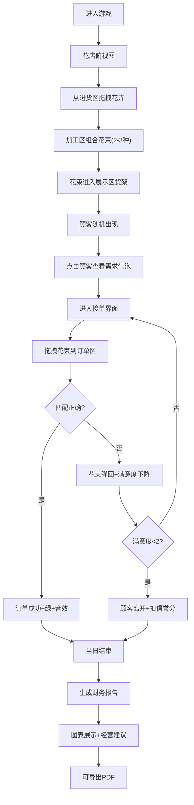

## 1. 产品概述
线上模拟经营花店游戏，用户扮演花店店主体验从进货、加工、展示到接单配送的完整花店运营流程。
- 核心玩法：拖拽交互+花束组合+顾客匹配+日结报告，打造沉浸式经营体验
- 目标用户：喜欢模拟经营类游戏的休闲玩家

## 2. 核心功能

### 2.1 用户角色
| 角色 | 注册方式 | 核心权限 |
|------|---------|---------|
| 店主 | 直接进入 | 全部游戏功能：进货、加工、展示、接单、报告查看 |

### 2.2 功能模块
1. **花店主界面**：俯视角花店平面图、四区域划分（进货区/加工区/展示区/收银台）、拖拽交互系统
2. **订单管理页**：顾客随机生成、气泡需求展示、花束匹配验证、满意度心形条
3. **每日报告页**：销售数据图表、满意度趋势、库存损耗、PDF导出

### 2.3 页面详情
| 页面名称 | 模块名称 | 功能描述 |
|---------|---------|---------|
| 花店主界面 | 进货区 | 展示4种花卉（玫瑰/百合/向日葵/满天星），带保质期标签，可拖拽 |
| 花店主界面 | 加工区 | 接收2-3种花卉拖拽，自动组合预览，生成花束图标 |
| 花店主界面 | 展示区 | 三层网格货架，花束自动排列，呼吸浮动动画 |
| 花店主界面 | 收银台 | 显示当日营业额、信誉分、当前时间 |
| 花店主界面 | 拖拽系统 | 鼠标跟随平滑动画、放置区域高亮、错误弹回动画 |
| 订单管理页 | 顾客气泡 | 随机生成顾客及需求（颜色/花种/价格偏好） |
| 订单管理页 | 匹配验证 | 拖拽花束到订单区，正确变绿+音效，错误弹回+满意度下降 |
| 订单管理页 | 满意度条 | 5颗心形，每次错误减0.5颗，低于2颗顾客离开扣信誉分 |
| 每日报告页 | 收入柱状图 | 展示当日各时段收入（Recharts BarChart） |
| 每日报告页 | 成本饼图 | 进货成本/损耗成本/其他成本占比（Recharts PieChart） |
| 每日报告页 | 满意度趋势 | 折线图展示当日顾客满意度变化（Recharts LineChart） |
| 每日报告页 | 经营建议 | AI生成建议，PDF导出功能（jsPDF） |

## 3. 核心流程
玩家登录后进入花店俯视图，从进货区拖拽花卉到加工区组合花束，花束自动进入展示区货架；顾客随机出现并展示需求气泡，玩家点击顾客进入接单界面，从展示区拖拽匹配花束完成订单；每日结束后系统根据销售数据、满意度、库存损耗生成报告与建议，支持导出PDF。

## 4. 用户界面设计
### 4.1 设计风格
- **主色调**：米白(#FFF8F0)、浅粉(#FFD6E0)、草绿(#A8D5BA)，辅以玫红(#E8899E)点缀
- **按钮风格**：统一圆角12px，悬停时scale(1.05)缩放+轻微阴影加深，点击时scale(0.98)回弹
- **字体**：标题使用"Noto Serif SC"衬线体，正文使用"Noto Sans SC"无衬线体
- **布局风格**：卡片式圆角容器，软阴影营造层次，呼吸浮动动画增加活力
- **图标风格**：使用Lucide图标配合emoji花卉图标，保持圆润可爱风格

### 4.2 页面设计概览
| 页面名称 | 模块名称 | UI元素 |
|---------|---------|--------|
| 花店主界面 | 俯视图容器 | 暖米白渐变背景，四区域带虚线边框区分，区域标签悬浮 |
| 花店主界面 | 花卉图标 | 圆形白底卡片，emoji+名称+保质期标签，拖拽时半透明+scale(1.1) |
| 花店主界面 | 加工区 | 粉色渐变边框，放置后花卉水平排列，中间"+"号连接 |
| 花店主界面 | 展示区货架 | 三层木纹质感背景，每层网格布局，花束呼吸浮动动画 |
| 花店主界面 | 收银台 | 绿色渐变卡片，大字号营业额+心形信誉分图标 |
| 订单管理页 | 顾客卡片 | 圆形头像+对话气泡(三角指向)，气泡内含颜色圆点+花种emoji+价格 |
| 订单管理页 | 订单区域 | 默认浅灰边框，拖拽悬停时虚线动画，成功时绿色填充闪光 |
| 订单管理页 | 满意度条 | 5颗渐变色心形，实心/空心/半实心三种状态，减少时抖动动画 |
| 每日报告页 | 图表区域 | 白色圆角卡片，图表配色与主题一致，hover显示tooltip |
| 每日报告页 | 建议区域 | 草绿渐变背景卡片，带灯泡图标+手写风格字体 |

### 4.3 响应式设计
- 桌面优先设计，适配1024px及以上屏幕
- 平板(768px-1024px)：区域布局保持比例，字号缩小10%，拖拽区域触控优化
- 使用flex+grid响应式布局，关键容器设置min-width保证可用性

### 4.4 性能要求
- 整体游戏帧率≥30fps
- 拖拽动画使用transform+will-change优化
- 动画优先使用CSS transitions/animations
- 状态更新采用requestAnimationFrame节流
