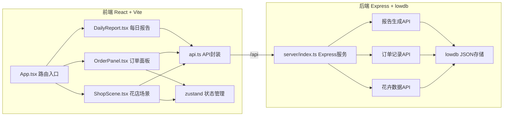
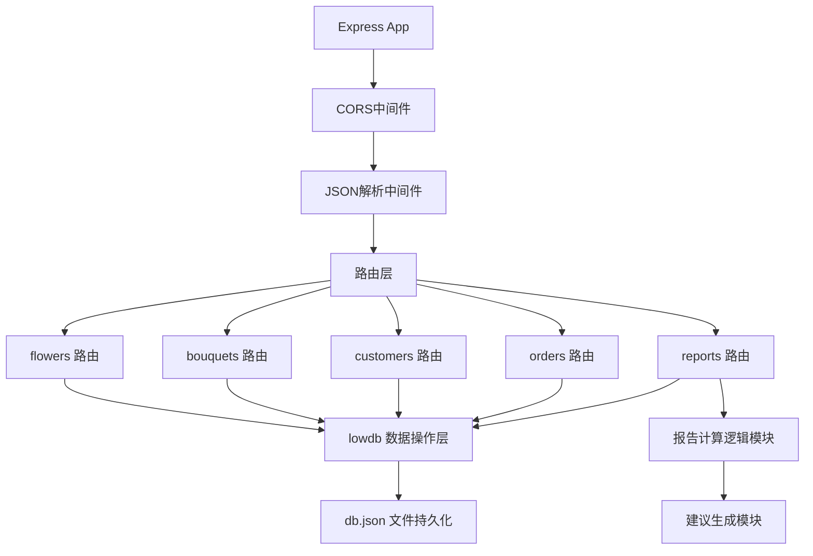
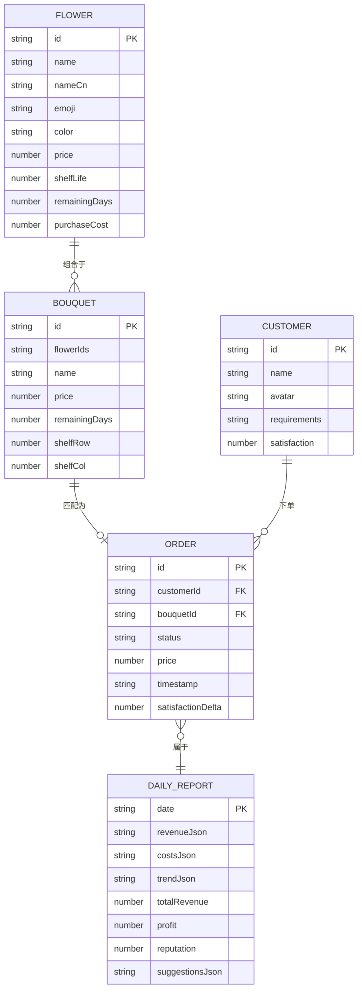

## 1. 架构设计



## 2. 技术描述
- **前端框架**：React@18 + TypeScript@5 + Vite@5
- **路由管理**：react-router-dom@6
- **状态管理**：zustand@4
- **HTTP客户端**：axios@1
- **图表库**：recharts@2
- **PDF导出**：jspdf@2
- **工具库**：uuid@9、moment@2
- **后端框架**：Express@4
- **数据库**：lowdb@7 (JSON文件存储)
- **跨域处理**：cors@2 (后端) + Vite代理(开发环境)
- **样式方案**：CSS Modules + 全局CSS变量

## 3. 路由定义
| 路由 | 用途 |
|------|------|
| / | 花店主界面：俯视图+四区域+拖拽交互+实时数据 |
| /orders | 订单管理页：顾客队列+花束匹配+满意度条 |
| /report | 每日报告页：三类图表+经营建议+PDF导出 |

## 4. API定义

### 4.1 类型定义
```typescript
// 花卉类型
interface Flower {
  id: string;
  name: 'rose' | 'lily' | 'sunflower' | 'baby_breath';
  nameCn: string;
  emoji: string;
  color: string;
  price: number;
  shelfLife: number; // 保质期(天)
  remainingDays: number; // 剩余天数
  purchaseCost: number;
}

// 花束类型
interface Bouquet {
  id: string;
  flowers: Flower[];
  name: string;
  price: number;
  color: string;
  remainingDays: number;
  shelfPosition?: { row: number; col: number };
}

// 顾客类型
interface Customer {
  id: string;
  name: string;
  avatar: string;
  requirements: {
    colors?: string[];
    flowerTypes?: string[];
    maxPrice?: number;
    minPrice?: number;
  };
  satisfaction: number; // 0-5，步进0.5
}

// 订单类型
interface Order {
  id: string;
  customerId: string;
  bouquetId?: string;
  status: 'pending' | 'success' | 'failed';
  price: number;
  timestamp: string;
  satisfactionDelta: number;
}

// 每日报告类型
interface DailyReport {
  date: string;
  revenue: number[]; // 各时段收入
  costs: { category: string; value: number }[];
  satisfactionTrend: { time: string; value: number }[];
  totalRevenue: number;
  totalCost: number;
  profit: number;
  reputation: number;
  suggestions: string[];
  spoiledFlowers: number;
  completedOrders: number;
  failedOrders: number;
}
```

### 4.2 接口定义
| Method | Endpoint | 说明 | Request | Response |
|--------|----------|------|---------|----------|
| GET | /api/flowers | 获取进货区花卉列表 | - | Flower[] |
| POST | /api/flowers | 新增花卉进货 | { name, quantity } | Flower[] |
| PUT | /api/flowers/:id | 更新花卉(保质期) | { remainingDays } | Flower |
| DELETE | /api/flowers/:id | 删除花卉(丢弃) | - | { success: true } |
| POST | /api/bouquets | 创建花束 | { flowerIds: string[] } | Bouquet |
| GET | /api/bouquets | 获取展示区花束 | - | Bouquet[] |
| GET | /api/customers | 获取当前顾客队列 | - | Customer[] |
| POST | /api/customers | 生成新顾客 | - | Customer |
| DELETE | /api/customers/:id | 顾客离开 | - | { reputationDelta: number } |
| POST | /api/orders/match | 验证花束匹配 | { customerId, bouquetId } | { match: boolean; order: Order } |
| GET | /api/orders | 获取当日订单记录 | - | Order[] |
| GET | /api/report/daily | 生成每日报告 | - | DailyReport |
| POST | /api/reputation | 操作信誉分 | { delta: number } | { reputation: number } |
| GET | /api/status | 获取当前经营状态 | - | { reputation, revenue, dayNumber } |

## 5. 服务端架构图



## 6. 数据模型

### 6.1 ER图



### 6.2 lowdb初始数据
```json
{
  "flowers": [
    {"id": "...", "name": "rose", "nameCn": "玫瑰", "emoji": "🌹", "color": "#E8899E", "price": 15, "shelfLife": 5, "remainingDays": 5, "purchaseCost": 6},
    {"id": "...", "name": "lily", "nameCn": "百合", "emoji": "🌸", "color": "#FFD6E0", "price": 12, "shelfLife": 4, "remainingDays": 4, "purchaseCost": 5},
    {"id": "...", "name": "sunflower", "nameCn": "向日葵", "emoji": "🌻", "color": "#FFD93D", "price": 10, "shelfLife": 6, "remainingDays": 6, "purchaseCost": 4},
    {"id": "...", "name": "baby_breath", "nameCn": "满天星", "emoji": "💐", "color": "#FFFFFF", "price": 8, "shelfLife": 7, "remainingDays": 7, "purchaseCost": 3}
  ],
  "bouquets": [],
  "customers": [],
  "orders": [],
  "status": {
    "reputation": 100,
    "revenue": 0,
    "dayNumber": 1
  }
}
```
