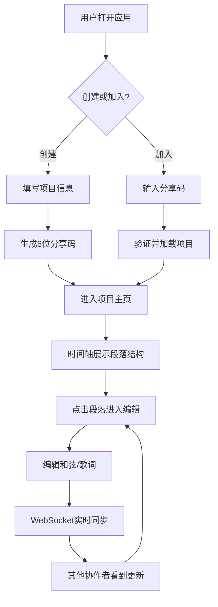

## 1. 产品概述

协同写歌（SongCollab）是一个面向音乐创作人的在线协作平台，解决多人异地写歌时的版本混乱、非实时同步、以及缺乏统一的和弦与歌词管理问题。通过实时WebSocket同步、时间轴式歌曲结构管理和ChordPro格式的和弦编辑，让音乐人可以高效地协作创作。

- 目标用户：乐队成员、词曲创作人、音乐制作人等需要异地协作的音乐创作者
- 核心价值：实时协作零延迟、结构化歌曲管理、和弦歌词一体化编辑

## 2. 核心功能

### 2.1 用户角色

| 角色 | 加入方式 | 核心权限 |
|------|----------|----------|
| 项目创建者 | 创建项目 | 创建/编辑/删除项目，管理段落，管理协作者 |
| 协作者 | 通过6位分享码加入 | 查看/编辑段落内容和弦歌词，查看协作者状态 |

### 2.2 功能模块

1. **首页/创建页**：创建新歌曲项目，设置标题、调性、BPM、拍号；通过分享码加入已有项目
2. **项目主页**：左侧歌曲结构时间轴，右侧段落编辑器，实时协作同步

### 2.3 页面详情

| 页面名称 | 模块名称 | 功能描述 |
|----------|----------|----------|
| 首页/创建页 | 项目创建表单 | 设置标题、调性（C大调/A小调等）、BPM、拍号，提交后生成6位分享码 |
| 首页/创建页 | 加入项目 | 输入6位分享码加入已有项目，跳转至项目主页 |
| 项目主页 | 歌曲结构时间轴 | 以时间轴形式展示前奏/主歌/副歌/桥段/尾奏，每段可拖拽调整长度和顺序，点击选中进入编辑 |
| 项目主页 | 段落编辑器 | 编辑和弦进行（ChordPro格式）和歌词文本，实时高亮并按节拍对齐，节拍线细竖线标记 |
| 项目主页 | 协作者光标 | 显示其他协作者光标位置和选中内容，不同颜色区分，编辑时段落闪烁提示 |
| 项目主页 | 格式化工具栏 | 加粗、斜体、下划线格式按钮，格式切换有平滑颜色过渡动画 |
| 项目主页 | 迷你节拍器 | BPM同步闪烁点状动画，播放/暂停波形按钮 |
| 项目主页 | 项目信息栏 | 显示调性、BPM信息和协作者头像列表 |

## 3. 核心流程

**创建项目流程**：用户打开应用 → 填写项目信息（标题/调性/BPM/拍号） → 点击创建 → 系统生成6位分享码 → 进入项目主页

**加入项目流程**：用户输入分享码 → 系统验证并加载项目 → 进入项目主页 → 可看到所有段落和协作者

**协作编辑流程**：用户点击段落 → 进入编辑模式 → 输入和弦/歌词 → WebSocket实时同步至其他协作者 → 其他协作者看到光标和编辑内容更新 → 保存完成后所有协作者看到最新内容

## 4. 用户界面设计

### 4.1 设计风格

- 主背景色：#1a1a2e（深蓝黑）
- 卡片背景色：#16213e（深蓝）
- 强调色：#0f3460（中蓝）
- 文字色：#e0e0e0（浅灰白）
- 链接和按钮色：#e94560（玫红）
- 字体：选用具有音乐感和现代感的字体，标题使用 Display 风格字体，正文使用清晰的等宽和无衬线搭配
- 布局风格：两栏布局（左侧时间轴280px + 右侧编辑区），深色沉浸式主题
- 卡片样式：圆角矩形，未选中半透明，选中高亮边缘发光，拖拽时弹性变形
- 动画风格：格式切换平滑过渡，段落编辑闪烁，节拍器BPM同步脉动

### 4.2 页面设计概览

| 页面名称 | 模块名称 | UI元素 |
|----------|----------|--------|
| 首页/创建页 | 项目创建表单 | 深色卡片式表单，输入框聚焦时边缘发光，调性选择下拉，BPM滑块，创建按钮玫红色渐变 |
| 首页/创建页 | 加入项目 | 分享码6位输入框，每位独立格子，输入完整后自动验证跳转 |
| 项目主页 | 时间轴面板 | 280px宽左侧面板，每段为圆角矩形卡片，拖拽手柄，选中高亮发光，可折叠 |
| 项目主页 | 段落编辑器 | 右侧编辑区，顶部项目信息和协作者头像，中部文本编辑区带节拍线，底部节拍器和控制按钮 |
| 项目主页 | 协作者指示 | 不同颜色光标（红/蓝/绿/黄），段落背景闪烁，最近编辑者emoji头像和时间戳 |

### 4.3 响应式适配

- 桌面端（≥768px）：两栏布局，左侧时间轴280px + 右侧编辑区
- 移动端（<768px）：时间轴自动折叠为底部导航条，编辑区全屏宽
- 触摸优化：拖拽操作支持触摸手势，编辑区点击聚焦优化
