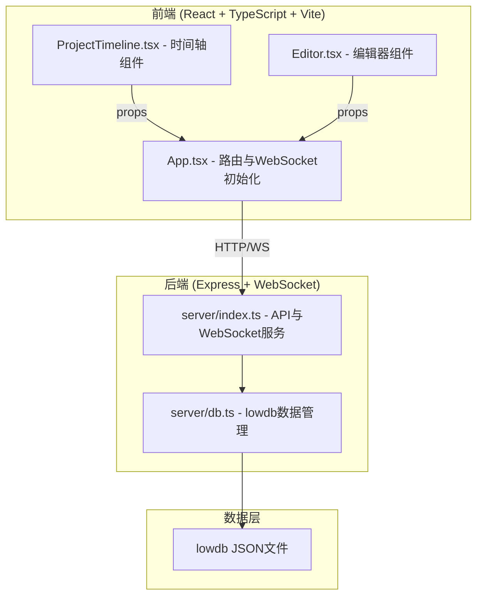
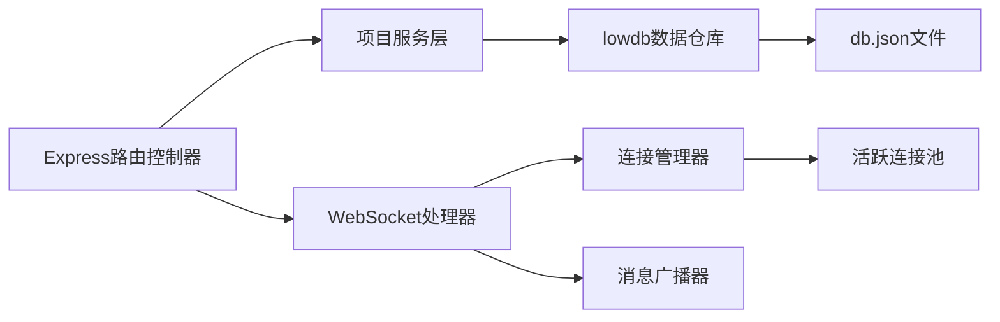
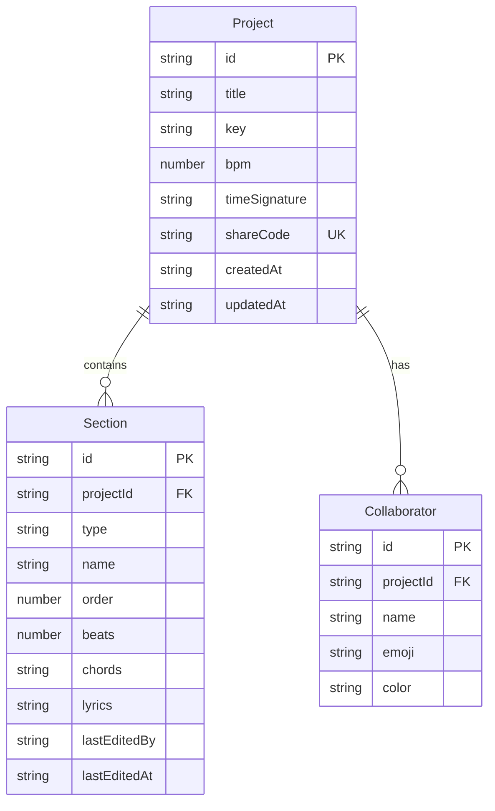

## 1. 架构设计



## 2. 技术说明

- 前端：React@18 + TypeScript + Vite + TailwindCSS
- 初始化工具：vite-init（react-express-ts 模板）
- 后端：Express@4 + ws（WebSocket）
- 数据库：lowdb（JSON文件存储）
- 实时通信：WebSocket（ws库）
- 状态管理：Zustand

## 3. 路由定义

| 路由 | 用途 |
|------|------|
| / | 首页，项目创建和加入 |
| /project/:id | 项目主页，时间轴+编辑器 |

## 4. API定义

### 4.1 TypeScript类型定义

```typescript
interface Project {
  id: string;
  title: string;
  key: string;
  bpm: number;
  timeSignature: string;
  shareCode: string;
  sections: Section[];
  collaborators: Collaborator[];
  createdAt: string;
  updatedAt: string;
}

interface Section {
  id: string;
  type: 'intro' | 'verse' | 'chorus' | 'bridge' | 'outro';
  name: string;
  order: number;
  beats: number;
  chords: string;
  lyrics: string;
  lastEditedBy: string | null;
  lastEditedAt: string | null;
}

interface Collaborator {
  id: string;
  name: string;
  emoji: string;
  color: string;
}

interface WsMessage {
  type: 'cursor' | 'edit' | 'select_section' | 'join' | 'leave' | 'save';
  projectId: string;
  userId: string;
  payload: any;
}
```

### 4.2 API端点

| 方法 | 路径 | 请求体 | 响应 | 用途 |
|------|------|--------|------|------|
| POST | /api/projects | { title, key, bpm, timeSignature } | { project, shareCode } | 创建项目 |
| GET | /api/projects/:id | - | { project } | 获取项目 |
| GET | /api/projects/share/:code | - | { project } | 通过分享码获取项目 |
| PUT | /api/projects/:id/sections | { sections } | { project } | 更新段落顺序/内容 |
| POST | /api/projects/:id/collaborators | { name, emoji } | { collaborator } | 添加协作者 |

### 4.3 WebSocket消息格式

| 类型 | 方向 | payload内容 |
|------|------|-------------|
| cursor | 客户端→服务端→广播 | { sectionId, position, selectionStart, selectionEnd } |
| edit | 客户端→服务端→广播 | { sectionId, field, value } |
| select_section | 客户端→服务端→广播 | { sectionId } |
| join | 客户端→服务端→广播 | { collaborator } |
| leave | 客户端→服务端→广播 | { userId } |
| save | 客户端→服务端 | { sectionId, chords, lyrics } |

## 5. 服务端架构图



## 6. 数据模型

### 6.1 数据模型定义



### 6.2 数据初始化

lowdb 初始化时创建默认数据结构：

```json
{
  "projects": [],
  "collaborators": []
}
```

项目创建时自动生成6位分享码和默认段落结构（前奏、主歌1、副歌、桥段、尾奏），每段预设4小节beats。
