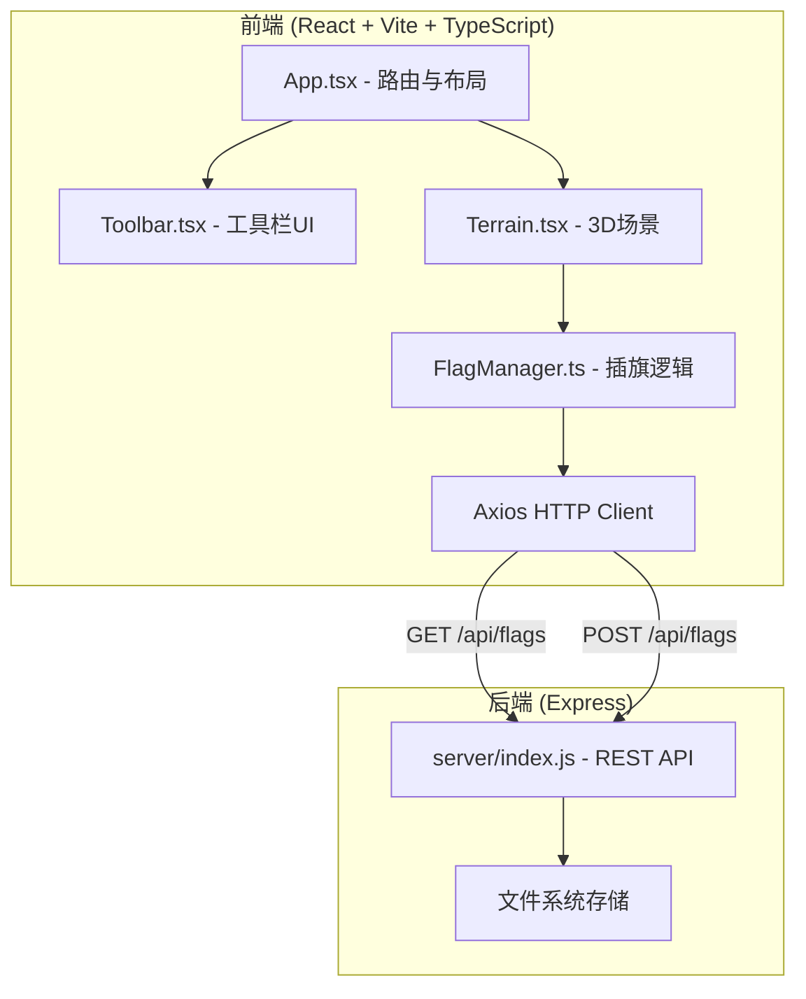
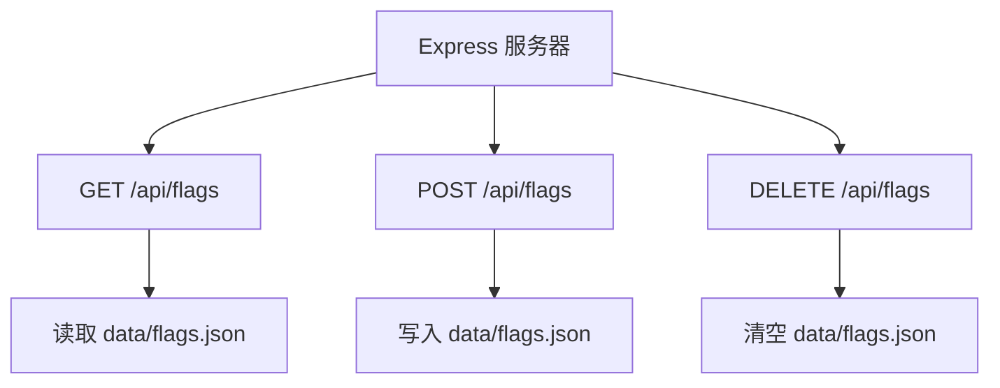
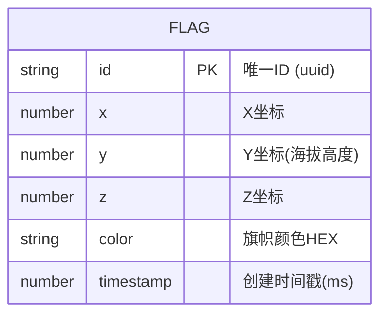

## 1. 架构设计



## 2. 技术选型说明

- **前端框架**：React@18 + TypeScript + Vite
- **3D渲染**：Three.js + @react-three/fiber + @react-three/drei
- **HTTP客户端**：axios
- **路由**：react-router-dom
- **后端框架**：Express@4 + cors
- **数据存储**：文件系统（JSON文件）
- **ID生成**：uuid
- **并行启动**：concurrently
- **构建工具**：Vite（配置/api代理到后端端口）

## 3. 路由定义

| 路由 | 用途 |
|-----|-----|
| / | 主沙盘页面 |

## 4. API 定义

### 4.1 GET /api/flags
获取所有旗子历史记录

**响应格式：**
```typescript
interface FlagData {
  id: string;
  x: number;
  y: number;
  z: number;
  color: string;
  timestamp: number;
}

type GetFlagsResponse = FlagData[];
```

### 4.2 POST /api/flags
保存一面旗子数据

**请求格式：**
```typescript
interface PostFlagRequest {
  x: number;
  y: number;
  z: number;
  color: string;
}
```

**响应格式：**
```typescript
interface PostFlagResponse {
  success: boolean;
  id: string;
  timestamp: number;
}
```

### 4.3 DELETE /api/flags
清空所有旗子数据

**响应格式：**
```typescript
interface ClearFlagsResponse {
  success: boolean;
  cleared: number;
}
```

## 5. 服务端架构



## 6. 数据模型

### 6.1 旗子数据模型



### 6.2 文件存储格式
`data/flags.json`:
```json
{
  "flags": [
    {
      "id": "uuid-string",
      "x": 1.23,
      "y": 0.45,
      "z": -2.67,
      "color": "#E53935",
      "timestamp": 1718280000000
    }
  ]
}
```

## 7. 核心技术实现要点

### 7.1 地形等高线渲染
- 使用自定义ShaderMaterial，在片段着色器中根据世界坐标Y值（海拔）计算等高线
- 使用fract函数和smoothstep实现平滑的线条效果

### 7.2 旗子呼吸光晕
- 使用useFrame钩子，每帧根据sin(time)更新旗子材质的emissiveIntensity和透明度
- 给旗子添加PointLight，光强随脉冲变化

### 7.3 截图导出
- 通过useThree钩子获取gl对象，使用gl.domElement.toDataURL()
- 确保WebGL上下文配置preserveDrawingBuffer: true

### 7.4 回放调度系统
- FlagManager中维护回放队列，根据旗子timestamp计算每面旗子应出现的相对时间
- 使用requestAnimationFrame或useFrame按时间进度逐条触发插旗动画

### 7.5 响应式布局
- 使用window.matchMedia监听横屏媒体查询
- CSS媒体查询 + resize事件动态调整工具栏宽度和字号
