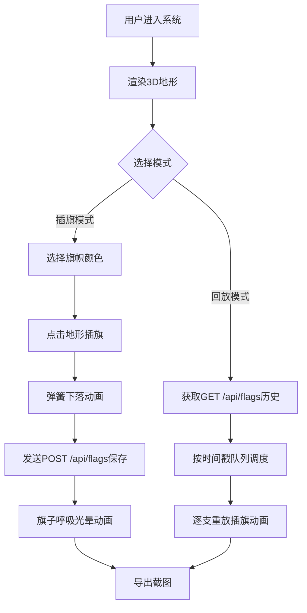

## 1. 产品概述

基于Web的交互式三维沙盘系统，用户可在低多边形风格的山地湖泊地形上插旗标记点位，支持插旗动画回放和截图导出。

- 面向需要地理标记、路径规划、战场推演等场景的用户群体，提供直观的3D交互体验
- 通过精美动画和响应式设计提升用户体验，支持PC与移动设备横屏使用

## 2. 核心功能

### 2.2 功能模块

1. **3D地形视图**：低多边形风格山地湖泊地形，海拔渐变色，等高线网格线
2. **插旗系统**：鼠标点击/拖拽旋转视角，点击地形插旗，弹簧下落动画，呼吸光晕效果
3. **回放系统**：按时间戳队列逐支重放插旗动画
4. **工具栏**：模式切换（插旗/回放）、颜色选择（5种预设色）、清空旗子、导出截图
5. **后端服务**：旗子数据持久化存储，提供REST API

### 2.3 页面详情

| 页面名称 | 模块名称 | 功能描述 |
|---------|---------|---------|
| 主页面 | 3D场景渲染 | Canvas承载Three.js地形渲染，支持OrbitControls视角控制 |
| 主页面 | 左侧工具栏 | 毛玻璃半透明悬浮工具栏，模式切换、颜色选择、清空、截图导出 |
| 主页面 | 地形系统 | 网格地形、海拔渐变着色、等高线线条渲染 |
| 主页面 | 旗子系统 | 旗子模型、弹簧下落动画、呼吸光晕脉冲 |
| 主页面 | 回放调度器 | 基于时间戳的队列调度，逐帧插入旗子动画 |

## 3. 核心流程

用户进入系统 → 查看3D沙盘地形 → 选择插旗模式 → 选择旗帜颜色 → 点击地形表面插旗 → 旗子弹簧下落动画 → 数据自动保存到后端 → 切换回放模式 → 逐支重放插旗动画 → 导出沙盘截图

## 4. 用户界面设计

### 4.1 设计风格

- **主色调**：青蓝（#1E88E5）与土黄（#D4A574）渐变冷暖对比
- **辅助色**：5种预设旗色 - 红色（#E53935）、蓝色（#1E88E5）、绿色（#43A047）、黄色（#FDD835）、紫色（#8E24AA）
- **工具栏**：毛玻璃半透明效果（backdrop-filter: blur(12px)），靠左悬浮
- **动画**：模式切换滑动过渡、旗子弹簧下落、呼吸光晕脉冲
- **字体**：现代无衬线字体，清晰可读

### 4.2 页面设计概览

| 页面名称 | 模块名称 | UI元素 |
|---------|---------|---------|
| 主页面 | 3D场景 | 低多边形地形、柔和光影、海拔渐变、等高线、旗子模型 |
| 主页面 | 工具栏 | 模式切换Tab、颜色选择按钮组、清空按钮、截图按钮、毛玻璃背景 |

### 4.3 响应式

- **桌面端优先**：全屏3D场景，左侧固定工具栏（宽240px）
- **手机横屏**：工具栏缩小为紧凑模式（宽160px），字体和图标缩小，避免遮挡场景
- **Resize事件监听**：动态调整Canvas尺寸和工具栏布局
- **触摸优化**：移动端支持双指缩放、单指旋转视角

### 4.4 3D场景指引

- **环境**：柔和环境光 + 方向光模拟日光，低多边形地形低面数
- **光照**：AmbientLight(0xffffff, 0.6) + DirectionalLight(0xfff5e6, 0.8) + 柔和阴影
- **相机**：PerspectiveCamera，初始距离15，俯视45度，OrbitControls阻尼
- **地形着色**：顶点着色器根据海拔高度插值青蓝→土黄→白色渐变
- **等高线**：根据海拔高度在片段着色器中绘制间隔线条，淡色半透明
- **旗子模型**：圆锥杆 + 平面旗帜，发光材质带脉冲动画
- **后处理**：可选抗锯齿，保持30fps以上性能
- **性能预算**：旗帜上限50面，地形网格分段64×64
