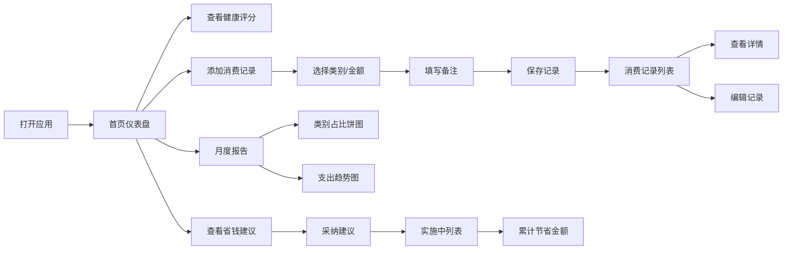

## 1. 产品概述

消费追踪与省钱建议应用是一款面向个人用户的财务管理工具，帮助用户记录日常消费、分析消费习惯，并提供个性化省钱建议。解决用户记账依赖手动回忆、消费类别混乱、缺乏数据分析发现浪费点的痛点。

- 目标用户：有记账需求、希望改善消费习惯的个人用户
- 核心价值：通过数据驱动的方式帮助用户发现消费问题，实现科学省钱

## 2. 核心功能

### 2.1 用户角色

| 角色 | 注册方式 | 核心权限 |
|------|----------|----------|
| 普通用户 | 无需注册，本地使用 | 添加消费记录、查看报告、采纳省钱建议 |

### 2.2 功能模块

1. **首页仪表盘**：消费健康评分、省钱建议卡片、消费概览数据
2. **消费记录页**：消费记录列表、添加/编辑消费表单、类别管理
3. **报告分析页**：月度消费报告、类别占比饼图、支出趋势折线图、健康评分

### 2.3 页面详情

| 页面名称 | 模块名称 | 功能描述 |
|----------|----------|----------|
| 首页仪表盘 | 健康评分圆环 | 动态圆环展示0-100分消费健康评分，颜色从红到绿渐变，数字滚动动画 |
| 首页仪表盘 | 省钱建议卡片 | 每周3条个性化建议，卡片从底部上滑切入，支持采纳/忽略操作 |
| 首页仪表盘 | 消费概览 | 本月总支出、各类别支出摘要数据展示 |
| 消费记录页 | 记录列表 | 时间倒序虚拟滚动列表，每条记录含类别图标、金额、备注预览 |
| 消费记录页 | 添加表单 | 支持快速选择常用类别和金额，自动填充带微动效，彩色标签展示类别 |
| 消费记录页 | 详情卡片 | 点击记录从右侧滑入详情，带弹性缓动动画，支持编辑操作 |
| 报告分析页 | 类别占比饼图 | 近30天各类别消费占比，点击扇形飞出详细列表，平滑伸展动画 |
| 报告分析页 | 支出趋势图 | 每日支出趋势折线图，平滑曲线，节点悬停高亮，x轴可滚动 |
| 报告分析页 | 每日摘要 | 每日凌晨生成消费摘要报告，含总支出和类别分析 |

## 3. 核心流程

### 3.1 主要用户流程

用户打开应用 → 查看首页仪表盘（健康评分、省钱建议）→ 添加消费记录（选择类别、输入金额、填写备注）→ 查看消费记录列表 → 查看月度报告（饼图、折线图）→ 采纳省钱建议 → 追踪节省金额

### 3.2 流程图

## 4. 用户界面设计

### 4.1 设计风格

- **主色调**：深蓝灰渐变背景（#1a1f2e → #0f1320），毛玻璃磨砂卡片（rgba(255,255,255,0.08)）
- **类别色**：餐饮红（#ef4444）、交通蓝（#3b82f6）、购物紫（#a855f7）、娱乐橙（#f97316）、其他灰（#6b7280）
- **强调色**：健康评分绿色（#10b981）、省钱金额金色（#eab308）
- **字体**：浅色文本（#f0f0f0），标题加粗，正文适中，数字使用等宽字体
- **按钮风格**：圆角按钮，毛玻璃效果，悬停微放大和发光效果
- **卡片风格**：半透明磨砂玻璃，背景模糊，圆角16px，微妙边框
- **布局风格**：响应式网格，移动端单列全宽，桌面端双列
- **图标风格**：简洁线性图标，与类别颜色对应

### 4.2 页面设计概览

| 页面名称 | 模块名称 | UI 元素 |
|----------|----------|---------|
| 首页仪表盘 | 健康评分圆环 | 渐变圆环、数字滚动动画、评分说明文字 |
| 首页仪表盘 | 省钱建议卡片 | 毛玻璃卡片、上滑入场动画、采纳/忽略按钮、预估节省金额 |
| 首页仪表盘 | 消费概览 | 数据卡片网格、类别图标、金额数字、趋势指示 |
| 消费记录页 | 记录列表 | 虚拟滚动、时间倒序、类别图标、金额、备注预览 |
| 消费记录页 | 添加表单 | 快速选择按钮、彩色类别标签、金额输入、备注输入、微动效 |
| 消费记录页 | 详情侧滑 | 右侧滑入、弹性缓动、完整备注、编辑按钮 |
| 报告分析页 | 饼图 | 平滑扇形展开、点击飞出详情、渐变色填充 |
| 报告分析页 | 折线图 | 平滑曲线、悬停高亮、可滚动x轴、渐变填充 |
| 报告分析页 | 数据摘要 | 统计卡片、类别占比、关键指标 |

### 4.3 响应式

- 采用桌面优先设计，移动端自适应
- 响应式断点：移动端（<768px）单列布局，桌面端（>=768px）双列网格
- 底部导航栏：移动端显示底部 Tab，桌面端显示顶部导航
- 图表自适应容器宽度，确保不同屏幕尺寸下显示正常
- 触控优化：按钮和可点击区域至少 44x44px，便于触摸操作

### 4.4 动画设计

- **页面切换**：淡入淡出 + 轻微位移
- **卡片入场**：从底部上滑，带 stagger 延迟
- **表单交互**：字段展开/收起的过渡动画
- **数据更新**：数字滚动动画、图表平滑过渡
- **详情展开**：右侧滑入 + 弹性缓动
- **悬停效果**：微放大、阴影加深、发光效果
