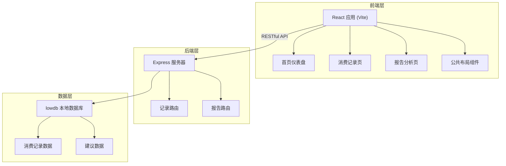
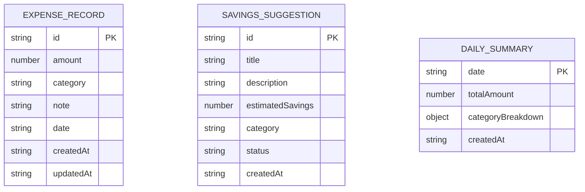

## 1. 架构设计



## 2. 技术说明

- **前端框架**: React 18 + TypeScript + Vite
- **状态管理**: React Hooks (useState, useContext, useReducer)
- **路由**: react-router-dom v6
- **UI 风格**: 毛玻璃风格卡片 + 深色主题 + CSS Modules / 自定义样式
- **图表库**: recharts
- **HTTP 客户端**: axios
- **工具库**: moment (日期处理), uuid (唯一ID生成)
- **后端框架**: Express 4
- **数据库**: lowdb (本地 JSON 数据库)
- **跨域**: cors
- **构建工具**: Vite
- **语言**: TypeScript (严格模式, ES2020)

## 3. 路由定义

| 前端路由 | 页面 | 说明 |
|----------|------|------|
| / | 首页仪表盘 | 健康评分、省钱建议、消费概览 |
| /records | 消费记录页 | 记录列表、添加/编辑表单 |
| /reports | 报告分析页 | 月度报告、图表分析 |

## 4. API 定义

### 4.1 消费记录 API

```typescript
// 消费记录类型
interface ExpenseRecord {
  id: string;
  amount: number;
  category: 'food' | 'transport' | 'shopping' | 'entertainment' | 'other';
  note: string;
  date: string; // ISO 日期格式
  createdAt: string;
  updatedAt: string;
}

// GET /api/records - 获取所有记录
interface GetRecordsResponse {
  records: ExpenseRecord[];
  total: number;
}

// GET /api/records/:id - 获取单条记录
interface GetRecordResponse {
  record: ExpenseRecord;
}

// POST /api/records - 添加记录
interface CreateRecordRequest {
  amount: number;
  category: string;
  note?: string;
  date?: string;
}
interface CreateRecordResponse {
  record: ExpenseRecord;
}

// PUT /api/records/:id - 更新记录
interface UpdateRecordRequest {
  amount?: number;
  category?: string;
  note?: string;
  date?: string;
}
interface UpdateRecordResponse {
  record: ExpenseRecord;
}

// DELETE /api/records/:id - 删除记录
interface DeleteRecordResponse {
  success: boolean;
}
```

### 4.2 报告 API

```typescript
// 类别统计
interface CategoryStats {
  category: string;
  amount: number;
  count: number;
  percentage: number;
}

// 每日支出
interface DailyExpense {
  date: string;
  amount: number;
}

// 健康评分
interface HealthScore {
  score: number;
  details: {
    category: string;
    deviation: number;
  }[];
}

// 省钱建议
interface SavingsSuggestion {
  id: string;
  title: string;
  description: string;
  estimatedSavings: number;
  category: string;
  status: 'pending' | 'adopted' | 'ignored';
  createdAt: string;
}

// GET /api/reports/summary - 获取报告摘要
interface ReportSummaryResponse {
  totalExpense: number;
  categoryStats: CategoryStats[];
  dailyExpenses: DailyExpense[];
  healthScore: HealthScore;
  period: string;
}

// GET /api/reports/suggestions - 获取省钱建议
interface SuggestionsResponse {
  suggestions: SavingsSuggestion[];
}

// POST /api/reports/suggestions/:id/adopt - 采纳建议
interface AdoptSuggestionResponse {
  suggestion: SavingsSuggestion;
  totalSavings: number;
}

// POST /api/reports/suggestions/:id/ignore - 忽略建议
interface IgnoreSuggestionResponse {
  suggestion: SavingsSuggestion;
}

// GET /api/reports/savings - 获取累计节省金额
interface SavingsResponse {
  totalSavings: number;
  adoptedSuggestions: SavingsSuggestion[];
}
```

## 5. 服务器架构图

```mermaid
graph LR
    A["客户端"] -->|"HTTP 请求| B["Express 服务器"]
    B --> C["CORS 中间件"]
    C --> D["静态文件服务"]
    C --> E["API 路由"]
    E --> F["records 路由"]
    E --> G["reports 路由"]
    F --> H["lowdb 数据库"]
    G --> H
    H --> I["db.json"]
```

## 6. 数据模型

### 6.1 数据模型定义



### 6.2 数据库结构 (db.json 结构

```json
{
  "records": [
    {
      "id": "uuid",
      "amount": 25.5,
      "category": "food",
      "note": "午餐",
      "date": "2024-01-15",
      "createdAt": "2024-01-15T08:30:00Z",
      "updatedAt": "2024-01-15T08:30:00Z"
    }
  ],
  "suggestions": [
    {
      "id": "uuid",
      "title": "减少奶茶消费",
      "description": "上周奶茶消费偏高，减少购买可节省50元",
      "estimatedSavings": 50,
      "category": "food",
      "status": "pending",
      "createdAt": "2024-01-15T00:00:00Z"
    }
  ],
  "dailySummaries": [
    {
      "date": "2024-01-15",
      "totalAmount": 128.5,
      "categoryBreakdown": {
        "food": 45,
        "transport": 15,
        "shopping": 68.5
      },
      "createdAt": "2024-01-16T00:00:00Z"
    }
  ],
  "budgets": {
    "food": 2000,
    "transport": 500,
    "shopping": 1500,
    "entertainment": 800,
    "other": 500
  }
}
```

### 6.3 初始化数据

- 预置 6.3.1 类别配置
  - 餐饮 (food): 红色 #ef4444
  - 交通 (transport): 蓝色 #3b82f6
  - 购物 (shopping): 紫色 #a855f7
  - 娱乐 (entertainment): 橙色 #f97316
  - 其他 (other): 灰色 #6b7280

- 预置 6.3.2 默认预算
  - 餐饮: 2000元/月
  - 交通: 500元/月
  - 购物: 1500元/月
  - 娱乐: 800元/月
  - 其他: 500元/月
