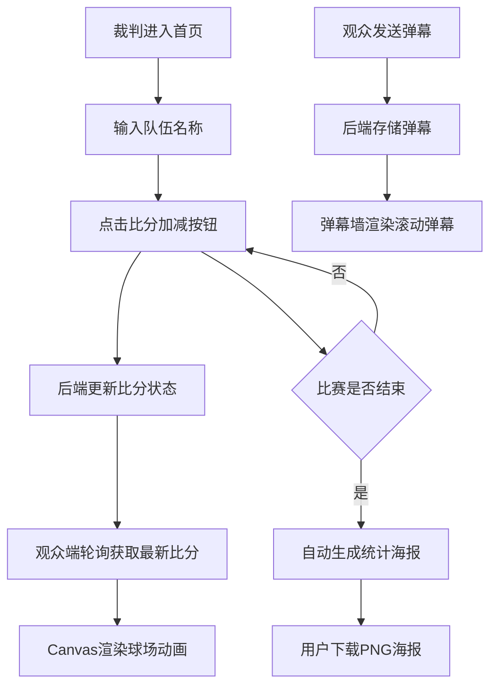

## 1. 产品概述
线上Mini羽毛球比赛计分与直播互动平台，支持裁判实时控制比赛比分、观众在线观看球场动画直播并发送弹幕互动，赛后自动生成精美比赛统计海报供用户下载。

- 主要解决：业余羽毛球比赛缺乏便捷的数字化计分、直播互动和纪念性统计的痛点
- 目标用户：羽毛球爱好者、小型赛事组织者、观赛观众
- 产品价值：提供沉浸式、互动性强的线上羽毛球比赛体验，留存比赛精彩瞬间

## 2. 核心功能

### 2.1 用户角色
| 角色 | 进入方式 | 核心权限 |
|------|----------|----------|
| 裁判 | 访问首页 `/` | 输入队伍名称、控制比分加减、查看比赛状态、生成海报 |
| 观众 | 访问 `/audience` | 观看实时球场动画、查看比分、发送弹幕助威 |

### 2.2 功能模块
1. **裁判页面**：队伍名称编辑、计分控制板、局分与总比分展示、比赛结束海报
2. **观众页面**：实时比分展示、Canvas球场动画、弹幕墙、弹幕发送
3. **后端服务**：比分状态存储、弹幕列表管理、REST API接口
4. **海报生成**：比赛结束后自动生成统计海报、支持PNG下载

### 2.3 页面详情
| 页面名称 | 模块名称 | 功能描述 |
|-----------|-------------|---------------------|
| 裁判页面 | 计分板 | 主队/客队名称输入、比分加减按钮（加弹动/减红抖）、脉搏呼吸发光、数字缩放弹跳动画 |
| 裁判页面 | 局分面板 | 三局两胜制、当前局数标记、每局小分记录、局间淡入翻转过渡 |
| 裁判页面 | 海报展示 | 比赛结束后自动生成、双方名字/最终比分/每局详情/比赛时长/金色徽章、中心放大动画、PNG下载 |
| 观众页面 | 实时比分 | 轮询后端API（每2秒刷新）、右侧显示当前比分 |
| 观众页面 | 球场Canvas | 绿色场地白色边线、羽毛球抛物线飞行+拖尾粒子、得分散开光点、30fps+帧率 |
| 观众页面 | 弹幕墙 | 彩色文字从右向左滚动、轻微上下浮动、离屏Canvas优化、底部输入框发送 |

## 3. 核心流程
裁判在首页设置队伍名称，通过加减按钮控制比分。后端存储比分状态并通过API提供给观众端轮询。观众端根据比分数据驱动Canvas球场动画，观众发送弹幕实时显示在弹幕墙上。比赛结束后，裁判端自动生成统计海报，用户可一键下载PNG。

## 4. 用户界面设计

### 4.1 设计风格
- 主题配色：深蓝（#0A1A3D）主色 + 明黄（#FFD700）强调色
- 计分板：深蓝底 + 金色文字
- 按钮：明黄色 + 悬停加深效果
- 卡片：圆角（16px）+ 柔和阴影
- 字体：现代无衬线字体，数字使用等宽字体增强视觉效果

### 4.2 页面设计概述
| 页面名称 | 模块名称 | UI元素 |
|-----------|-------------|-------------|
| 裁判页面 | 计分板 | 深蓝背景卡片、金色大字体比分、明黄加减按钮、脉搏发光边框动画 |
| 裁判页面 | 局分面板 | 三格小卡片标记各局比分、当前局高亮、局间3D翻转动画 |
| 裁判页面 | 海报 | 居中弹窗、中心缩放出现、金色渐变徽章+旋转光芒、下载按钮 |
| 观众页面 | 比分面板 | 右侧固定、深蓝卡片、金色数字、实时更新闪烁 |
| 观众页面 | 球场Canvas | 居中展示、绿色场地、白色边界线、羽毛球带拖尾 |
| 观众页面 | 弹幕墙 | 覆盖屏幕上方、彩色滚动文字、底部输入框+发送按钮 |

### 4.3 响应式
- 桌面端：多栏布局，计分板横向排布
- 移动端：计分板变窄纵向排列，按钮尺寸保留可点击区域（≥44px）
- 触控优化：移动端按钮增大点击热区

