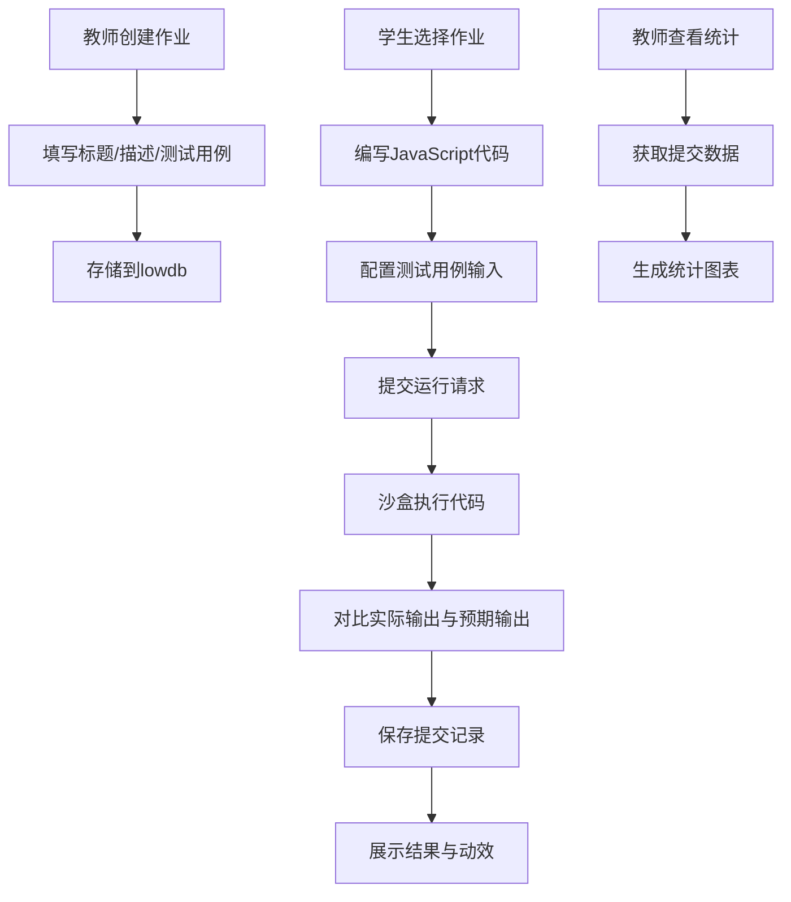

## 1. 产品概述

编程作业在线批改与反馈平台，解决在线教育场景中学生编程作业缺少即时自动化反馈的痛点。学生可提交JavaScript代码并通过预置测试用例自动校验，教师可创建作业集并查看班级提交统计分析。

- 核心价值：提供即时、客观的代码运行反馈，降低教师批改负担，提升学生学习效率
- 目标用户：编程课程教师、学习编程的学生

## 2. 核心功能

### 2.1 用户角色

| 角色 | 核心权限 |
|------|----------|
| 教师 | 创建作业、查看提交统计、成绩分布图 |
| 学生 | 提交代码运行、查看历史记录、获取即时反馈 |

### 2.2 功能模块

1. **教师仪表盘**：作业列表管理、提交统计看板、测试用例通过率图表
2. **学生提交页**：代码编辑器、测试用例配置、运行结果展示
3. **结果展示组件**：测试用例逐条反馈、通过/失败动效、总分统计
4. **历史记录**：提交记录侧边栏、历史详情回看

### 2.3 页面详情

| 页面名称 | 模块名称 | 功能描述 |
|-----------|-------------|---------------------|
| 教师仪表盘 | 作业列表 | 展示所有作业、点击查看统计、支持创建新作业 |
| 教师仪表盘 | 统计看板 | 总提交次数、平均通过率、最高/最低分、柱状图 |
| 学生提交页 | 代码编辑区 | Monaco编辑器、VS Code暗色主题、语法高亮 |
| 学生提交页 | 测试用例区 | 输入/预期输出配置、默认加载作业预置用例 |
| 学生提交页 | 结果展示区 | 逐行反馈、通过/失败动效、运行时长、总分 |
| 历史记录 | 侧边栏 | 滑入动画、模糊背景遮罩、历史提交列表 |

## 3. 核心流程

## 4. 用户界面设计

### 4.1 设计风格
- **主背景**：深蓝 #0a0f1a
- **强调色1**：青色 #00f0ff（导航下划线、按钮、链接）
- **强调色2**：亮紫 #c084fc（原#9b59b6调整为更高对比度版本）
- **通过状态**：绿色 #10b981（带微光效果）
- **失败状态**：红色 #ef4444（带闪烁边框）
- **字体**：系统默认等宽字体
- **整体风格**：赛博朋克明暗结合、科技感、发光效果

### 4.2 页面设计概述

| 页面名称 | 模块名称 | UI元素 |
|-----------|-------------|-------------|
| 教师仪表盘 | 作业列表 | 卡片式布局、悬停发光、点击展开 |
| 教师仪表盘 | 统计图表 | Chart.js柱状图、淡入动画、悬停高亮、数值标签 |
| 学生提交页 | 代码编辑区 | 深色背景、语法高亮、行号、垂直分割 |
| 学生提交页 | 测试用例表 | 圆角边框、悬停发光、可编辑输入框 |
| 结果展示区 | 反馈行 | 渐变背景、弹跳/抖动动画、图标状态 |
| 历史侧边栏 | 记录列表 | 滑入动画、模糊遮罩、时间戳显示 |

### 4.3 响应式
- **桌面端（1366px+）**：左右分栏，左侧导航固定，右侧主内容
- **平板端（768px）**：上下结构，导航变为顶部水平布局
- **组件过渡**：淡入上滑动画、透明度过渡 200ms ease-in-out

### 4.4 动画效果
- 页面加载：主内容区淡入上滑
- 导航选中：青色下划线滑动动画
- 通过用例：绿色对勾弹性弹跳
- 失败用例：红色叉号轻微抖动
- 失败行：边框轻微闪烁
- 柱状图：淡入动画、悬停高亮
- 历史侧边栏：滑入 + 背景模糊
