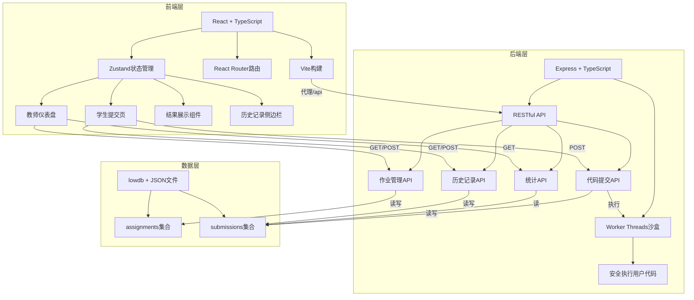
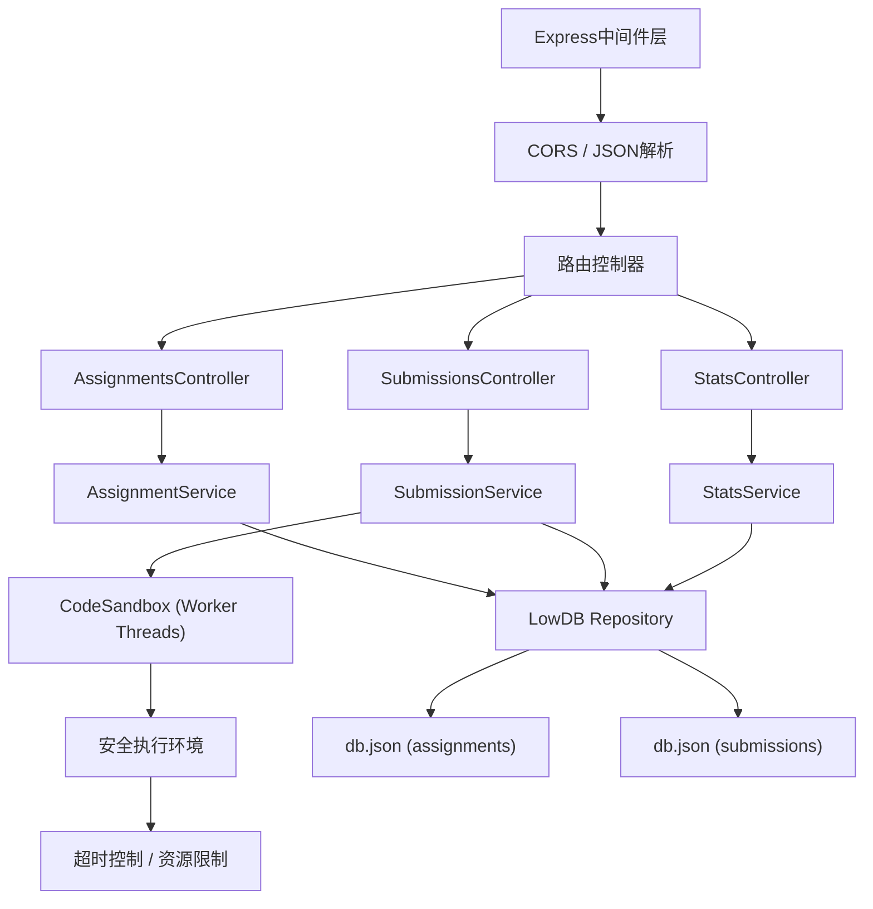
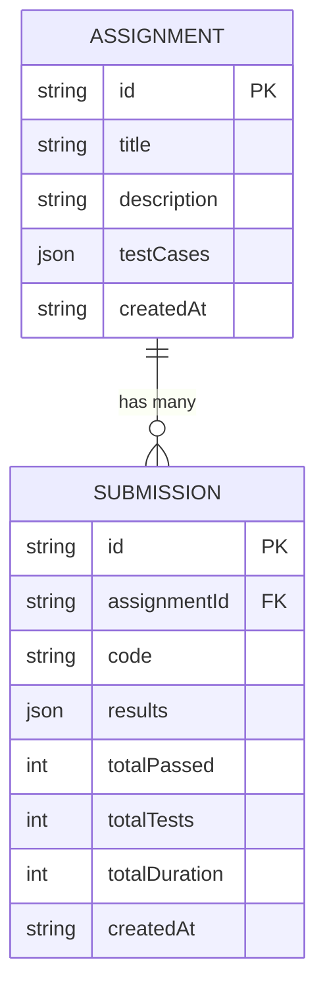

## 1. 架构设计



## 2. 技术描述

- **前端**：React@18 + TypeScript + Vite + React Router + Zustand + TailwindCSS
- **后端**：Express@4 + TypeScript + Worker Threads（代码沙盒）
- **数据库**：lowdb（本地JSON文件持久化）
- **代码编辑器**：@monaco-editor/react
- **图表**：chart.js + react-chartjs-2
- **HTTP客户端**：axios
- **启动工具**：concurrently（一键启动前后端）

## 3. 路由定义

| 路由 | 用途 |
|-------|---------|
| / | 根路由，重定向到/student |
| /student | 学生提交代码页面 |
| /teacher | 教师仪表盘页面 |
| /teacher/assignments/:id | 作业统计详情页 |

## 4. API 定义

```typescript
// 类型定义
interface TestCase {
  input: string;
  expected: string;
}

interface Assignment {
  id: string;
  title: string;
  description: string;
  testCases: TestCase[];
  createdAt: string;
}

interface TestResult {
  input: string;
  expected: string;
  actual: string;
  passed: boolean;
  duration: number;
}

interface Submission {
  id: string;
  assignmentId: string;
  code: string;
  results: TestResult[];
  totalPassed: number;
  totalTests: number;
  totalDuration: number;
  createdAt: string;
}

interface AssignmentStats {
  assignmentId: string;
  totalSubmissions: number;
  avgPassRate: number;
  highestScore: number;
  lowestScore: number;
  testCaseStats: { testIndex: number; passRate: number }[];
}

// 请求/响应
GET /api/assignments → Assignment[]
POST /api/assignments → { title, description, testCases } → Assignment
GET /api/assignments/:id/stats → AssignmentStats
POST /api/assignments/:id/submit → { code, testCases? } → Submission
GET /api/assignments/:id/history → Submission[]
```

## 5. 服务器架构图



## 6. 数据模型

### 6.1 数据模型定义



### 6.2 数据库初始化数据

```json
{
  "assignments": [
    {
      "id": "1",
      "title": "两数之和",
      "description": "实现一个函数，接收两个数字参数，返回它们的和。",
      "testCases": [
        { "input": "1, 2", "expected": "3" },
        { "input": "-1, 1", "expected": "0" },
        { "input": "100, 200", "expected": "300" }
      ],
      "createdAt": "2026-06-14T00:00:00.000Z"
    },
    {
      "id": "2",
      "title": "数组最大值",
      "description": "实现一个函数，找出数组中的最大值。",
      "testCases": [
        { "input": "[1, 3, 5, 2, 4]", "expected": "5" },
        { "input": "[-1, -5, -3]", "expected": "-1" },
        { "input": "[42]", "expected": "42" }
      ],
      "createdAt": "2026-06-14T00:00:00.000Z"
    }
  ],
  "submissions": []
}
```

## 7. 关键技术决策

### 7.1 代码沙盒方案：Worker Threads 替代 vm2
- vm2 已废弃且存在安全漏洞
- 使用 Node.js 内置 `worker_threads` 模块创建隔离执行环境
- 配合 `vm` 模块和严格的上下文隔离
- 增加超时控制（默认 2000ms）和内存限制
- 禁止访问 `require`、`process`、`fs` 等危险 API

### 7.2 配色调整
- 原紫色 #9b59b6 → 亮紫 #c084fc，提升与深蓝背景 #0a0f1a 的对比度
- 青色 #00f0ff 保持不变，用于主要交互元素
- 通过 WCAG AA 对比度标准验证

### 7.3 构建与启动
- 使用 Vite 作为前端构建工具，配置 `/api` 代理到后端
- 使用 concurrently 实现 `npm run dev` 一键启动前后端
- 前后端分别配置独立的 TypeScript 编译选项
