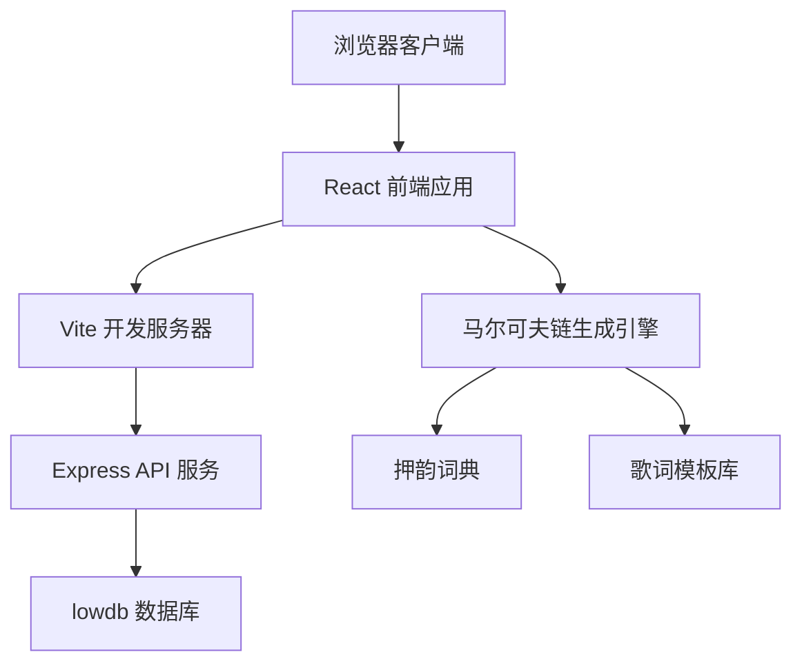
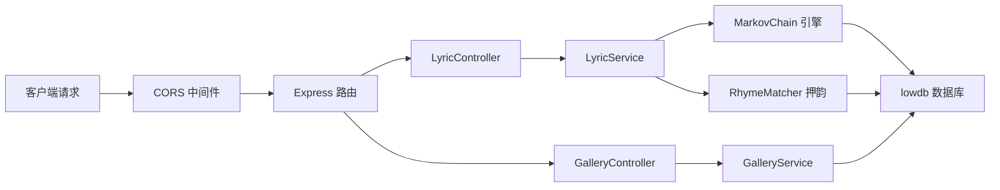
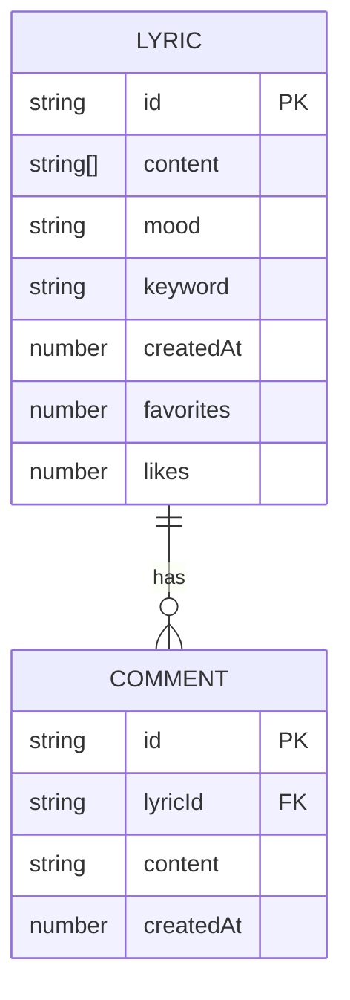

## 1. 架构设计



## 2. 技术描述

- **前端**：React@18 + TypeScript + Vite@5 + TailwindCSS@3 + Zustand
- **后端**：Express@4 + TypeScript
- **数据库**：lowdb（本地JSON文件存储）
- **HTTP客户端**：axios
- **图标**：lucide-react
- **路由**：react-router-dom@6

## 3. 路由定义

| 路由 | 页面 | 说明 |
|-------|---------|------|
| / | LyricGenerator | 创作首页 + 歌词生成展示 |
| /gallery | Gallery | 集锦广场 |

## 4. API 定义

```typescript
// 歌词数据模型
interface Lyric {
  id: string;
  content: string[];
  mood: 'happy' | 'sad' | 'romantic' | 'passionate';
  keyword: string;
  createdAt: number;
  favorites: number;
  likes: number;
  comments: Comment[];
  isFavorite?: boolean;
}

interface Comment {
  id: string;
  content: string;
  createdAt: number;
}

interface GenerateRequest {
  keyword: string;
  mood: 'happy' | 'sad' | 'romantic' | 'passionate';
}

// API Endpoints
// POST /api/lyric/generate - 生成歌词
// 请求: GenerateRequest
// 响应: { success: boolean; data: Lyric }

// POST /api/lyric/:id/favorite - 收藏歌词
// 响应: { success: boolean; favorites: number }

// POST /api/lyric/:id/like - 点赞歌词
// 响应: { success: boolean; likes: number }

// POST /api/lyric/:id/comment - 添加评论
// 请求: { content: string }
// 响应: { success: boolean; data: Comment }

// GET /api/gallery - 获取歌词列表
// 参数: mood?, search?, page?, limit?
// 响应: { success: boolean; data: Lyric[]; total: number }

// GET /api/lyric/:id - 获取歌词详情
// 响应: { success: boolean; data: Lyric }
```

## 5. 服务器架构图



## 6. 数据模型

### 6.1 数据模型定义



### 6.2 数据库初始化

lowdb 数据结构 (db.json):

```json
{
  "lyrics": [],
  "templates": {
    "happy": [],
    "sad": [],
    "romantic": [],
    "passionate": []
  },
  "rhymes": {}
}
```

## 7. 项目结构

```
auto64/
├── package.json
├── vite.config.ts
├── tsconfig.json
├── index.html
├── src/
│   ├── App.tsx
│   ├── main.tsx
│   ├── index.css
│   ├── LyricGenerator.tsx
│   ├── Gallery.tsx
│   ├── lyricEngine.ts
│   ├── components/
│   │   ├── ParticleBackground.tsx
│   │   ├── MoodButton.tsx
│   │   ├── LyricDisplay.tsx
│   │   ├── SpectrumVisualizer.tsx
│   │   ├── LyricCard.tsx
│   │   └── Modal.tsx
│   ├── hooks/
│   │   ├── useParticleSystem.ts
│   │   └── useTypewriter.ts
│   ├── utils/
│   │   ├── api.ts
│   │   └── rhymes.ts
│   └── store/
│       └── useLyricStore.ts
└── server/
    ├── index.ts
    ├── controllers/
    ├── services/
    └── data/
        └── db.json
```
