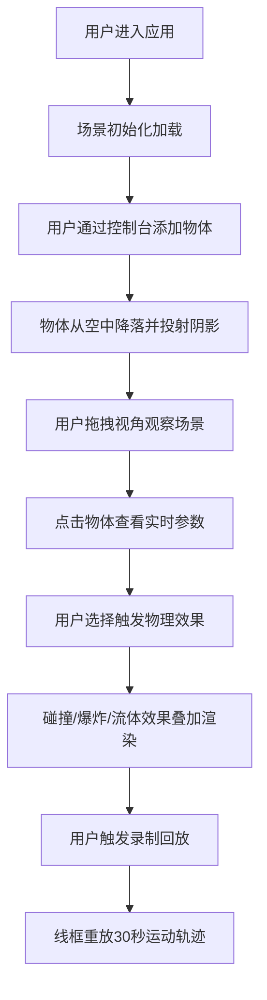

## 1. 产品概述

3D沙盒物理模拟应用，面向物理教学场景和游戏开发者预览，提供直观可交互的3D物体碰撞、爆炸和流体扩散演示体验。

- 核心目标：解决传统物理教学缺乏直观交互演示、游戏物理效果预览不便的问题
- 目标用户：物理教师、学生、游戏开发者、物理爱好者
- 产品价值：通过实时可交互的3D物理模拟，降低物理概念理解门槛，提升学习与开发效率

## 2. 核心功能

### 2.1 功能模块

1. **3D场景交互**：视角旋转、平移、缩放控制，物体选中高亮
2. **物理体配置**：添加立方体/球体/圆柱体，配置位置、质量、弹性、颜色
3. **物理效果系统**：碰撞反弹、爆炸冲击、流体模拟三种可叠加效果
4. **实时参数面板**：选中物体显示速度、动量、位置等实时物理数据
5. **控制台**：物体添加表单、重置场景、效果切换、录制回放
6. **录制回放**：记录30秒物体运动路径，线框模式重放

### 2.2 页面详情

| 页面名称 | 模块名称 | 功能描述 |
|---------|---------|---------|
| 主界面 | 3D场景 | 深空色渐变背景、半透明网格地面、物体实时渲染、阴影投射 |
| 主界面 | 参数面板 | 毛玻璃效果、实时数据显示、微小数据跳动动画 |
| 主界面 | 底部控制台 | 添加物体表单、效果切换按钮、重置按钮、录制回放按钮 |

## 3. 核心流程

## 4. 用户界面设计

### 4.1 设计风格
- **主色调**：深空蓝渐变（#0a0e27 → #1a0a2e），紫黑色背景
- **点缀色**：霓虹青（#00f5ff）、霓虹紫（#a855f7）、暖橙（#f97316）
- **按钮风格**：圆角磨砂玻璃，悬停光晕，点击按压动画
- **字体**：Space Mono（标题等宽）、IBM Plex Sans（正文）
- **布局风格**：全屏沉浸式3D场景 + 底部悬浮控制台
- **图标风格**：Lucide线性图标，2px线宽

### 4.2 页面设计概述

| 页面名称 | 模块名称 | UI元素 |
|---------|---------|---------|
| 主界面 | 3D场景 | 深空渐变背景、半透明网格地面、PBR高光塑料材质物体、环境光反射、阴影 |
| 主界面 | 参数面板 | 半透明毛玻璃（backdrop-blur）、青色边框高亮、数据微跳动效 |
| 主界面 | 控制台 | 磨砂玻璃底栏（bg-opacity-60 + backdrop-blur-xl）、发光按钮、线性图标 |

### 4.3 响应式
- 桌面优先设计，适配1920×1080及以上宽屏
- 最小适配1280×720分辨率
- 按钮和控制面板自适应窗口宽度

### 4.4 3D场景指引
- **环境**：深空色渐变背景，无HDRI，程序化渐变+轻微噪点
- **光照**：主方向光（投射阴影）+ 半球光（蓝紫色基调）+ 点光补光
- **相机**：PerspectiveCamera，OrbitControls支持阻尼旋转
- **构图**：物体集中在场景中央，地面网格提供空间参照
- **交互**：点击选中物体高亮，拖拽旋转视角，滚轮缩放
- **后处理**：Bloom发光效果（物体高亮时）、轻微色彩分级
- **性能预算**：实时物体≤20个，粒子≤200个，帧率≥25fps
