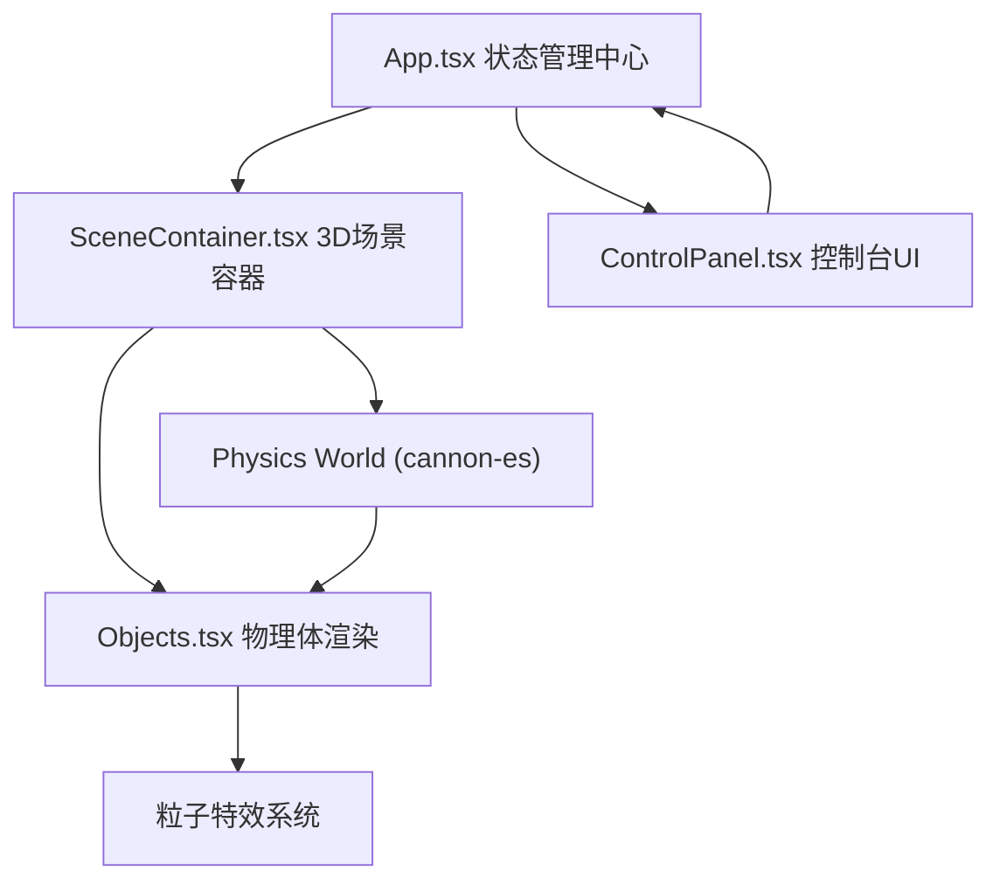

## 1. 架构设计



## 2. 技术描述

- **前端框架**：React 18 + TypeScript（严格模式）
- **构建工具**：Vite 5
- **3D渲染**：Three.js + @react-three/fiber + @react-three/drei
- **物理引擎**：cannon-es（通过@react-three/cannon封装）
- **样式方案**：TailwindCSS 3 + 原生CSS（渐变、动画）
- **状态管理**：React useState/useRef（轻量级）+ zustand（物理状态）
- **图标库**：lucide-react
- **ID生成**：uuid

## 3. 核心数据模型

### 3.1 物理体数据结构

```typescript
interface PhysicsBody {
  id: string;
  type: 'box' | 'sphere' | 'cylinder';
  position: [number, number, number];
  initialPosition: [number, number, number];
  mass: number;
  restitution: number;
  color: { h: number; s: number; l: number };
  velocity?: [number, number, number];
  momentum?: number;
}
```

### 3.2 物理效果状态

```typescript
interface EffectState {
  collision: boolean;
  explosion: boolean;
  fluid: boolean;
  explosionCenter?: [number, number, number];
  explosionForce?: number;
}
```

### 3.3 录制数据结构

```typescript
interface RecordingFrame {
  timestamp: number;
  bodies: { id: string; position: [number, number, number] }[];
}
```

## 4. 文件结构

```
src/
├── App.tsx                 # 主应用，状态管理，UI布局
├── main.tsx               # 入口文件
├── index.css              # 全局样式，Tailwind导入
├── scene/
│   ├── SceneContainer.tsx # 3D场景容器，物理世界，相机控制
│   ├── Objects.tsx        # 物理体组件（立方体/球体/圆柱）
│   ├── Particles.tsx      # 粒子特效系统
│   ├── Ground.tsx         # 半透明网格地面
│   └── SelectedPanel.tsx  # 物体选中参数面板
└── ui/
    ├── ControlPanel.tsx   # 底部控制台
    ├── AddObjectForm.tsx  # 添加物体表单
    ├── EffectButtons.tsx  # 效果切换按钮组
    └── HSLPicker.tsx      # HSL颜色选择器
```

## 5. 数据流向

1. **App.tsx** 维护全局状态：物体列表、选中物体ID、效果开关、录制状态
2. **ControlPanel.tsx** 用户操作 → 调用App的setter更新状态
3. **SceneContainer.tsx** 从App接收物体列表 → 通过@react-three/cannon渲染物理体
4. **Objects.tsx** 接收单个物体配置 → 创建Cannon物理体 → useFrame动画循环
5. **物体选中**：点击事件冒泡 → 更新App.selectedId → SelectedPanel显示实时数据
6. **效果触发**：ControlPanel切换效果 → App.effectState更新 → SceneContainer执行物理逻辑
7. **录制回放**：useFrame记录帧 → 回放模式下线框渲染历史轨迹
