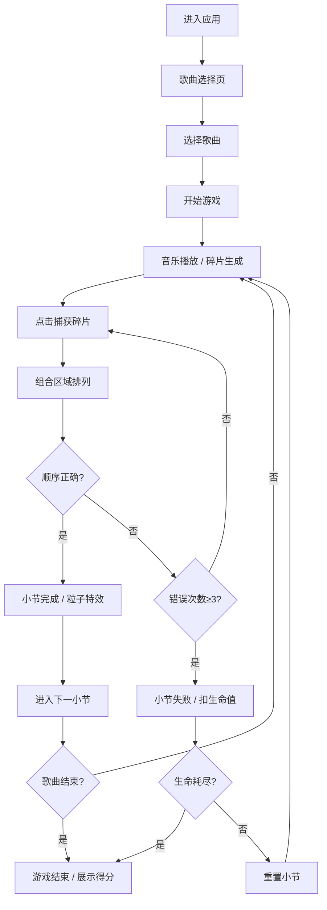

## 1. 产品概述

一款融合音乐节奏与文字解谜的跨界游戏应用，玩家在音乐播放过程中点击悬浮的文字碎片，按正确顺序组合成歌词片段，完成整首歌曲的拼图。

- 主要目的：将音乐欣赏与文字解谜结合，提供沉浸式的互动体验
- 目标用户：音乐爱好者、休闲游戏玩家

## 2. 核心功能

### 2.1 用户角色

| 角色 | 注册方式 | 核心权限 |
|------|----------|----------|
| 玩家 | 无需注册 | 选择歌曲、进行游戏、查看得分 |

### 2.2 功能模块

1. **歌曲选择页**：歌曲卡片展示、歌曲信息预览、开始游戏
2. **游戏主页面**：音乐播放控制、文字碎片舞台、组合区域、得分与状态栏

### 2.3 页面详情

| 页面名称 | 模块名称 | 功能描述 |
|----------|----------|----------|
| 歌曲选择页 | 歌曲卡片列表 | 水平滑动卡片展示，封面渐变色、歌名、歌手名，选中放大动效 |
| 游戏主页面 | 音乐播放器 | 歌曲加载、播放/暂停、进度条、歌曲信息 |
| 游戏主页面 | 文字碎片舞台 | 随机生成歌词碎片，动态大小颜色随音乐节奏动态变化，漂浮动画 |
| 游戏主页面 | 组合区域 | 捕获碎片按顺序排列，可移回舞台，正确匹配时粒子特效 |
| 游戏主页面 | 状态栏 | 生命值（心形）、环形进度条、得分展示 |
| 游戏主页面 | 游戏结束面板 | 最终得分、数字滚动动画、重新开始 |

## 3. 核心流程

玩家进入应用 → 选择歌曲 → 开始游戏 → 音乐播放，碎片出现 → 点击捕获碎片 → 组合歌词 → 完成小节 → 进入下一段 → 完成整首歌 → 展示得分

## 4. 用户界面设计

### 4.1 设计风格

- **主色调**：深蓝至暗紫径向渐变背景，营造星空氛围
- **辅助色**：蓝色光晕、白色发光文字、五彩粒子特效
- **按钮风格**：毛玻璃半透明效果，边缘光晕
- **字体**：现代无衬线字体，发光效果
- **布局风格**：中央舞台区域，顶部状态栏，底部组合区
- **图标风格**：心形生命值图标，发光效果

### 4.2 页面设计概览

| 页面名称 | 模块名称 | UI 元素 |
|----------|----------|----------|
| 歌曲选择页 | 歌曲卡片 | 渐变封面、歌名、歌手、选中放大动效、水平滑动 |
| 游戏主页面 | 星空背景 | Canvas 闪烁星星粒子、深蓝暗紫径向渐变 |
| 游戏主页面 | 文字碎片 | 发光白色字体、蓝色光晕、大小颜色随音乐变化、漂浮动画 |
| 游戏主页面 | 组合区域 | 半透明毛玻璃长条、边缘光晕 |
| 游戏主页面 | 状态栏 | 心形生命值、环形进度条、得分数字上跳动效 |
| 游戏主页面 | 游戏结束 | 数字滚动动画、低沉失败音效、重新开始按钮 |

### 4.3 响应式设计

- 桌面端优先设计
- 移动端通过媒体查询调整碎片大小和间距
- 触控优化，确保点击区域足够大

### 4.4 动画与动效

- 碎片漂浮动画（正弦波动、旋转、摇摆）
- 点击回弹放大动画
- 粒子爆炸粒子特效
- 屏幕抖动效果
- 心形碎裂消失动画
- 得分数字上跳动效
- 数字滚动计数动画
