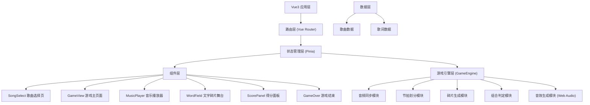

## 1. 架构设计



## 2. 技术说明

- **前端框架**：Vue 3 + TypeScript
- **构建工具**：Vite
- **路由管理**：Vue Router
- **状态管理**：Pinia
- **音频处理**：Howler.js（音频播放）+ Web Audio API（节拍分析、音效生成）
- **动画**：requestAnimationFrame + CSS 动画 + GPU 动画
- **视觉效果**：Canvas（星空背景、粒子特效）

## 3. 路由定义

| 路由 | 页面 | 用途 |
|------|------|------|
| / | SongSelect | 歌曲选择页，展示歌曲卡片列表 |
| /game/:songId | GameView | 游戏主页面，核心游戏玩法 |

## 4. 数据模型

### 4.1 歌曲数据模型

```typescript
interface Song {
  id: string;
  title: string;
  artist: string;
  genre: 'pop' | 'folk' | 'electronic';
  coverGradient: string;
  audioUrl: string;
  duration: number;
  sections: Section[];
}

interface Section {
  id: number;
  startTime: number;
  endTime: number;
  lyrics: string[];
  beats: Beat[];
}

interface Beat {
  time: number;
  volume: number;
  pitch: number;
}
```

### 4.2 游戏状态模型

```typescript
interface GameState {
  currentSong: Song | null;
  currentSection: number;
  score: number;
  combo: number;
  lives: number;
  isPlaying: boolean;
  isPaused: boolean;
  capturedWords: string[];
  errorCount: number;
  gameStatus: 'idle' | 'playing' | 'paused' | 'success' | 'failed' | 'gameover';
}
```

### 4.3 碎片数据模型

```typescript
interface WordFragment {
  id: string;
  text: string;
  x: number;
  y: number;
  targetX: number;
  targetY: number;
  size: number;
  color: string;
  opacity: number;
  rotation: number;
  animationType: 'sine' | 'rotate' | 'sway';
  animationOffset: number;
  captured: boolean;
  beatIndex: number;
}
```

## 5. 文件结构

```
src/
├── main.ts              # 应用入口
├── App.vue              # 根组件
├── router/
│   └── index.ts         # 路由配置
├── stores/
│   └── gameStore.ts       # Pinia 状态管理
├── game/
│   └── GameEngine.ts    # 游戏核心引擎
├── components/
│   ├── MusicPlayer.vue   # 音乐播放器组件
│   ├── WordField.vue   # 文字碎片舞台组件
│   ├── ScorePanel.vue   # 得分面板组件
│   ├── SongCard.vue      # 歌曲卡片组件
│   └── GameOver.vue      # 游戏结束组件
├── views/
│   ├── SongSelect.vue    # 歌曲选择页
│   └── GameView.vue      # 游戏主页面
├── data/
│   └── songs.ts          # 歌曲数据
├── types/
│   └── index.ts          # 类型定义
└── assets/
    └── styles/
        └── global.css    # 全局样式
```

## 6. 性能优化

- 使用 requestAnimationFrame 驱动动画
- 启用 GPU 加速（transform 和 opacity）
- 碎片数量峰值不超过 30 个
- 避免布局抖动
- Canvas 星空背景独立渲染
- 事件委托处理碎片点击
- 帧率不低于 45fps
