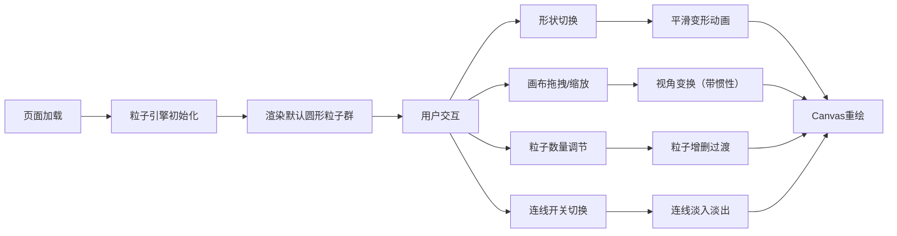

## 1. 产品概述

基于Canvas的交互式粒子形状变形工具，通过粒子系统实现复杂的形状变形动画和交互效果，解决传统CSS动画难以实现的复杂路径运动和形状变形问题。

- 主要用途：网页动画性能优化演示、交互式数据可视化、创意动画展示
- 目标用户：前端开发者、动画设计师、创意编程爱好者
- 产品价值：提供高性能、可交互的粒子动画解决方案，展示Canvas动画的性能优势

## 2. 核心功能

### 2.1 用户角色

| 角色 | 注册方式 | 核心权限 |
|------|----------|----------|
| 普通用户 | 无需注册 | 体验所有交互功能，调整参数 |

### 2.2 功能模块

1. **主界面**：Canvas画布区域、底部控制栏
2. **形状变形系统**：圆形、心形、星形三种预设形状平滑切换
3. **交互反馈系统**：鼠标拖拽平移缩放、悬停粒子高亮、惯性效果
4. **粒子控制系统**：粒子数量动态调节、新增/删除粒子过渡动画
5. **连线效果系统**：KD树优化邻近查找、连线淡入淡出、颜色混合

### 2.3 页面详情

| 页面名称 | 模块名称 | 功能描述 |
|----------|----------|----------|
| 主界面 | Canvas画布 | 渲染粒子系统、支持鼠标交互（平移、缩放、悬停） |
| 主界面 | 形状切换按钮 | 点击切换圆形/心形/星形，带选中动画效果 |
| 主界面 | 粒子数量滑块 | 范围50-500，步长50，动态调节粒子数量 |
| 主界面 | 连线开关 | 控制粒子间连线显示，带淡入淡出动画 |

## 3. 核心流程

用户打开页面 → 粒子群以默认形状（圆形）呈现 → 用户点击形状按钮切换形状 → 粒子群平滑变形到目标形状 → 用户拖拽画布平移/缩放 → 用户悬停粒子查看高亮效果 → 用户调整粒子数量 → 用户切换连线开关

## 4. 用户界面设计

### 4.1 设计风格
- **主色调**：深色背景 #0d1117，配合蓝色系（圆形）、粉色系（心形）、金色系（星形）
- **按钮风格**：圆角矩形，毛玻璃效果，选中时下划线从中间向两侧扩展动画
- **字体**：使用现代无衬线字体，如 'Inter' 或系统无衬线字体
- **布局风格**：全屏Canvas为主，底部悬浮控制栏，无多余边框
- **视觉效果**：粒子微光效果，连线渐变透明度，整体科技感深色主题

### 4.2 页面设计概述

| 页面名称 | 模块名称 | UI元素 |
|----------|----------|----------|
| 主界面 | Canvas画布 | 深色背景，粒子动画，连线效果，悬停高亮光晕 |
| 主界面 | 底部控制栏 | backdrop-filter: blur(12px)，半透明背景，圆角设计 |
| 主界面 | 形状按钮 | 圆形/心形/星形图标，选中状态下划线动画 |
| 主界面 | 滑块控件 | 圆角轨道，自定义滑块样式，数值显示 |
| 主界面 | 开关控件 | iOS风格开关，平滑过渡动画 |

### 4.3 响应式设计
- Desktop-first设计，适配主流桌面分辨率（1280px+）
- Canvas画布自适应窗口大小，保持最小70%高度
- 控制栏在小屏幕下自动换行，保持可访问性
- 触摸设备支持双指缩放和拖拽

## 5. 性能约束
- 粒子数量500且连线开启时，帧率不低于25fps
- 粒子数量50且连线关闭时，帧率不低于45fps
- 所有交互延迟低于50ms
