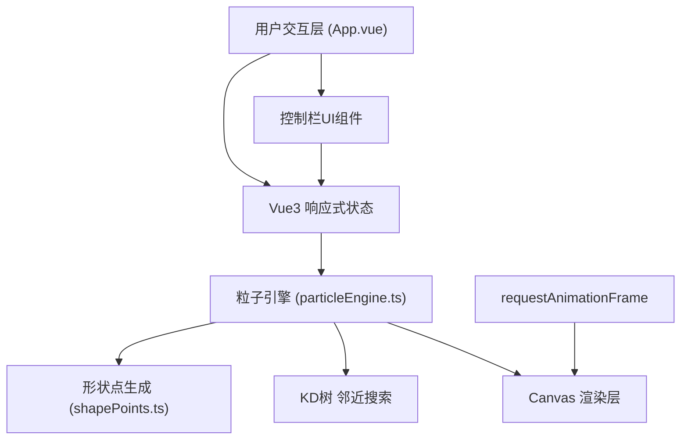

## 1. 架构设计



## 2. 技术描述

- **前端框架**: Vue@3.4 + TypeScript@5.0
- **构建工具**: Vite@5.0
- **状态管理**: Pinia@2.1
- **路由**: vue-router@4.2
- **渲染技术**: HTML5 Canvas 2D API
- **性能优化**: KD树空间索引、requestAnimationFrame、对象池模式

## 3. 目录结构与调用关系

### 3.1 文件结构

```
auto67/
├── package.json              # 项目依赖与脚本
├── vite.config.ts            # Vite构建配置
├── tsconfig.json             # TypeScript配置
├── index.html                # 入口HTML
└── src/
    ├── main.ts               # Vue应用入口
    ├── App.vue               # 主界面组件
    ├── shapePoints.ts        # 形状点坐标生成工具
    ├── particleEngine.ts     # 粒子引擎核心模块
    └── stores/
        └── particleStore.ts  # Pinia状态管理（可选）
```

### 3.2 调用关系与数据流向

1. **index.html** → 加载 **src/main.ts**
2. **src/main.ts** → 创建Vue应用，挂载App.vue，初始化粒子引擎
3. **src/App.vue** →
   - 渲染Canvas画布和控制栏
   - 监听用户交互事件（点击、拖拽、滑块、开关）
   - 调用 particleEngine 控制粒子状态
   - 通过 requestAnimationFrame 驱动渲染循环
   - 数据流向：用户交互 → 状态更新 → 引擎更新 → Canvas重绘
4. **src/particleEngine.ts** →
   - 定义Particle类（位置、速度、目标位置、颜色）
   - 引用 shapePoints.ts 生成目标形状点集
   - 实现形状变形算法（ease-in-out插值 + 随机抖动）
   - 实现HSL颜色插值
   - 实现KD树邻近查找（连线优化）
   - 数据流向：接收目标形状点集 → 计算插值 → 更新粒子 → 返回新数组
5. **src/shapePoints.ts** →
   - 导出圆形、心形、星形点坐标生成函数
   - 供 particleEngine.ts 引用

## 4. 核心数据结构

### 4.1 Particle 类

```typescript
interface Particle {
  id: number;
  x: number;           // 当前位置X
  y: number;           // 当前位置Y
  vx: number;          // 速度X
  vy: number;          // 速度Y
  targetX: number;     // 目标位置X
  targetY: number;     // 目标位置Y
  startX: number;      // 起始位置X（用于插值）
  startY: number;      // 起始位置Y（用于插值）
  color: HSLColor;     // 当前颜色
  targetColor: HSLColor; // 目标颜色
  startColor: HSLColor;  // 起始颜色
  size: number;        // 粒子大小
  progress: number;    // 变形进度 0-1
  isRemoving: boolean; // 是否正在被删除
  isAdding: boolean;   // 是否正在被添加
  addProgress: number; // 添加动画进度
  removeProgress: number; // 删除动画进度
}

interface HSLColor {
  h: number;  // 色相 0-360
  s: number;  // 饱和度 0-100
  l: number;  // 亮度 0-100
}
```

### 4.2 ShapeType 枚举

```typescript
type ShapeType = 'circle' | 'heart' | 'star';
```

### 4.3 形状对应颜色

- Circle: 蓝色系 HSL(210, 80, 60)
- Heart: 粉色系 HSL(340, 80, 65)
- Star: 金色系 HSL(45, 90, 60)

## 5. 核心算法

### 5.1 形状点生成算法

- **圆形**: 极坐标均匀分布 `(r * cosθ, r * sinθ)`
- **心形**: 心形参数方程 `x = 16sin³θ, y = 13cosθ - 5cos2θ - 2cos3θ - cos4θ`
- **星形**: 星形多边形顶点 + 边缘均匀采样

### 5.2 缓动函数 (Ease-in-out)

```typescript
function easeInOut(t: number): number {
  return t < 0.5 ? 4 * t * t * t : 1 - Math.pow(-2 * t + 2, 3) / 2;
}
```

### 5.3 KD树邻近搜索

- 每帧重建KD树（或增量更新）
- 对每个粒子查询最近的3个邻居
- 时间复杂度 O(n log n) 构建，O(log n) 查询

### 5.4 HSL颜色插值

- 对H/S/L三个分量分别进行线性插值
- 色相插值考虑最短角度路径

## 6. 性能优化策略

1. **空间分区**: KD树优化邻近粒子查找，避免O(n²)复杂度
2. **对象池**: 粒子对象复用，减少GC压力
3. **离屏Canvas**: （可选）静态背景预渲染
4. **帧率自适应**: 动态调整粒子数量或连线精度
5. **批量绘制**: 连线使用Path批量绘制，减少drawCall

## 7. 性能指标

- 500粒子 + 连线开启: ≥25fps
- 50粒子 + 连线关闭: ≥45fps
- 交互响应延迟: <50ms
- 变形动画时长: 1.5秒
- 粒子增删过渡: 0.3秒
- 连线淡入淡出: 0.2秒
