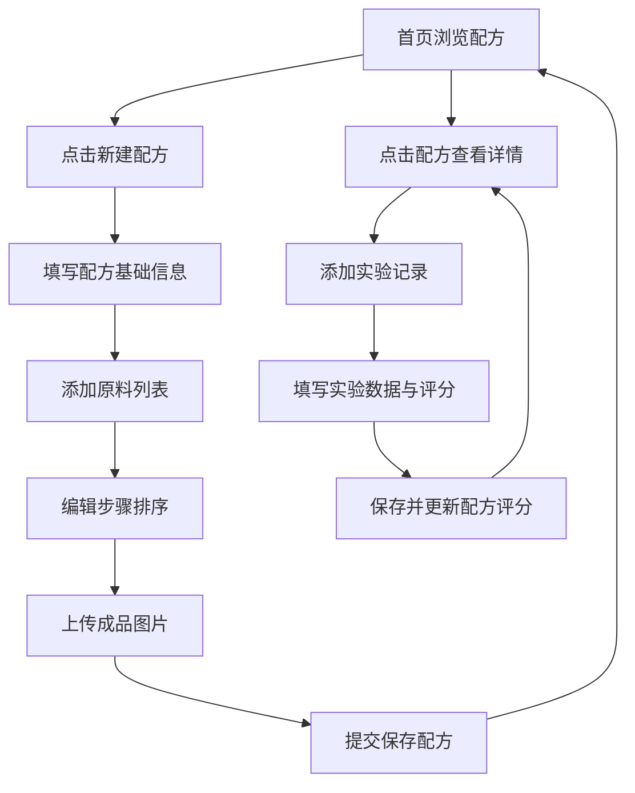

## 1. 产品概述

烘焙日志应用是一款专为个人烘焙爱好者设计的配方管理与实验记录工具，解决纸质配方易丢失、实验调整无记录、难以从多次尝试中总结经验的痛点。

- 目标用户：家庭烘焙爱好者、手工烘焙从业者
- 核心价值：数字化配方管理 + 实验迭代记录 + 经验沉淀总结

## 2. 核心功能

### 2.1 用户角色
| 角色 | 注册方式 | 核心权限 |
|------|----------|----------|
| 普通用户 | 本地使用，无需注册 | 配方CRUD、实验记录管理、图片上传 |

### 2.2 功能模块
1. **首页**：配方卡网格展示、分类筛选、最新评分显示
2. **新建配方页**：配方信息填写、原料动态增删、步骤拖拽排序、成品图片上传
3. **配方详情/实验记录**：实验记录流水、星级评分、备注标签管理

### 2.3 页面详情
| 页面名称 | 模块名称 | 功能描述 |
|----------|----------|----------|
| 首页 | 导航栏 | 毛玻璃效果、悬停下划线动画、页面跳转 |
| 首页 | 配方卡网格 | 卡片悬停阴影上浮、类别色带标识、交错淡入动画 |
| 首页 | 配方卡片 | 显示名称、类别、最新评分、成品预览图 |
| 新建配方页 | 配方基础信息 | 名称、类别选择（彩色标签）、烤箱型号 |
| 新建配方页 | 原料列表 | 动态增删行、平滑展开收起动画 |
| 新建配方页 | 步骤列表 | 有序列表、拖拽排序、半透明阴影跟随 |
| 新建配方页 | 成品品相 | 文字描述、最多三张图片上传、裁剪预览压缩 |
| 实验记录页 | 记录流水 | 按时间倒序展示、环境温湿度、修改描述 |
| 实验记录页 | 星级评分 | 1-5星、悬停放大、点击填充动画 |
| 实验记录页 | 备注标签 | 回车添加、圆角药丸样式、删除缩放动画 |

## 3. 核心流程

用户打开应用 → 在首页浏览配方卡片 → 点击新建配方 → 填写配方信息（基础信息/原料/步骤/成品）→ 提交保存 → 返回首页查看新配方 → 点击配方查看详情 → 添加实验记录 → 填写实验数据和评分 → 保存后配方评分自动更新

## 4. 用户界面设计

### 4.1 设计风格
- **主色调**：暖橙色 #e67e22、柔粉色 #e8a87c
- **背景色**：浅灰白色 #f5f3ef
- **类别色带**：面包橙、蛋糕粉、饼干绿、其他紫
- **按钮风格**：圆角 10px，点击缩放回弹效果（scale 1.1 → 1.0）
- **卡片风格**：浅暖色渐变（米白到淡黄），悬停阴影加深微上浮
- **导航栏**：毛玻璃效果 backdrop-filter: blur(8px)，半透明白色背景
- **字体**：使用系统无衬线字体栈，清晰易读
- **动画**：交错淡入上滑（duration: 0.4s, easing: cubic-bezier(0.25, 0.1, 0.25, 1)）

### 4.2 页面设计概览
| 页面名称 | 模块名称 | UI 元素 |
|----------|----------|---------|
| 首页 | 导航栏 | 毛玻璃、彩色下滑线、悬停动画 |
| 首页 | 配方卡网格 | 响应式布局、卡片渐变、类别色带、评分星星 |
| 新建配方页 | 表单 | 分组卡片式表单、输入框圆角、标签彩色 |
| 新建配方页 | 原料列表 | 动态行、平滑展开收起、删除按钮 |
| 新建配方页 | 步骤列表 | 拖拽手柄、半透明拖拽阴影、淡出效果 |
| 实验记录页 | 记录流水 | 时间线布局、环境数据展示、评分星星 |
| 实验记录页 | 标签系统 | 药丸形状标签、回车添加、缩放删除动画 |

### 4.3 响应式
- 桌面端（1440px+）：多列网格布局
- 平板端：两列布局
- 移动端（320px+）：单列布局，导航简化
- 触摸优化：按钮最小 44px 点击区域

### 4.4 动效设计
- 卡片进入视口：交错淡入上滑动画
- 按钮点击：scale 1.1 → 1.0 回弹
- 导航悬停：底部彩色下划线滑入
- 评分星星：悬停放大、点击填充
- 列表增删：平滑展开收起、透明度过渡
- 拖拽排序：半透明阴影跟随、原位置淡出
- 数字评分更新：滚动过渡动画
- 标签删除：缩放消失动画
