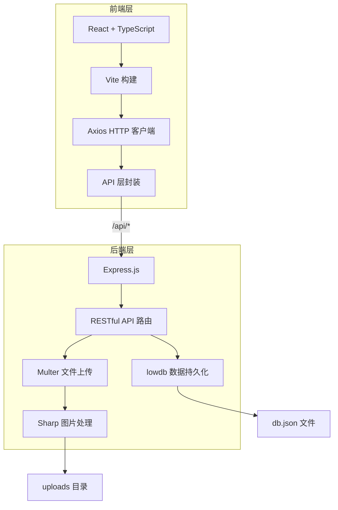
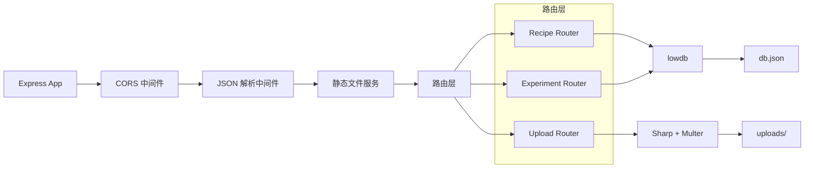
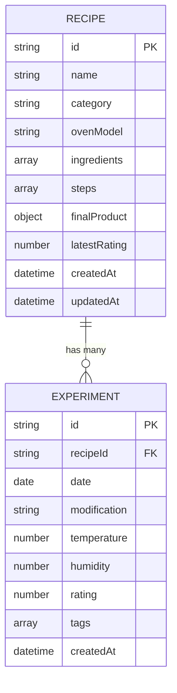

## 1. 架构设计



## 2. 技术栈描述

- **前端框架**：React 18 + TypeScript（严格模式）
- **构建工具**：Vite 5
- **路由管理**：react-router-dom 6
- **HTTP 客户端**：Axios
- **样式方案**：CSS Modules / 内联样式（使用 CSS 变量）
- **拖拽库**：原生 HTML5 拖拽 API（或 react-beautiful-dnd）
- **后端框架**：Express 4
- **数据库**：lowdb（基于 JSON 文件）
- **文件上传**：Multer
- **图片处理**：Sharp（裁剪、压缩）
- **唯一ID**：uuid
- **跨域**：cors

## 3. 路由定义

| 前端路由 | 页面 | 用途 |
|----------|------|------|
| `/` | 首页 | 配方卡网格展示 |
| `/create` | 新建配方页 | 创建新配方表单 |
| `/recipe/:id` | 配方详情页 | 查看配方详情与实验记录 |

## 4. API 定义

### 4.1 配方 API

| 方法 | 路径 | 描述 |
|------|------|------|
| GET | `/api/recipes` | 获取所有配方列表 |
| GET | `/api/recipes/:id` | 获取单个配方详情 |
| POST | `/api/recipes` | 创建新配方 |
| PUT | `/api/recipes/:id` | 更新配方 |
| DELETE | `/api/recipes/:id` | 删除配方 |

### 4.2 实验记录 API

| 方法 | 路径 | 描述 |
|------|------|------|
| GET | `/api/recipes/:recipeId/experiments` | 获取配方的所有实验记录 |
| POST | `/api/recipes/:recipeId/experiments` | 添加实验记录 |
| PUT | `/api/experiments/:id` | 更新实验记录 |
| DELETE | `/api/experiments/:id` | 删除实验记录 |

### 4.3 文件上传 API

| 方法 | 路径 | 描述 |
|------|------|------|
| POST | `/api/upload` | 上传图片（自动压缩裁剪） |

### 4.4 TypeScript 类型定义

```typescript
// 配方类别
type RecipeCategory = 'bread' | 'cake' | 'cookie' | 'other';

// 原料
interface Ingredient {
  id: string;
  name: string;
  amount: number;
  unit: string;
}

// 步骤
interface Step {
  id: string;
  description: string;
  order: number;
}

// 成品品相
interface FinalProduct {
  description: string;
  images: string[];
}

// 配方
interface Recipe {
  id: string;
  name: string;
  category: RecipeCategory;
  ovenModel: string;
  ingredients: Ingredient[];
  steps: Step[];
  finalProduct: FinalProduct;
  latestRating: number;
  createdAt: string;
  updatedAt: string;
}

// 实验记录
interface Experiment {
  id: string;
  recipeId: string;
  date: string;
  modification: string;
  temperature: number;
  humidity: number;
  rating: number;
  tags: string[];
  createdAt: string;
}
```

## 5. 服务端架构



## 6. 数据模型

### 6.1 数据模型 ER 图



### 6.2 数据文件结构

```json
{
  "recipes": [
    {
      "id": "uuid",
      "name": "配方名称",
      "category": "bread",
      "ovenModel": "烤箱型号",
      "ingredients": [
        { "id": "uuid", "name": "面粉", "amount": 250, "unit": "g" }
      ],
      "steps": [
        { "id": "uuid", "description": "步骤描述", "order": 1 }
      ],
      "finalProduct": {
        "description": "成品描述",
        "images": ["image-url-1", "image-url-2"]
      },
      "latestRating": 4.5,
      "createdAt": "2024-01-01T00:00:00.000Z",
      "updatedAt": "2024-01-01T00:00:00.000Z"
    }
  ],
  "experiments": [
    {
      "id": "uuid",
      "recipeId": "recipe-uuid",
      "date": "2024-01-01",
      "modification": "修改描述",
      "temperature": 25,
      "humidity": 60,
      "rating": 4,
      "tags": ["标签1", "标签2"],
      "createdAt": "2024-01-01T00:00:00.000Z"
    }
  ]
}
```

## 7. 项目文件结构

```
auto68/
├── package.json
├── vite.config.ts
├── tsconfig.json
├── index.html
├── src/
│   ├── types.ts          # 类型定义
│   ├── api.ts            # API 封装
│   ├── App.tsx           # 根组件
│   ├── main.tsx          # 入口文件
│   ├── components/
│   │   ├── RecipeCard.tsx      # 配方卡组件
│   │   ├── ExperimentLog.tsx   # 实验记录组件
│   │   └── Navbar.tsx          # 导航栏组件
│   └── pages/
│       ├── HomePage.tsx            # 首页
│       ├── CreateRecipePage.tsx    # 新建配方页
│       └── RecipeDetailPage.tsx    # 配方详情页
├── server/
│   ├── index.ts     # Express 服务端
│   └── db.json      # lowdb 数据文件
└── uploads/         # 上传图片目录
```

## 8. 性能要求

- 用户交互响应延迟：低于 150ms
- CRUD 操作响应时间（localhost）：不超过 300ms
- 图片上传：前端压缩后再上传，减少传输时间
- 动画：使用 CSS transform 和 opacity，确保 60fps
