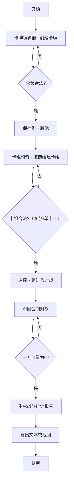

## 1. 产品概述
卡牌游戏设计与对战模拟应用，面向卡牌游戏爱好者，解决实体卡牌测试成本高、平衡性难以验证的问题。用户可设计自定义卡牌、组建卡组并与AI进行模拟对战。
- 核心价值：让卡牌游戏设计师在无需印刷实体卡牌的情况下快速迭代设计并验证平衡性
- 目标用户：桌面卡牌游戏（TCG/CCG）爱好者、独立游戏设计师

## 2. 核心特性

### 2.1 功能模块
1. **卡牌编辑器**：创建卡牌、设置属性、选择装饰边框和图标、实时翻转预览、属性合法性校验
2. **卡牌池管理**：保存最多50张自定义卡牌、搜索筛选、删除
3. **卡组构筑**：组建30张卡组（每张最多2张）、拖拽操作、实时数量提示、费用曲线图表
4. **AI对战**：回合制自动对战、1x/2x/4x倍速、战斗日志面板、伤害动画
5. **战斗统计**：对战结束报告、卡组构成、使用次数、总伤害、费用利用率、文本导出

### 2.2 页面详情
| 页面名称 | 模块名称 | 功能描述 |
|-----------|-------------|---------------------|
| 卡牌编辑器 | 左侧预览区 | 3D翻转卡牌预览，正反面切换动画 |
| 卡牌编辑器 | 右侧属性区 | 名称/稀有度/费用/攻击/生命表单输入，表单验证 |
| 卡牌编辑器 | 图案选择区 | 预设边框和图标库，点击选择 |
| 卡牌池 | 卡牌网格 | 展示所有卡牌，搜索框，稀有度筛选，删除按钮 |
| 卡组构筑 | 卡牌池网格 | 可拖拽卡牌加入卡组 |
| 卡组构筑 | 卡组区域 | 显示已选卡牌及数量，最多30张，单卡最多2张 |
| 卡组构筑 | 费用曲线 | 动态柱状图显示各费用卡牌数量分布 |
| 对战界面 | AI区域（上） | AI手牌（背面）、AI战场、AI血量与费用 |
| 对战界面 | 中央战场 | 随从交错排列，攻击冲刺动画，伤害数字弹出 |
| 对战界面 | 玩家区域（下） | 玩家手牌、玩家战场、玩家血量与费用 |
| 对战界面 | 日志面板 | 右下角可折叠，按时间戳逐行显示，逐字打印效果 |
| 对战界面 | 速度控制 | 1x/2x/4x倍速切换按钮 |
| 战斗报告 | 统计面板 | 双方卡组构成、使用次数、总伤害、回合费用效率 |
| 战斗报告 | 导出功能 | 将报告导出为文本文件 |

## 3. 核心流程

用户主要流程：
1. 用户进入卡牌编辑器，创建卡牌并保存到卡牌池
2. 用户进入卡组构筑，从卡牌池中拖拽卡牌组建30张卡组
3. 用户进入对战界面，选择自己的卡组，与AI预设卡组对战
4. 对战以回合制自动进行，用户可调节速度查看过程
5. 对战结束后展示统计报告，可导出为文本

## 4. 用户界面设计

### 4.1 设计风格
- **深色幻想风格**：主背景 `#1a1a2e`，卡片面板背景 `#16213e`
- **稀有度辉光**：普通(白)、稀有(蓝)、史诗(紫)、传说(橙) 不同颜色边框发光动画
- **字体**：标题使用 Cinzel（古典衬线），正文使用 Noto Sans SC
- **按钮风格**：悬停放大 `transform: scale(1.05)` + `box-shadow` 渐变
- **卡牌比例**：经典CCG黄金比例（约 5:7）
- **图标**：SVG 色块清晰，深色背景高对比

### 4.2 页面设计概述
| 页面名称 | 模块名称 | UI元素 |
|-----------|-------------|-------------|
| 卡牌编辑器 | 预览区 | 3D翻转卡片、透视阴影、正反面切换按钮 |
| 卡牌编辑器 | 属性区 | 表单输入、下拉选择、实时校验提示、保存按钮 |
| 卡牌池 | 网格区 | 响应式网格卡片、悬停放大、搜索/筛选栏 |
| 卡组构筑 | 双栏布局 | 左侧卡牌池网格、右侧卡组列表、底部费用柱状图 |
| 对战界面 | 三区布局 | 上(AI)/中(战场)/下(玩家)、半透明手牌边缘、伤害弹出动画 |
| 对战界面 | 日志面板 | 可折叠、时间戳、逐字打印效果、操作类型背景色区分 |
| 战斗报告 | 统计面板 | 分栏展示、数据高亮、导出按钮 |

### 4.3 响应式设计
- 桌面优先，宽度 960px 以下自动切换为垂直堆叠布局
- 拖拽操作支持触屏手势（touch 事件）
- 按钮最小尺寸 44x44px 适配触屏
