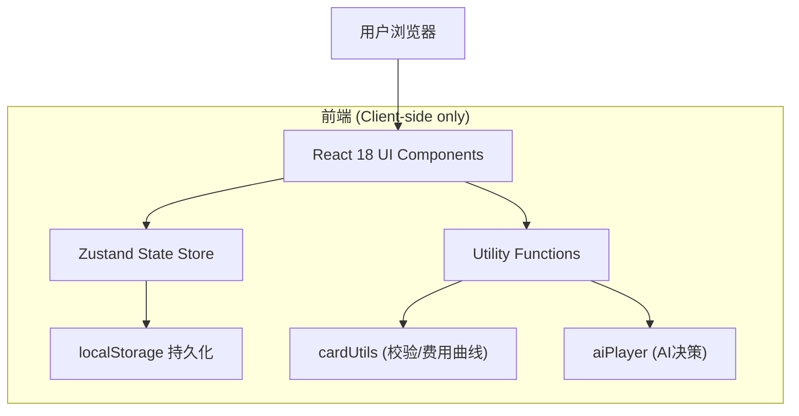
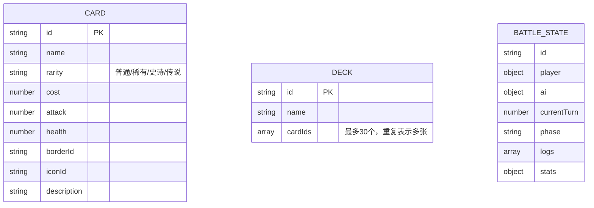

## 1. 架构设计



纯客户端应用，无后端服务器，所有数据通过 localStorage 持久化。

## 2. 技术选型
- **框架**：React 18 + TypeScript
- **构建工具**：Vite
- **路由**：react-router-dom
- **状态管理**：Zustand
- **拖拽**：react-beautiful-dnd
- **工具库**：lodash、clsx
- **持久化**：localStorage
- **样式**：原生 CSS（CSS Variables + Keyframes）

## 3. 路由定义
| 路由 | 用途 |
|-------|---------|
| / | 首页导航 |
| /editor | 卡牌编辑器 |
| /cardpool | 卡牌池管理 |
| /deckbuilder | 卡组构筑 |
| /battle | AI对战 |
| /report | 战斗统计报告 |

## 4. 数据模型

### 4.1 数据模型定义



### 4.2 TypeScript 类型定义

```typescript
type Rarity = 'common' | 'rare' | 'epic' | 'legendary';

interface Card {
  id: string;
  name: string;
  rarity: Rarity;
  cost: number;
  attack: number;
  health: number;
  borderId: string;
  iconId: string;
  description: string;
}

interface Deck {
  id: string;
  name: string;
  cardIds: string[];
}

interface BattleUnit {
  instanceId: string;
  cardId: string;
  currentHealth: number;
  maxHealth: number;
  attack: number;
  canAttack: boolean;
}

interface PlayerState {
  hp: number;
  maxHp: number;
  mana: number;
  maxMana: number;
  hand: Card[];
  deck: Card[];
  field: BattleUnit[];
}

interface BattleLog {
  id: string;
  timestamp: number;
  type: 'draw' | 'play' | 'attack' | 'endTurn' | 'damage' | 'death';
  message: string;
}

interface BattleStats {
  cardsPlayed: Record<string, number>;
  totalDamage: number;
  manaEfficiency: Record<number, number>;
}
```

## 5. 文件结构

```
src/
├── components/
│   ├── Editor.tsx        # 卡牌编辑器
│   ├── CardPool.tsx      # 卡牌池管理
│   ├── DeckBuilder.tsx   # 卡组构筑
│   └── Battle.tsx        # AI对战主组件
├── store/
│   └── cardStore.ts      # Zustand 状态管理
├── utils/
│   ├── cardUtils.ts      # 卡牌工具函数
│   └── aiPlayer.ts       # AI 决策逻辑
├── styles/
│   └── global.css        # 全局样式
├── pages/
│   └── ...               # 路由页面
├── main.tsx              # 入口文件
└── App.tsx               # 根组件
```

## 6. 性能指标
- 卡牌翻转动画 ≥ 30fps（CSS transform + backface-visibility）
- AI决策单步 ≤ 200ms（贪心策略，无前瞻搜索）
- 卡牌池加载 ≤ 500ms（localStorage 同步读取，最多50条）
