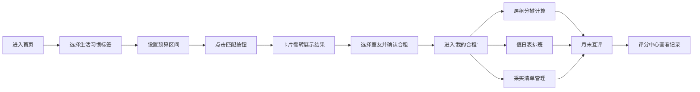

## 1. 产品概述

虚拟合租室友匹配与管理平台，帮助用户根据生活习惯和预算匹配理想室友，并提供合租日常事务的协同管理工具。
- 解决痛点：传统找室友信息不对称、生活习惯冲突、合租事务管理混乱
- 目标用户：城市年轻租房群体、大学生、职场新人
- 市场价值：降低合租矛盾风险，提升合租生活品质，打造信任型合租社区

## 2. 核心功能

### 2.1 用户角色
| 角色 | 注册方式 | 核心权限 |
|------|----------|----------|
| 普通用户 | 平台注册 | 匹配室友、管理合租事务、参与评分 |

### 2.2 功能模块
1. **首页（发现室友）**：导航栏、毛玻璃欢迎区、生活习惯标签选择、预算区间设置、卡片翻转匹配结果、环形进度条匹配度展示
2. **我的合租**：合租房信息展示、事务面板（房租分摊、值日表、采买清单）
3. **评分中心**：五维度评分条形图、文字评价展开、维度筛选查看

### 2.3 页面详情
| 页面名称 | 模块名称 | 功能描述 |
|-----------|-------------|---------------------|
| 首页 | 导航栏 | 四项导航、悬停下划线动画、响应式汉堡菜单 |
| 首页 | 搜索匹配区 | 毛玻璃卡片、三对生活习惯标签切换、预算滑块、匹配按钮 |
| 首页 | 匹配结果 | 卡片翻转动画、头像昵称展示、环形进度条、80%+脉动发光 |
| 我的合租 | 房源信息卡 | 地址、租金总额、成员头像列表 |
| 我的合租 | 房租分摊 | 总租金输入、占比设置、数字滚动上翻动画、实时计算 |
| 我的合租 | 值日表 | 日历网格、今日高亮+点头动画、切换翻转效果 |
| 我的合租 | 采买清单 | 右侧滑入添加、勾选灰化淡出、价格统计 |
| 评分中心 | 维度条形图 | 五维度水平条、进度填充动画、分数对应变色 |
| 评分中心 | 文字评价 | 点击展开、高度过渡动画、按维度筛选 |

## 3. 核心流程

用户进入首页 → 选择生活习惯标签（作息/清洁/社交）→ 拖动设置预算区间 → 点击匹配按钮 → 卡片翻转展示匹配结果列表 → 选择高匹配度室友发起合租 → 进入我的合租模块 → 日常管理（分摊房租/排值日/采买）→ 月末互评进入评分中心 → 查看互评记录优化合租关系

## 4. 用户界面设计

### 4.1 设计风格
- **主色调**：海盐蓝 `#4A90A4`（理性、信任）、暖沙色 `#E8C99B`（温馨、舒适）
- **辅助色**：渐变匹配度（红 `#E74C3C` → 黄 `#F39C12` → 绿 `#27AE60`）
- **按钮风格**：圆角 12px、主色填充、悬停 0.3s 过渡阴影加深
- **字体**：标题用 "Noto Serif SC"（优雅衬线），正文用 "PingFang SC"（清晰易读）
- **布局风格**：卡片式毛玻璃（backdrop-filter: blur(12px)）、柔和阴影、大留白
- **图标**：lucide-react 线性图标，线宽 1.5px

### 4.2 页面设计概述
| 页面名称 | 模块名称 | UI 元素 |
|-----------|-------------|----------|
| 首页 | 导航栏 | 顶部固定、海盐蓝半透明、悬停下划线从左滑入 |
| 首页 | Hero 匹配区 | 居中大卡、毛玻璃效果、渐变背景、分栏标签选择 |
| 首页 | 结果卡 | 3D 翻转动画、环形 SVG 进度条、高匹配度脉动光晕 |
| 我的合租 | 信息头卡 | 左侧房源信息、右侧成员头像横排叠加 |
| 我的合租 | 三功能面板 | Tab 切换、内容区切换带淡入 |
| 评分中心 | 评分条 | 每维度一行、填充色按分数段切换、从左到右进度动画 |

### 4.3 响应式设计
- **桌面端（≥1024px）**：固定顶部导航 + 可拖动宽度侧边栏（阻尼感）、主内容区最大宽 1200px 居中
- **平板端（768–1023px）**：顶部导航、侧边栏收起为图标、内容两列布局
- **手机端（<768px）**：汉堡菜单按钮，点击后菜单项从顶部依次滑入、单列堆叠布局
- **触控优化**：按钮最小高度 44px、滑动手势支持预算调整

### 4.4 动画与交互性能
- 导航项悬停：`transform: scaleX(1)` 从 0→1，300ms cubic-bezier(0.4,0,0.2,1)
- 卡片翻转：`perspective: 1000px` + `rotateY(180deg)`，600ms
- 数字滚动：requestAnimationFrame 缓动上翻，<100ms 响应
- 交互反馈延迟：所有用户操作反馈 <50ms
- 列表渲染（50+项）：虚拟滚动或 memo 优化，稳定 30fps+
