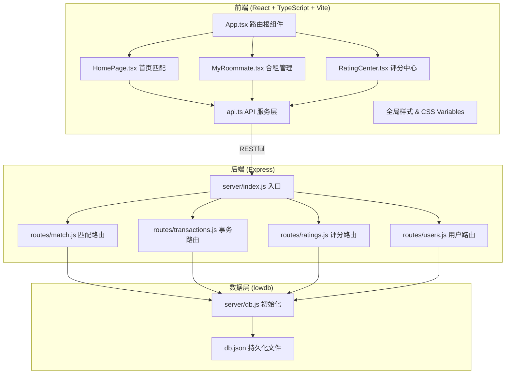
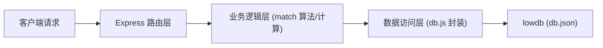
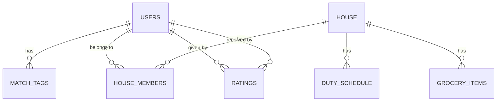

## 1. 架构设计



## 2. 技术说明

- **前端框架**：React 18 + TypeScript 5（严格模式）
- **构建工具**：Vite 5，代理 `/api` → `http://localhost:3001`
- **路由**：react-router-dom 6（BrowserRouter）
- **HTTP 客户端**：axios 1.x
- **状态管理**：React hooks (useState, useContext) + 局部状态
- **后端框架**：Express 4.x，CORS 中间件
- **数据库**：lowdb 3.x（JSON 文件持久化）
- **辅助库**：uuid（主键生成）、bcryptjs（密码哈希）、jsonwebtoken（鉴权）
- **开发工具**：concurrently 同时运行前后端

## 3. 路由定义

| 路由路径 | 页面/组件 | 功能用途 |
|-----------|-----------|----------|
| `/` | HomePage | 首页：匹配室友搜索与结果展示 |
| `/my-roommate` | MyRoommate | 我的合租：事务管理面板 |
| `/rating-center` | RatingCenter | 评分中心：互评记录与维度图 |

## 4. API 接口定义

### 4.1 匹配服务 `/api/match`
```typescript
// POST /api/match/find
interface MatchRequest {
  schedule: 'early' | 'night';       // 早睡星人 / 夜猫子
  cleanliness: 'tidy' | 'flexible';  // 洁癖常态 / 随叫随到
  social: 'outgoing' | 'solo';       // 社交达人 / 独行侠
  budgetMin: number;
  budgetMax: number;
}
interface MatchUser {
  id: string;
  nickname: string;
  avatar: string;
  tags: string[];
  budget: [number, number];
  matchScore: number;  // 0-100
}
// 返回 MatchUser[]
```

### 4.2 事务服务 `/api/transactions`
```typescript
// 合租基础信息 GET /api/transactions/house
interface HouseInfo {
  id: string;
  address: string;
  totalRent: number;
  members: { id: string; nickname: string; avatar: string }[];
}
// 房租分摊 POST /api/transactions/rent/split
interface RentSplitReq { totalRent: number; ratios: { userId: string; ratio: number }[]; }
interface RentSplitRes { userId: string; amount: number }[];
// 值日表 CRUD /api/transactions/duty
interface DutyItem { date: string; userId: string; area: string; }
// 采买清单 CRUD /api/transactions/grocery
interface GroceryItem { id: string; name: string; price: number; done: boolean; createdAt: string; }
```

### 4.3 评分服务 `/api/ratings`
```typescript
interface Rating {
  id: string;
  fromUserId: string;
  toUserId: string;
  dimensions: { punctuality: number; cleanliness: number; friendliness: number; quietness: number; sharing: number; };
  comment: string;
  createdAt: string;
}
// GET  /api/ratings?userId=xxx  → Rating[]
// POST /api/ratings             → 新增评价
```

## 5. 服务器分层



- **路由层 (routes/*.js)**：参数校验、请求解析、响应封装
- **业务层**（路由内函数）：匹配算法加权计算、分摊金额计算、值日分配逻辑
- **数据层 (db.js)**：统一的 get/set/find/create/update/delete 方法封装

## 6. 数据模型

### 6.1 ER 图



### 6.2 db.json 结构

```json
{
  "users": [
    { "id": "uuid", "nickname": "string", "avatar": "string",
      "schedule": "early|night", "cleanliness": "tidy|flexible",
      "social": "outgoing|solo", "budgetMin": 0, "budgetMax": 9999 }
  ],
  "houses": [
    { "id": "uuid", "address": "string", "totalRent": 0,
      "memberIds": ["user_id1", "user_id2"] }
  ],
  "duties": [
    { "id": "uuid", "houseId": "string", "date": "YYYY-MM-DD",
      "userId": "string", "area": "客厅/厨房/卫生间" }
  ],
  "groceries": [
    { "id": "uuid", "houseId": "string", "name": "string",
      "price": 0, "done": false, "createdAt": "ISO-8601" }
  ],
  "ratings": [
    { "id": "uuid", "fromUserId": "string", "toUserId": "string",
      "dimensions": { "punctuality": 0, "cleanliness": 0, "friendliness": 0,
                      "quietness": 0, "sharing": 0 },
      "comment": "string", "createdAt": "ISO-8601" }
  ]
}
```

## 7. 性能与质量保障

- **动画性能**：所有动画使用 `transform` / `opacity`（GPU 合成层），避免布局抖动
- **渲染优化**：`React.memo` 包装匹配列表项 / 评分项；大列表用 `useMemo` 派生数据
- **响应时间**：分摊计算、值日切换等同步操作 <200ms；接口加 `Date.now()` 埋点监控
- **类型安全**：TypeScript `strict: true`，API 响应类型全部定义 interface
- **阻尼侧边栏**：mousedown → mousemove (throttle 16ms, 0.7 阻尼系数) → mouseup
