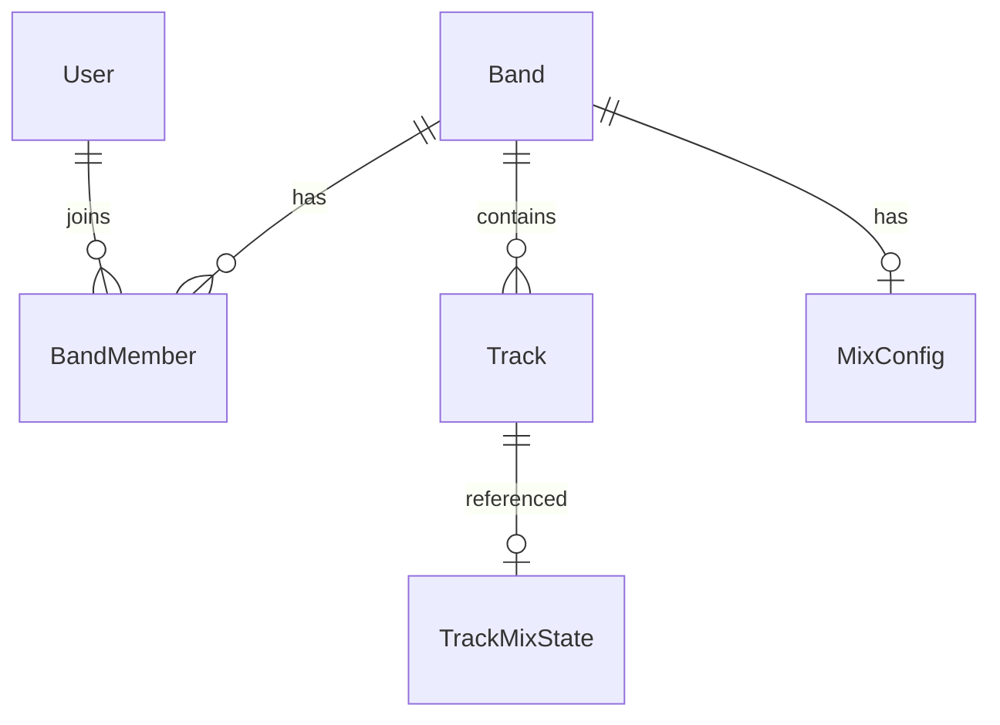

## 1. 架构设计

```mermaid
graph TB
    "React前端" --> "Express API"
    "Express API" --> "lowdb数据持久化"
    "Express API" --> "文件上传(音轨)"
    "React前端" --> "Tone.js音频引擎"
    "React前端" --> "Howler.js音频播放"
```

## 2. 技术说明

- 前端：React@18 + TypeScript + Vite + TailwindCSS
- 后端：Express@4 + TypeScript + lowdb
- 音频引擎：Tone.js（混音/效果器）+ Howler.js（音频播放）
- 认证：JWT（jsonwebtoken + bcryptjs）
- 初始化工具：vite-init（react-express-ts模板）

## 3. 路由定义

| 路由 | 用途 |
|------|------|
| /login | 登录/注册页面 |
| / | 乐队列表页 |
| /band/:id | 乐队详情页（音轨列表+混音控制台） |

## 4. API定义

### 4.1 认证API

| 方法 | 路径 | 说明 |
|------|------|------|
| POST | /api/auth/register | 用户注册 |
| POST | /api/auth/login | 用户登录 |

### 4.2 乐队API

| 方法 | 路径 | 说明 |
|------|------|------|
| GET | /api/bands | 获取用户的所有乐队 |
| POST | /api/bands | 创建乐队 |
| GET | /api/bands/:id | 获取乐队详情 |
| POST | /api/bands/:id/members | 邀请成员 |
| DELETE | /api/bands/:id/members/:userId | 移除成员 |
| GET | /api/users/search?username= | 搜索用户 |

### 4.3 音轨API

| 方法 | 路径 | 说明 |
|------|------|------|
| GET | /api/bands/:id/tracks | 获取乐队音轨 |
| POST | /api/bands/:id/tracks | 上传音轨 |
| DELETE | /api/tracks/:id | 删除音轨 |
| PUT | /api/tracks/:id | 更新音轨（音量/平移/静音/排序） |
| PUT | /api/bands/:id/tracks/order | 更新音轨排序 |

### 4.4 混音API

| 方法 | 路径 | 说明 |
|------|------|------|
| GET | /api/bands/:id/mix | 获取混音配置 |
| POST | /api/bands/:id/mix | 保存混音配置 |
| POST | /api/bands/:id/mix/export | 导出混音文件 |

### 4.5 TypeScript类型定义

```typescript
interface User {
  id: string;
  username: string;
  password: string;
  avatar: string;
  createdAt: string;
}

interface Band {
  id: string;
  name: string;
  description: string;
  coverGradient: string;
  members: BandMember[];
  createdAt: string;
  updatedAt: string;
}

interface BandMember {
  userId: string;
  role: 'admin' | 'member';
  joinedAt: string;
}

interface Track {
  id: string;
  bandId: string;
  name: string;
  fileName: string;
  duration: number;
  volume: number;
  pan: number;
  muted: boolean;
  order: number;
  effects: TrackEffects;
  createdAt: string;
}

interface TrackEffects {
  reverb: { enabled: boolean; wet: number };
  delay: { enabled: boolean; wet: number };
}

interface MixConfig {
  id: string;
  bandId: string;
  tracks: TrackMixState[];
  globalVolume: number;
  loopMode: 'single' | 'list' | 'random';
  createdAt: string;
}

interface TrackMixState {
  trackId: string;
  volume: number;
  pan: number;
  muted: boolean;
  effects: TrackEffects;
}
```

## 5. 服务端架构图

```mermaid
graph LR
    "Express路由" --> "控制器逻辑"
    "控制器逻辑" --> "lowdb数据操作"
    "控制器逻辑" --> "文件系统(音轨文件)"
    "JWT中间件" --> "路由保护"
```

## 6. 数据模型

### 6.1 数据模型定义



### 6.2 lowdb数据结构

```json
{
  "users": [],
  "bands": [],
  "tracks": [],
  "mixConfigs": []
}
```
