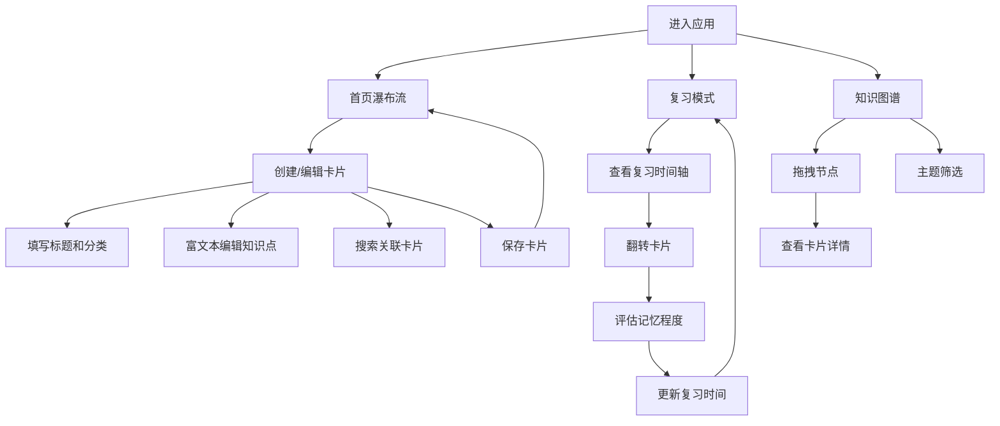

## 1. 产品概述

知识卡片关联回顾应用是一款帮助个人用户在线整理碎片化知识、建立知识点关联并通过间隔重复进行高效复习的工具。解决纸质笔记和零散文档难以建立知识连接、复习缺乏系统提醒的问题。

- 核心目标：帮助用户建立个人知识网络，实现知识的深度关联和长期记忆
- 目标用户：学生、程序员、终身学习者等需要系统管理知识的个人用户
- 产品价值：将零散知识转化为结构化的知识网络，通过科学的间隔重复算法提升记忆效率

## 2. 核心功能

### 2.1 用户角色

| 角色 | 注册方式 | 核心权限 |
|------|---------|---------|
| 普通用户 | 本地注册 | 创建/编辑/删除卡片、建立关联、进行复习、查看知识图谱 |

### 2.2 功能模块

1. **卡片管理模块**：知识卡片的创建、编辑、删除、瀑布流展示
2. **复习模式模块**：间隔重复复习系统，包含时间轴提醒、卡片翻转、记忆评估
3. **知识图谱模块**：力导向图展示卡片关联关系，支持筛选和交互
4. **卡片详情模块**：单张卡片详情展示，包含关联关系可视化

### 2.3 页面详情

| 页面名称 | 模块名称 | 功能描述 |
|---------|---------|----------|
| 首页 | 复习时间轴 | 横向滚动展示今日到期复习卡片，带进度环和脉冲动画 |
| 首页 | 卡片瀑布流 | 网格展示所有卡片，支持搜索和分类筛选，悬停上浮效果 |
| 卡片编辑页 | 富文本编辑器 | 支持加粗、列表、代码块，编辑时卡片向内收缩动画 |
| 卡片编辑页 | 关联搜索 | 实时模糊搜索已有卡片，浮动气泡展示，点击建立连线 |
| 卡片详情页 | 关联力导向图 | 展示当前卡片与其他卡片的关联关系 |
| 复习页面 | 卡片翻转 | 3D翻转动画展示卡片正反面，记忆程度选择按钮 |
| 知识图谱页 | 全局力导向图 | 所有卡片按关联关系展示，支持主题筛选，拖拽交互 |

## 3. 核心流程

### 3.1 用户创建知识卡片流程
用户进入首页 → 点击新建卡片 → 填写标题、选择主题分类 → 使用富文本编辑核心知识点 → 搜索并关联已有卡片 → 保存卡片 → 返回首页瀑布流

### 3.2 用户复习流程
用户进入首页 → 查看顶部复习时间轴 → 点击开始复习 → 卡片展示正面知识点 → 用户思考后翻转 → 选择记忆程度（忘记/困难/正常/轻松） → 系统自动计算下次复习时间 → 继续下一张卡片

### 3.3 知识图谱浏览流程
用户进入知识图谱页 → 查看力导向图展示的所有卡片关联 → 拖拽节点调整位置 → 点击节点查看卡片详情 → 使用主题筛选器筛选特定分类卡片 → 观察关联关系

## 4. 用户界面设计

### 4.1 设计风格
- **主色调**：深灰蓝（#2c3e50）和柔白（#f5f5f5）
- **主题标签色**：编程蓝（#3498db）、历史棕（#8b4513）、生活技巧绿（#27ae60）、其他灰（#7f8c8d）
- **设计风格**：极简主义，干净整洁，注重内容展示
- **按钮样式**：圆角矩形，悬停平滑过渡0.2s，不可点击时半透明灰色遮罩
- **字体**：使用 Inter 或系统无衬线字体，清晰易读
- **布局**：顶部固定导航栏，卡片式内容布局，12px间距

### 4.2 页面设计概述

| 页面名称 | 模块名称 | UI元素 |
|---------|---------|--------|
| 首页 | 复习时间轴 | 横向滚动容器、卡片缩略图、进度环、脉冲呼吸动画 |
| 首页 | 瀑布流网格 | 响应式网格（桌面多列/平板2列/手机单列）、卡片悬停上浮阴影、主题色渐变阴影 |
| 卡片编辑页 | 富文本编辑器 | 工具栏（加粗/列表/代码块）、编辑时向内收缩动画、聚焦效果 |
| 卡片编辑页 | 关联搜索 | 实时搜索框、浮动气泡卡片、匹配高亮、点击建立连线 |
| 复习页面 | 翻转动画 | 3D卡片翻转效果、正面知识点/背面提示、按钮动画反馈 |
| 知识图谱页 | 力导向图 | 节点大小表示关联数量、连线样式区分关联类型、弹性追随动画、淡出筛选动画 |

### 4.3 响应式设计
- **桌面端（>768px）**：多列瀑布流布局，完整功能展示
- **平板端（480px-768px）**：自动变为两列布局，侧边导航收起为汉堡菜单
- **移动端（<480px）**：单列布局，优化触摸交互，按钮尺寸增大

### 4.4 动画与交互
- **卡片悬停**：上浮3px，投射主题色渐变阴影，过渡0.2s
- **编辑聚焦**：卡片轻微向内收缩，边框高亮
- **复习提醒**：到期卡片脉冲呼吸动画，进度环渐变填充
- **按钮反馈**：忘记（红色抖动）、困难（橙色轻弹）、正常（绿色平滑放大）、轻松（蓝色放光）
- **图谱筛选**：无关节点淡出动画，时长0.3s
- **所有交互**：响应延迟低于100ms，知识图谱帧率不低于45fps
