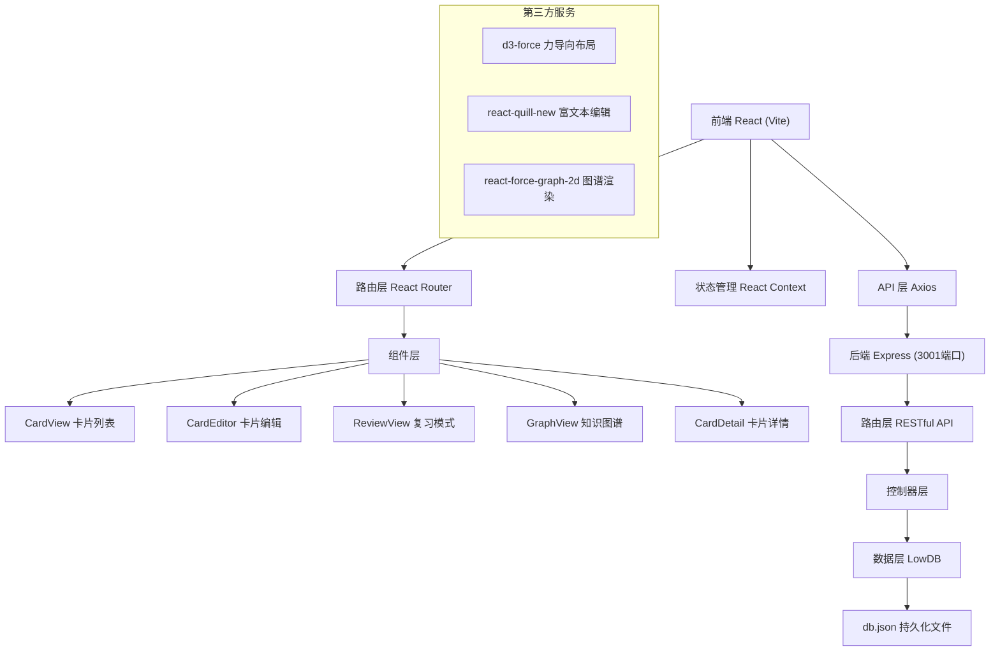
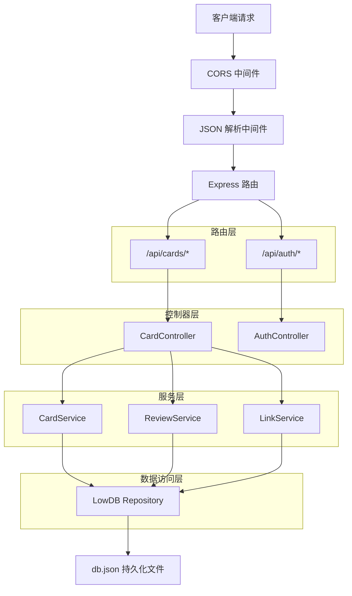
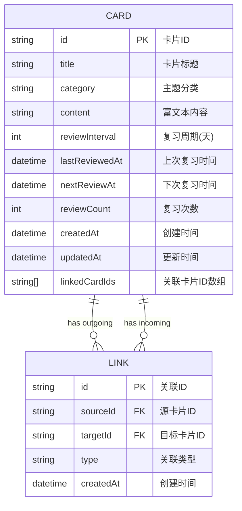

## 1. 架构设计



## 2. 技术描述

### 2.1 技术栈选择
- **前端框架**：React 18 + TypeScript 5，提供类型安全和组件化开发
- **构建工具**：Vite 5，快速的开发服务器和构建
- **前端路由**：React Router DOM 6，单页应用路由管理
- **状态管理**：React Context + useState，轻量级全局状态
- **HTTP客户端**：Axios，统一API请求管理
- **富文本编辑**：react-quill-new，支持加粗、列表、代码块
- **力导向图**：d3-force + react-force-graph-2d，高性能知识图谱
- **UI样式**：CSS Modules + CSS Variables，组件级样式隔离

### 2.2 后端技术栈
- **后端框架**：Express 4，轻量级Node.js Web框架
- **数据库**：LowDB（Lodash + JSON文件），嵌入式数据库无需额外安装
- **数据验证**：服务端手动验证
- **跨域处理**：cors 中间件
- **用户认证**：bcryptjs（密码加密）+ jsonwebtoken（JWT认证）
- **ID生成**：uuid，唯一标识符生成

### 2.3 运行环境
- 前端运行端口：5173（Vite开发服务器）
- 后端运行端口：3001（Express服务器）
- API代理：Vite配置代理 `/api` 到 `http://localhost:3001`
- 数据存储：`server/db.json` 自动创建和持久化

## 3. 路由定义

| 前端路由 | 页面/组件 | 功能描述 |
|---------|----------|---------|
| `/` | CardView | 首页，瀑布流展示卡片 + 复习时间轴 |
| `/card/new` | CardEditor | 创建新卡片 |
| `/card/edit/:id` | CardEditor | 编辑已有卡片 |
| `/card/:id` | CardDetail | 卡片详情页，展示关联图谱 |
| `/review` | ReviewView | 复习模式，间隔重复复习 |
| `/graph` | GraphView | 知识图谱视图，全局力导向图 |

### 后端 API 路由

| 方法 | API路径 | 功能描述 |
|-----|---------|---------|
| GET | `/api/cards` | 获取所有卡片列表，支持搜索和筛选 |
| GET | `/api/cards/:id` | 获取单张卡片详情 |
| POST | `/api/cards` | 创建新卡片 |
| PUT | `/api/cards/:id` | 更新卡片内容 |
| DELETE | `/api/cards/:id` | 删除卡片 |
| GET | `/api/cards/due/today` | 获取今日到期复习的卡片 |
| PUT | `/api/cards/:id/review` | 更新卡片复习状态和下次复习时间 |
| POST | `/api/cards/:id/links` | 为卡片添加关联 |
| DELETE | `/api/cards/:id/links/:targetId` | 移除卡片关联 |
| GET | `/api/cards/links/graph` | 获取所有卡片关联关系图谱数据 |

## 4. API 定义

### 4.1 数据类型定义

```typescript
// 主题分类枚举
type Category = 'programming' | 'history' | 'life' | 'other';

// 复习周期（天数）
type ReviewInterval = 1 | 3 | 7 | 14 | 30;

// 记忆程度
type MemoryLevel = 'forgot' | 'hard' | 'normal' | 'easy';

// 关联类型
type LinkType = 'same-category' | 'cross-category' | 'manual';

// 卡片接口
interface Card {
  id: string;
  title: string;
  category: Category;
  content: string; // HTML 格式的富文本内容
  reviewInterval: ReviewInterval;
  lastReviewedAt: string | null; // ISO 日期字符串
  nextReviewAt: string; // ISO 日期字符串
  reviewCount: number;
  createdAt: string;
  updatedAt: string;
  linkedCardIds: string[];
}

// 关联接口
interface CardLink {
  id: string;
  sourceId: string;
  targetId: string;
  type: LinkType;
  createdAt: string;
}

// 复习请求
interface ReviewRequest {
  memoryLevel: MemoryLevel;
}

// 关联请求
interface LinkRequest {
  targetCardId: string;
}

// 图谱节点
interface GraphNode {
  id: string;
  title: string;
  category: Category;
  linkCount: number;
  x?: number;
  y?: number;
  vx?: number;
  vy?: number;
}

// 图谱连线
interface GraphLink {
  source: string;
  target: string;
  type: LinkType;
  value: number; // 关联强度，用于线宽
}
```

### 4.2 响应格式

```typescript
// 统一响应格式
interface ApiResponse<T> {
  success: boolean;
  data?: T;
  error?: string;
}

// 列表响应
interface ListResponse<T> {
  items: T[];
  total: number;
}
```

## 5. 服务器架构图



## 6. 数据模型

### 6.1 数据模型定义



### 6.2 数据库结构（db.json）

```json
{
  "cards": [
    {
      "id": "uuid-1",
      "title": "React Hooks 原理",
      "category": "programming",
      "content": "<p>React Hooks 是...</p>",
      "reviewInterval": 7,
      "lastReviewedAt": "2024-01-10T00:00:00.000Z",
      "nextReviewAt": "2024-01-17T00:00:00.000Z",
      "reviewCount": 3,
      "createdAt": "2024-01-01T00:00:00.000Z",
      "updatedAt": "2024-01-10T00:00:00.000Z",
      "linkedCardIds": ["uuid-2", "uuid-3"]
    }
  ],
  "links": [
    {
      "id": "link-uuid-1",
      "sourceId": "uuid-1",
      "targetId": "uuid-2",
      "type": "same-category",
      "createdAt": "2024-01-01T00:00:00.000Z"
    }
  ],
  "users": [
    {
      "id": "user-uuid-1",
      "username": "demo",
      "passwordHash": "$2a$10$...",
      "createdAt": "2024-01-01T00:00:00.000Z"
    }
  ]
}
```

### 6.3 间隔重复算法

根据用户选择的记忆程度动态调整复习间隔：

| 记忆程度 | 间隔调整系数 | 效果 |
|---------|-------------|------|
| forgot (忘记) | 0.5 | 间隔减半，重新学习 |
| hard (困难) | 0.8 | 间隔缩短20% |
| normal (正常) | 1.0 | 保持当前间隔 |
| easy (轻松) | 1.5 | 间隔增加50%，延长复习 |

算法逻辑：
```typescript
function calculateNextReview(
  currentInterval: number,
  memoryLevel: MemoryLevel
): ReviewInterval {
  const multiplier = {
    forgot: 0.5,
    hard: 0.8,
    normal: 1.0,
    easy: 1.5
  };
  
  const newInterval = Math.round(currentInterval * multiplier[memoryLevel]);
  
  // 限制在有效范围内 [1, 3, 7, 14, 30]
  const validIntervals: ReviewInterval[] = [1, 3, 7, 14, 30];
  return validIntervals.reduce((prev, curr) => 
    Math.abs(curr - newInterval) < Math.abs(prev - newInterval) ? curr : prev
  );
}
```

### 6.4 主题分类颜色映射

```typescript
const categoryColors: Record<Category, string> = {
  programming: '#3498db', // 编程蓝
  history: '#8b4513',     // 历史棕
  life: '#27ae60',        // 生活技巧绿
  other: '#7f8c8d'        // 其他灰
};
```
