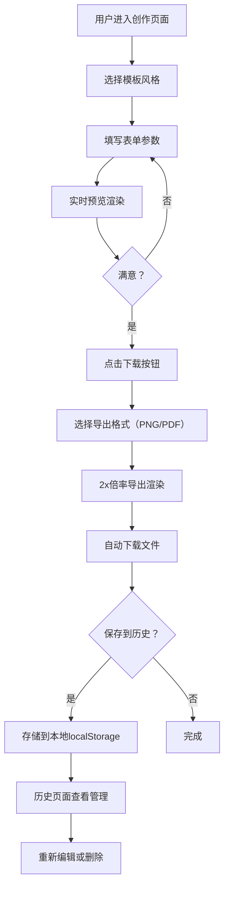

## 1. 产品概述

在线个性化报纸封面生成工具，让用户通过简单的表单输入和模板选择，快速生成仿真报纸封面图片。
- 面向喜欢趣味创作、社交媒体分享、个性化礼品制作的普通用户
- 价值：将数字创作与复古报纸美学结合，提供沉浸式、即时反馈的创作体验

## 2. 核心功能

### 2.1 用户角色
| 角色 | 注册方式 | 核心权限 |
|------|----------|----------|
| 普通用户 | 无需注册，浏览器本地存储 | 创建、保存、编辑、删除报纸封面；导出PNG/PDF |

### 2.2 功能模块
1. **创作页面（首页）**：沉浸式创作空间、A4预览画布、参数控制面板、模板选择器、下载导出器
2. **历史管理页面**：时间线布局、封面缩略卡片、重新编辑、删除操作

### 2.3 页面详情
| 页面名称 | 模块名称 | 功能描述 |
|----------|----------|----------|
| 创作页面 | 预览画布 | A4比例、纸质纹理背景、圆角阴影、实时渲染报纸封面（报头/标题/副标题/日期/摘要/作者） |
| 创作页面 | 参数控制面板 | 毛玻璃卡片、标题输入、摘要文本域（120字限制+实时计数）、日期选择器、作者输入框 |
| 创作页面 | 模板选择器 | 3种风格模板（严肃大报/娱乐小报/复古黑白）、独特悬停动画 |
| 创作页面 | 下载导出器 | 模态框、PNG/PDF格式选择、2x倍率导出、加载动画、自动下载 |
| 历史页面 | 时间线卡片 | 从底部滑入动画（间隔100ms）、悬停上浮阴影、缩略图/标题/日期/模板标签 |
| 历史页面 | 卡片操作 | 重新编辑（填充高亮动画）、删除（翻转+缩小消失动画） |

## 3. 核心流程

用户进入首页 → 选择报纸模板风格 → 填写标题、摘要、日期、作者 → 实时预览渲染效果 → 点击下载 → 选择PNG或PDF格式 → 导出并自动下载文件 → 可选择保存到历史 → 在历史页查看/编辑/删除已保存封面

## 4. 用户界面设计

### 4.1 设计风格
- **主色调**：暖米色（#F5E6C8）、复古红（#8B4513）、深灰（#333333）
- **配色风格**：大地色系为主，复古报纸与数字科技结合
- **按钮样式**：柔和圆角矩形，悬停有平滑过渡
- **字体**：
  - 严肃大报：无衬线粗体（标题）+ 衬线体（正文）
  - 娱乐小报：手写风格衬线字体，标题斜置
  - 复古黑白：老式打字机字体
- **布局风格**：卡片式布局、毛玻璃半透明效果
- **图标风格**：简洁线条图标，与复古风格协调

### 4.2 页面设计概述
| 页面名称 | 模块名称 | UI 元素 |
|----------|----------|---------|
| 创作页面 | 整体背景 | 模拟印刷纸张浅米色微纹理图案 |
| 创作页面 | 预览画布 | A4比例、圆角、纸质阴影、平滑淡入更新（300ms） |
| 创作页面 | 控制面板 | 毛玻璃半透明卡片、暖白渐变背景、悬浮阴影 |
| 创作页面 | 模板按钮 | 严肃大报：黑金配色+金色边框流光悬停；娱乐小报：粉紫渐变+彩色泡泡飘起；复古黑白：泛黄底色+纸张卷角 |
| 创作页面 | 导出模态框 | 毛玻璃背景、柔和光晕边缘、渐隐关闭动画、印刷滚筒加载图标 |
| 历史页面 | 时间线卡片 | 从底部滑入（间隔100ms）、悬停上浮阴影、删除翻转动画、编辑填充高亮 |

### 4.3 响应式
- 桌面端优先设计，创作页面采用左右分栏布局
- 移动端自适应：控制面板移至画布下方，单列堆叠
- 触摸交互优化：增大按钮点击区域，支持手势操作

### 4.4 性能要求
- 预览画布渲染更新 ≤ 200ms
- 导出过程（点击到下载） ≤ 3秒
