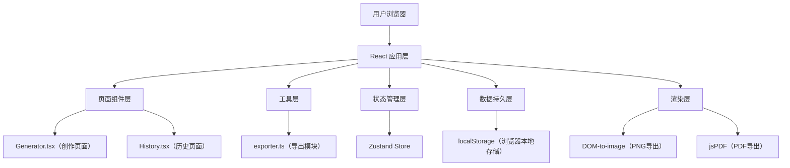

## 1. 架构设计



## 2. 技术描述

- **前端框架**：React 18 + TypeScript
- **构建工具**：Vite
- **路由**：React Router DOM 6
- **状态管理**：Zustand
- **样式方案**：TailwindCSS 3 + CSS Modules
- **导出工具**：dom-to-image（PNG渲染）、jsPDF（PDF生成）
- **数据存储**：浏览器 localStorage（历史记录本地持久化）
- **图标库**：lucide-react

## 3. 路由定义

| 路由 | 用途 |
|------|------|
| `/` | 创作页面 - 首页，沉浸式创作空间 |
| `/history` | 历史管理页面 - 时间线展示已保存封面 |

## 4. 数据模型

### 4.1 封面记录数据模型

```typescript
interface CoverRecord {
  id: string;
  title: string;
  summary: string;
  date: string;
  author: string;
  template: 'serious' | 'entertainment' | 'vintage';
  createdAt: number;
  thumbnail?: string;
}
```

### 4.2 模板样式配置

```typescript
interface TemplateStyle {
  id: 'serious' | 'entertainment' | 'vintage';
  name: string;
  fontFamily: {
    title: string;
    body: string;
  };
  colors: {
    background: string;
    title: string;
    body: string;
    accent: string;
  };
  layout: {
    titleAlign: 'left' | 'center' | 'right';
    titleTransform?: string;
  };
}
```

## 5. 项目文件结构

```
auto82/
├── package.json
├── vite.config.ts
├── tsconfig.json
├── index.html
└── src/
    ├── main.tsx              # 应用入口和路由配置
    ├── App.tsx               # 根组件，管理页面路由
    ├── index.css             # 全局样式和Tailwind配置
    ├── pages/
    │   ├── Generator.tsx     # 创作页面主组件
    │   └── History.tsx       # 历史管理页面
    ├── components/
    │   ├── NewspaperCanvas.tsx    # 报纸预览画布组件
    │   ├── ControlPanel.tsx       # 参数控制面板
    │   ├── TemplateSelector.tsx   # 模板选择器
    │   ├── ExportModal.tsx        # 导出模态框
    │   ├── HistoryCard.tsx        # 历史卡片
    │   └── Navbar.tsx             # 导航栏
    ├── store/
    │   └── useCoverStore.ts       # Zustand状态管理
    ├── types/
    │   └── index.ts               # TypeScript类型定义
    └── utils/
        └── exporter.ts            # 导出功能模块
```

## 6. 核心实现要点

### 6.1 性能优化
- 使用 React.memo 包装预览画布组件，避免不必要重渲染
- 表单值变更使用 debounce（100ms）后触发画布更新
- 导出使用 2x 像素比保证清晰度，dom-to-image 配置 quality: 1

### 6.2 动画实现
- CSS transitions 处理悬停、淡入等基础动画
- CSS keyframes 处理复杂动画（泡泡飘起、卷角、印刷滚筒旋转）
- 状态切换触发 CSS class 变化实现动画序列

### 6.3 本地存储
- 历史记录存储上限：50条（超过自动清理最早记录）
- 缩略图使用 base64 存储，尺寸限制为 400px 宽度
- 存储键名：`newspaper_cover_history`
