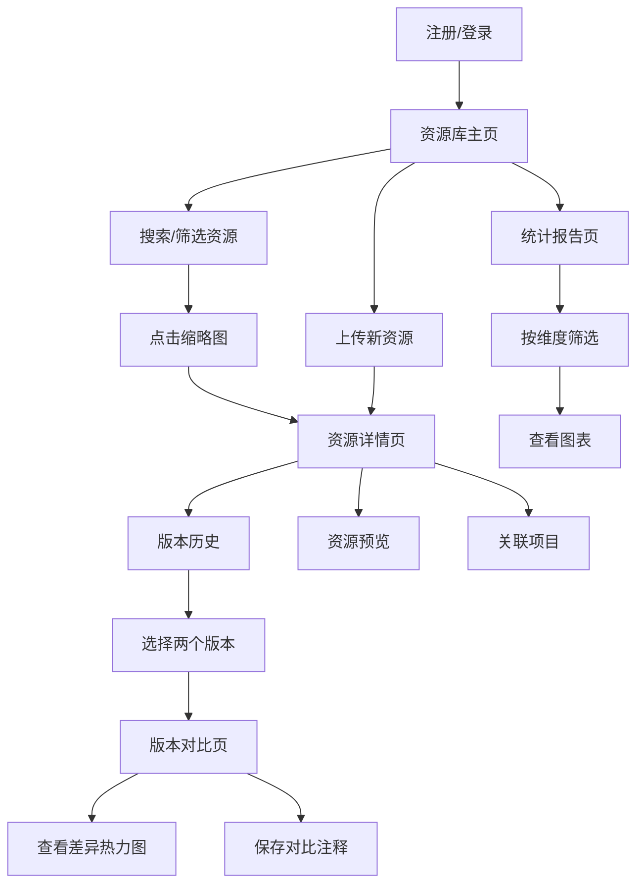

## 1. 产品概述

面向独立游戏开发者的在线美术资源版本管理与协作平台，解决团队在管理游戏素材版本、追踪美术资源修改历史以及快速生成资源使用报告方面的痛点。目标用户为独立游戏开发团队及个人开发者，核心价值在于提供轻量级、可视化的资源版本管控与协作能力。

## 2. 核心功能

### 2.1 用户角色

| 角色 | 注册方式 | 核心权限 |
|------|----------|----------|
| 普通用户 | 用户名/密码注册 | 上传资源、查看版本历史、对比版本、生成报告 |
| 未登录访客 | 无 | 仅可浏览公开资源缩略图 |

### 2.2 功能模块

1. **资源库主页**：资源网格展示、搜索筛选、懒加载缩略图
2. **资源上传页**：素材上传、类型标注、关联项目
3. **资源详情页**：版本历史、资源预览（Canvas 缩放平移）、关联项目标签
4. **版本对比页**：并排对比、同步缩放滚动、差异热力图、对比注释
5. **统计报告页**：柱状图/饼图/折线图、多维度筛选、入场动画

### 2.3 页面详情

| 页面名称 | 模块名称 | 功能描述 |
|----------|----------|----------|
| 资源库主页 | 搜索栏 | 实时模糊匹配资源名称（防抖300ms），下拉高亮匹配关键字 |
| 资源库主页 | 高级筛选面板 | 类型多选下拉、尺寸范围滑块、上传时间日期选择器 |
| 资源库主页 | 瀑布流网格 | 缩略图懒加载+渐变淡入、悬停显示名称和修改日期、点击进入详情 |
| 资源上传页 | 上传表单 | 拖拽/点击上传、类型选择、关联项目、提交备注 |
| 资源详情页 | 详细信息栏 | 资源名称、类型、尺寸、上传时间 |
| 资源详情页 | 版本历史标签 | 版本列表、展开提交备注、相邻版本对比按钮 |
| 资源详情页 | 资源预览标签 | Canvas 绘制原图、滚轮缩放+百分比显示、平移+弹性阻尼 |
| 资源详情页 | 关联项目标签 | 渐变色项目标签列表 |
| 版本对比页 | 并排对比画布 | 左右分屏、同步缩放和滚动 |
| 版本对比页 | 差异热力图 | 红色半透明区域标注变化区块、变化像素百分比 |
| 版本对比页 | 对比注释 | 保存对比文字说明 |
| 统计报告页 | 筛选控件 | 按类型、时间范围、修改频率筛选 |
| 统计报告页 | 柱状图 | 各类资源数量，柱体从底部升起动画 |
| 统计报告页 | 饼图 | 各类型存储占比，扇形顺时针展开动画 |
| 统计报告页 | 折线图 | 近期上传/修改趋势，路径从左侧擦除进入动画 |

## 3. 核心流程

用户注册登录后进入资源库主页，可浏览所有已上传资源的缩略图网格。通过搜索或高级筛选定位特定资源，点击缩略图进入资源详情页查看版本历史和预览。需要对比两个版本时，选择版本进入对比页面，查看差异热力图并添加注释。在统计报告页可按维度生成资源使用统计。

## 4. 用户界面设计

### 4.1 设计风格

- 主色调：深蓝灰（#1E293B）+ 翡翠绿强调色（#10B981）
- 按钮：圆角12px，主按钮翡翠绿渐变背景（#10B981 → #059669），悬停亮度提升+scale(1.03)，点击内陷translateY(2px)
- 字体：标题使用 Outfit，正文使用 DM Sans
- 布局：顶部固定导航栏 + 内容区域
- 图标：Lucide React 图标库
- 卡片：圆角16px，背景深灰蓝#273548，悬停上浮8px+柔和阴影

### 4.2 页面设计概览

| 页面名称 | 模块名称 | UI 元素 |
|----------|----------|---------|
| 全局 | 导航栏 | 毛玻璃效果(backdrop-filter:blur(12px))，悬停导航项底部横线从中心展开动画 |
| 资源库主页 | 瀑布流网格 | 4/3/2列响应式，卡片3:2缩略图裁剪，加载失败旋转占位图标 |
| 资源库主页 | 搜索下拉 | 匹配关键字高亮，300ms防抖 |
| 资源上传页 | 拖拽上传区 | 虚线边框，拖入高亮，上传进度条 |
| 资源详情页 | 标签页切换 | 三个标签：版本历史/资源预览/关联项目 |
| 版本对比页 | 双画布分屏 | 左右各50%，同步缩放/滚动控件，下方差异热力图 |
| 统计报告页 | 图表卡片 | 柱状图/饼图/折线图，悬停数值提示，入场动画 |

### 4.3 响应式适配

- 桌面端（≥1024px）：网格4列，导航全展开
- 平板端（768px-1023px）：网格3列，导航折叠
- 移动端（<768px）：网格2列，导航汉堡菜单

### 4.4 动画规范

- 缩略图加载：渐变淡入（opacity 0→1，0.3s ease）
- 卡片悬停：上浮8px（translateY(-8px)，0.25s ease），柔和阴影
- 模态框：中央淡入缩放（scale(0.95)→1，opacity 0→1，0.3s ease）
- 筛选重排：交错过渡动画（staggered transition）
- 图表入场：柱状图柱体升起、饼图扇形展开、折线图路径擦除
