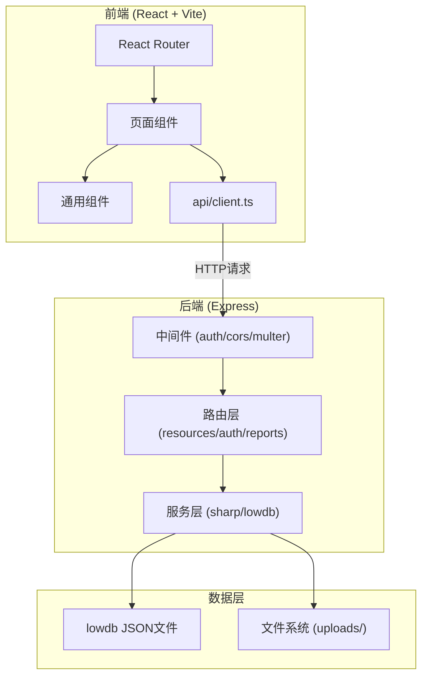
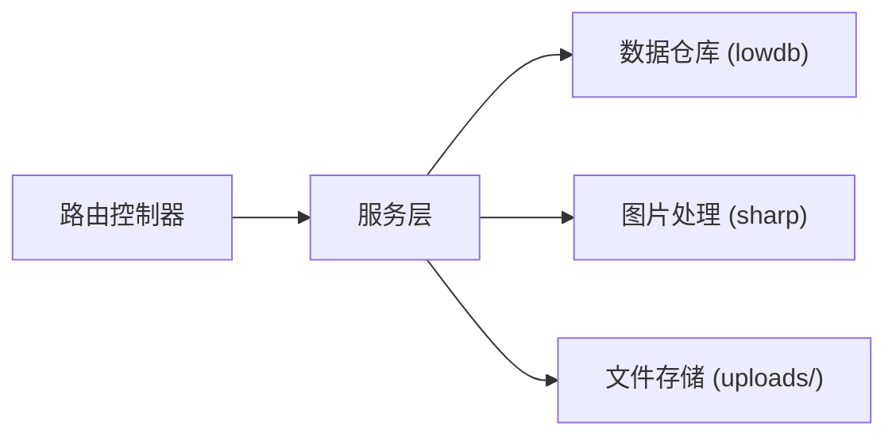
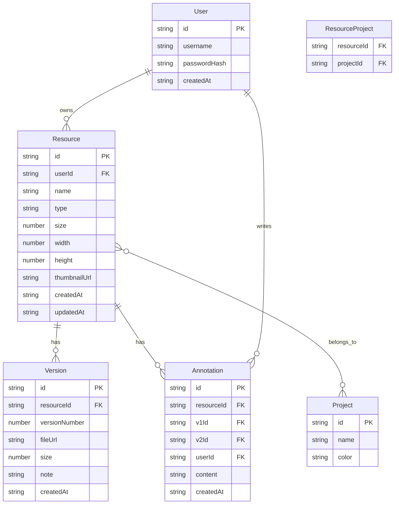

## 1. 架构设计



## 2. 技术说明

- 前端：React@18 + TypeScript + Tailwind CSS@3 + Vite
- 初始化工具：vite-init (react-express-ts 模板)
- 后端：Express@4 + TypeScript
- 数据库：lowdb (JSON文件持久化)
- 图片处理：sharp (缩略图生成、差异热力图)
- 状态管理：Zustand
- 图表库：recharts
- 认证：bcryptjs + jsonwebtoken

## 3. 路由定义

| 路由 | 用途 |
|------|------|
| / | 资源库主页：网格展示、搜索筛选 |
| /upload | 资源上传页 |
| /resources/:id | 资源详情页：版本历史、预览、关联项目 |
| /compare/:id/:v1/:v2 | 版本对比页 |
| /reports | 统计报告页 |
| /login | 登录页 |
| /register | 注册页 |

## 4. API 定义

### 4.1 认证相关

```typescript
POST /api/auth/register
  Body: { username: string; password: string }
  Response: { token: string; user: { id: string; username: string } }

POST /api/auth/login
  Body: { username: string; password: string }
  Response: { token: string; user: { id: string; username: string } }
```

### 4.2 资源相关

```typescript
GET /api/resources
  Query: { type?: string; search?: string; minSize?: number; maxSize?: number; startDate?: string; endDate?: string }
  Response: Resource[]

POST /api/resources
  Body: FormData { file: File; name: string; type: ResourceType; project?: string; note?: string }
  Response: Resource

GET /api/resources/:id
  Response: ResourceDetail (含版本列表)

POST /api/resources/:id/versions
  Body: FormData { file: File; note?: string }
  Response: Version

GET /api/resources/:id/compare/:v1/:v2
  Response: { diffImageUrl: string; changePercent: number }

POST /api/resources/:id/compare/:v1/:v2/annotation
  Body: { annotation: string }
  Response: { success: boolean }
```

### 4.3 报告相关

```typescript
GET /api/reports/stats
  Query: { type?: string; startDate?: string; endDate?: string; frequency?: 'daily' | 'weekly' }
  Response: {
    byType: { type: string; count: number; totalSize: number }[];
    trend: { date: string; uploads: number; modifications: number }[];
    summary: { totalResources: number; totalSize: number; avgVersions: number }
  }
```

### 4.4 类型定义

```typescript
type ResourceType = 'sprite' | 'background' | 'ui' | 'audio';

interface Resource {
  id: string;
  name: string;
  type: ResourceType;
  size: number;
  width: number;
  height: number;
  thumbnailUrl: string;
  createdAt: string;
  updatedAt: string;
  versionCount: number;
  projects: string[];
}

interface Version {
  id: string;
  resourceId: string;
  versionNumber: number;
  fileUrl: string;
  size: number;
  note: string;
  createdAt: string;
}

interface ResourceDetail extends Resource {
  versions: Version[];
}
```

## 5. 服务端架构图



## 6. 数据模型

### 6.1 数据模型定义



### 6.2 数据初始化

lowdb 初始化时创建默认数据结构：

```json
{
  "users": [],
  "resources": [],
  "versions": [],
  "annotations": [],
  "projects": [
    { "id": "proj-1", "name": "暗影传说", "color": "#10B981" },
    { "id": "proj-2", "name": "星际漂流", "color": "#6366F1" },
    { "id": "proj-3", "name": "像素冒险", "color": "#F59E0B" },
    { "id": "proj-4", "name": "末日生存", "color": "#EF4444" }
  ],
  "resourceProjects": []
}
```
