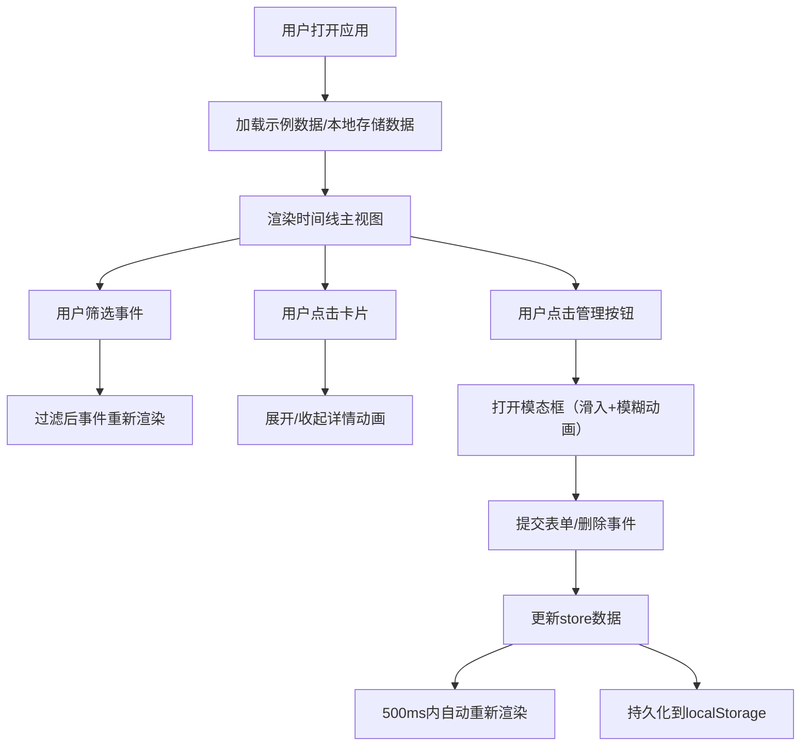

## 1. 产品概述

基于时间线的个人职业履历可视化应用，帮助求职者以视觉化方式呈现职业成长路径，让招聘方快速抓住关键节点和技能发展轨迹。

- 核心功能：时间线展示、事件管理、筛选过滤、响应式布局
- 目标用户：求职者、职业规划师、简历制作需求者
- 市场价值：区别于传统文字简历，提供直观、交互性强的职业经历展示方式

## 2. 核心功能

### 2.1 功能模块
1. **时间线展示页**：水平/垂直时间线、事件卡片、缩放平移、筛选工具栏
2. **事件管理**：添加事件、编辑事件、删除事件（模态框表单）

### 2.2 页面详情
| 页面名称 | 模块名称 | 功能描述 |
|-----------|-------------|---------------------|
| 时间线展示页 | 筛选工具栏 | 技能类别复选框（全选/前端/后端/设计/产品/其他）、时间范围滑块（带实时数值浮标和弹性动画） |
| 时间线展示页 | 时间线主视图 | 水平/垂直布局切换、节点圆形图标（年份+径向渐变光环）、渐变连接线、鼠标滚轮缩放、拖拽平移 |
| 时间线展示页 | 事件卡片 | 默认显示精简信息（年份区间/职位/公司）、点击展开详情（250ms高度展开+淡入动画）、技能标签（圆角胶囊样式） |
| 时间线展示页 | 事件管理按钮 | 打开添加/编辑模态框、删除事件 |
| 事件编辑模态框 | 表单区域 | 年份范围输入、职位/角色输入、公司/项目名输入、描述文本域、技能标签选择、底部滑入动画+背景遮罩模糊 |

## 3. 核心流程

用户打开应用 → 查看默认示例数据的时间线 → 使用筛选工具栏过滤事件 → 点击事件卡片展开详情 → 点击管理按钮增删改事件 → 数据自动保存到本地存储

## 4. 用户界面设计

### 4.1 设计风格
- **主色调**：深蓝色 #1a237e（强调色）
- **背景色**：浅灰色 #f5f5f5
- **卡片背景**：纯白 #ffffff
- **技能类别颜色**：
  - 前端：蓝色系 #2196f3
  - 后端：绿色系 #4caf50
  - 设计：紫色系 #9c27b0
  - 产品：橙色系 #ff9800
  - 其他：灰色系 #757575
- **卡片样式**：圆角 12px，阴影 `0 2px 8px rgba(0,0,0,0.1)`，悬停时阴影加深并上浮 2px，边缘出现彩色细线边框
- **动画时长**：200-300ms 平滑过渡，展开动画 250ms
- **字体**：现代无衬线字体，层次分明

### 4.2 页面设计概述
| 页面名称 | 模块名称 | UI元素 |
|-----------|-------------|-------------|
| 时间线展示页 | 筛选工具栏 | 顶部固定，复选框组 + 双滑块范围选择器，白色卡片背景 |
| 时间线展示页 | 时间线主视图 | 占满剩余空间，圆形节点居中显示年份，渐变连接线，卡片交替排列 |
| 时间线展示页 | 事件卡片 | 白色圆角卡片，悬停微交互，点击展开详情区 |
| 事件编辑模态框 | 表单区域 | 底部滑入，背景模糊遮罩，表单输入框带聚焦动效 |

### 4.3 响应式设计
- **桌面端（>1024px）**：时间线水平铺满，卡片左右交替排列
- **平板端（≤1024px）**：自动切换为垂直布局，单列垂直排列
- **手机端（≤768px）**：时间线全屏垂直滚动，事件卡片全宽显示，触摸优化
