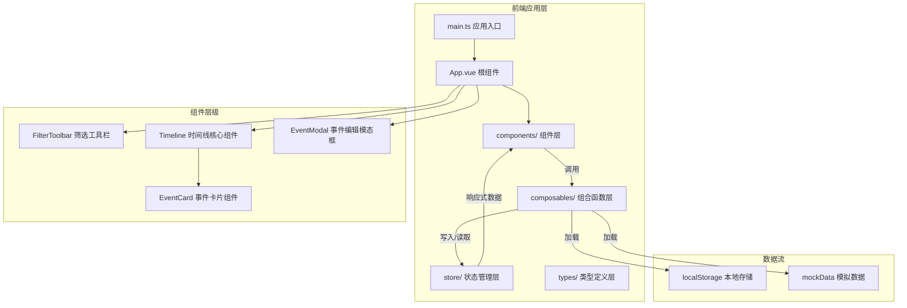
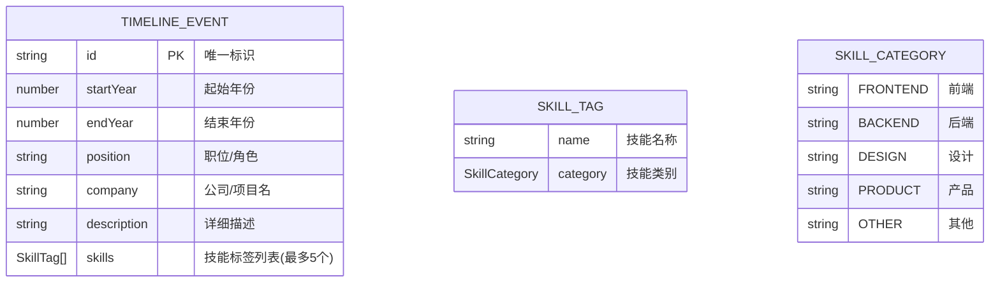

## 1. 架构设计



## 2. 技术说明

- **前端框架**：Vue@3 + TypeScript@5
- **构建工具**：Vite@5
- **状态管理**：Pinia@2
- **路由**：Vue Router@4（单页应用，预留路由扩展）
- **数据持久化**：localStorage（浏览器本地存储）
- **样式方案**：原生 CSS + CSS 变量 + Scoped 样式

## 3. 文件结构

```
auto86/
├── package.json                 # 项目依赖与脚本
├── vite.config.ts               # Vite 构建配置
├── tsconfig.json                # TypeScript 严格模式配置
├── index.html                   # HTML 入口
└── src/
    ├── main.ts                  # Vue 应用入口
    ├── App.vue                  # 根组件
    ├── types/
    │   └── index.ts             # 全局类型定义
    ├── store/
    │   └── timelineStore.ts     # Pinia 状态管理
    ├── composables/
    │   └── useTimelineData.ts   # 数据加载与处理组合函数
    └── components/
        ├── Timeline.vue         # 时间线核心组件
        ├── EventCard.vue        # 事件卡片组件
        ├── FilterToolbar.vue    # 筛选工具栏
        └── EventModal.vue       # 事件编辑模态框
```

## 4. 数据模型

### 4.1 数据模型定义



### 4.2 TypeScript 类型定义

```typescript
type SkillCategory = 'frontend' | 'backend' | 'design' | 'product' | 'other';

interface SkillTag {
  name: string;
  category: SkillCategory;
}

interface TimelineEvent {
  id: string;
  startYear: number;
  endYear: number;
  position: string;
  company: string;
  description: string;
  skills: SkillTag[];
}

interface TimelineState {
  events: TimelineEvent[];
  selectedEventId: string | null;
  zoomLevel: number;
  layout: 'horizontal' | 'vertical';
  filters: {
    categories: SkillCategory[];
    yearRange: [number, number];
  };
}
```

## 5. 数据流向

1. **初始化阶段**：`main.ts` → 初始化 Pinia → `App.vue` 调用 `useTimelineData` → 从 localStorage/mockData 加载数据 → 写入 `timelineStore`
2. **渲染阶段**：`timelineStore` → `Timeline.vue` 读取响应式 events → 遍历渲染 `EventCard.vue`
3. **用户交互**：
   - 筛选：`FilterToolbar.vue` → 更新 store filters → Timeline 计算属性重新过滤
   - 展开/收起：`EventCard.vue` → 本地状态控制动画
   - 增删改：`EventModal.vue` → `useTimelineData` → 更新 store → 持久化到 localStorage
4. **响应式更新**：store 数据变更 → 所有依赖组件自动重新渲染（500ms 内完成）
