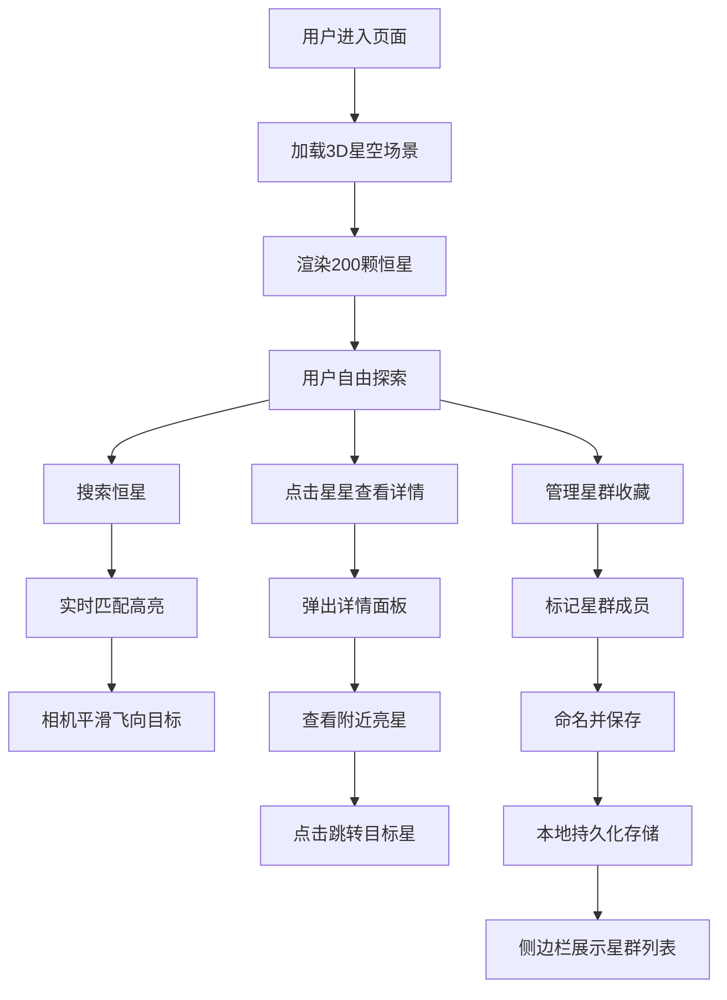

## 1. 产品概述

沉浸式星空数据漫游是一个基于Web的3D星空探索应用，用户可以在浏览器中探索由真实恒星数据驱动的3D星空场景，搜索特定恒星、查看详细参数，并记录和分享自己发现的星群组合。

- 主要用途：天文爱好者、学生和普通用户探索星空、学习恒星知识
- 目标用户：对天文感兴趣的大众用户
- 产品价值：将抽象的恒星数据转化为沉浸式3D体验，降低天文学习门槛

## 2. 核心功能

### 2.1 用户角色

| 角色 | 注册方式 | 核心权限 |
|------|----------|----------|
| 普通用户 | 无需注册，直接访问 | 浏览星空、搜索恒星、查看详情、管理本地星群收藏 |

### 2.2 功能模块

1. **3D星空场景**：全屏沉浸式星空渲染，支持视角旋转、缩放、惯性阻尼
2. **恒星搜索**：实时模糊匹配恒星名称，高亮并飞向日标星
3. **恒星详情**：点击星星展示详细参数面板，包含附近亮星列表
4. **星群管理**：标记、命名、保存星群集合，本地持久化存储
5. **分享功能**：截图分享当前星空视角

### 2.3 页面详情

| 页面名称 | 模块名称 | 功能描述 |
|----------|----------|----------|
| 首页 | 3D星空场景 | 暗夜紫到深蓝渐变背景，200颗真实数据恒星，闪烁动画，鼠标拖拽旋转、滚轮缩放、惯性阻尼 |
| 首页 | 信息控制栏 | 底部半透明栏，包含星名搜索框、视角重置按钮、截图分享按钮 |
| 首页 | 搜索功能 | 实时模糊匹配，下拉建议列表，匹配星高亮，相机平滑飞向目标 |
| 首页 | 详情面板 | 毛玻璃效果面板，展示恒星详细参数，连接线动画，附近亮星跳转 |
| 首页 | 侧边栏星群面板 | 星群卡片列表，悬停上浮动画，点击跳转星群位置，支持删除重命名 |
| 首页 | 星群标记 | 彩色虚线连接星群成员，浮动标签显示星群名 |

## 3. 核心流程

## 4. 用户界面设计

### 4.1 设计风格

- **主色调**：暗夜紫 (#1a0a2e) 到 深蓝 (#0a1628) 渐变背景
- **强调色**：星光白 (#ffffff)、星群彩色标签（青蓝、橙红、暖黄等）
- **毛玻璃效果**：backdrop-filter: blur(12px)，半透明背景
- **字体**：现代无衬线字体，标题使用更具科技感的字体
- **动画**：缓入缓出 (ease-in-out)，平滑过渡，微妙的星光闪烁

### 4.2 页面设计概览

| 页面名称 | 模块名称 | UI元素 |
|----------|----------|--------|
| 首页 | 3D星空 | 渐变背景、闪烁恒星、彩色星点、相机控制 |
| 首页 | 底部控制栏 | 半透明毛玻璃、搜索框、功能按钮 |
| 首页 | 搜索下拉 | 模糊匹配列表、高亮关键词、悬停效果 |
| 首页 | 详情面板 | 毛玻璃卡片、连接线、参数列表、附近亮星 |
| 首页 | 侧边栏 | 星群卡片、悬停上浮、操作按钮 |
| 首页 | 星群标签 | 浮动文字、虚线连接、彩色标识 |

### 4.3 响应式

- 桌面端优先设计，支持全屏幕沉浸式体验
- 移动端适配触摸操作（捏合缩放、滑动旋转）
- 控制栏在小屏幕上调整布局

### 4.4 3D场景指引

- **环境背景**：暗夜紫到深蓝径向渐变，模拟深空效果
- **光照**：自发光恒星材质，无需额外光源，星星本身发光
- **相机设置**：PerspectiveCamera，初始距离较远，可缩放范围大
- **相机动画**：平滑插值 (lerp) 飞向目标，缓入缓出效果
- **交互**：OrbitControls 带惯性阻尼，拖拽旋转、滚轮缩放
- **后处理**：Bloom 发光效果，增强星光质感
- **性能**：200颗星星使用 Points 或 InstancedMesh 优化
