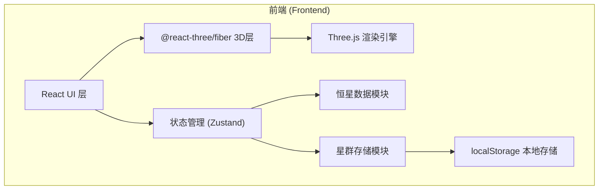
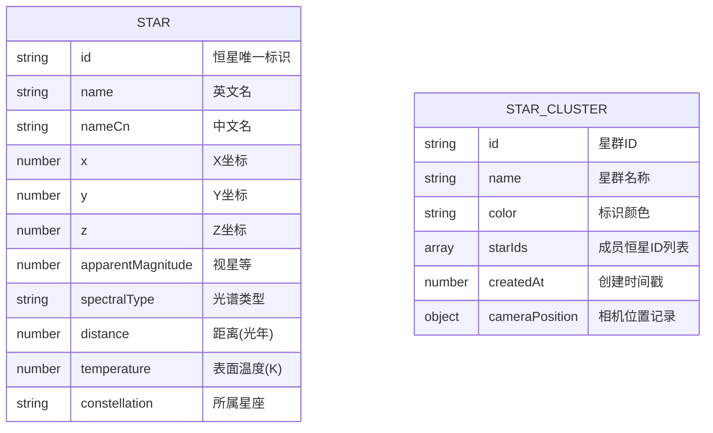

## 1. 架构设计



## 2. 技术描述

- **前端框架**：React 18 + TypeScript
- **构建工具**：Vite 5
- **3D渲染**：Three.js + @react-three/fiber + @react-three/drei
- **状态管理**：Zustand
- **样式方案**：CSS Modules + 全局CSS变量
- **数据持久化**：localStorage
- **HTTP请求**：axios（预留扩展）

## 3. 路由定义

| 路由 | 用途 |
|------|------|
| / | 首页 - 3D星空探索主界面 |

## 4. 数据模型

### 4.1 数据模型定义



### 4.2 类型定义

```typescript
// 恒星数据
interface StarData {
  id: string;
  name: string;
  nameCn: string;
  x: number;
  y: number;
  z: number;
  apparentMagnitude: number;
  spectralType: string;
  distance: number;
  temperature: number;
  constellation: string;
}

// 星群集合
interface StarCluster {
  id: string;
  name: string;
  color: string;
  starIds: string[];
  createdAt: number;
  cameraPosition: { x: number; y: number; z: number };
}
```

## 5. 项目文件结构

```
src/
├── components/
│   ├── StarScene.tsx      # Three.js 3D星空场景主组件
│   ├── InfoPanel.tsx      # 恒星详情毛玻璃面板
│   ├── SearchBar.tsx      # 搜索框组件
│   └── StarClusterPanel.tsx # 星群管理侧边栏
├── utils/
│   ├── stardata.ts        # 恒星数据生成与查询
│   └── clusterStore.ts    # 星群本地存储管理
├── styles/
│   └── global.css         # 全局样式
├── types.ts               # TypeScript 类型定义
├── App.tsx                # 顶层应用组件
└── main.tsx               # React 入口
```

## 6. 核心技术点

### 6.1 3D渲染优化
- 使用 `THREE.Points` 或 `InstancedMesh` 批量渲染恒星
- 视星等映射到点大小和透明度
- 光谱类型映射到恒星颜色

### 6.2 相机动画
- 使用 `useFrame` hook 实现相机平滑插值
- 缓入缓出动画曲线 (easeInOutCubic)
- 搜索/点击后自动飞向目标星

### 6.3 恒星数据
- 模拟200颗真实恒星数据
- 基于光谱类型计算颜色和温度
- 提供模糊搜索和邻近查询算法

### 6.4 星群管理
- localStorage 持久化存储
- Zustand 状态管理
- 彩色虚线连接星群成员
