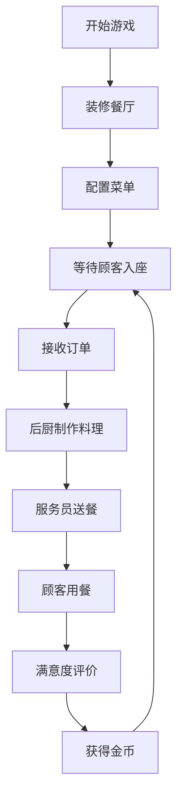

## 1. 产品概述
地下城主题餐厅模拟经营游戏，让玩家在缺乏游戏内资源的情况下，直观体验餐厅从装修、菜单配置到顾客服务的全流程运营。
- 核心价值：提供沉浸式的餐厅经营模拟体验，融合装修DIY、策略菜单配置与实时顾客服务三大玩法
- 目标用户：模拟经营游戏爱好者、休闲游戏玩家

## 2. 核心功能

### 2.1 功能模块
1. **主游戏场景**：俯视视角网格地图、家具拖拽放置、视角旋转、主题风格切换
2. **菜单配置系统**：食材组合料理、卡片编辑面板、后厨制作进度
3. **顾客与服务员AI系统**：顾客生成入座、等待计时、满意度反馈、A*寻路送餐

### 2.2 页面详情
| 页面名称 | 模块名称 | 功能描述 |
|---------|---------|---------|
| 主游戏场景 | 资源栏 | 显示金币、食材库存、顾客满意度，数值变化有滚动动画 |
| 主游戏场景 | 网格地图 | 拖拽放置家具、吸附网格、半透明虚影预览 |
| 主游戏场景 | 工具栏 | 选择/拖拽切换、主题切换按钮、菜单编辑入口 |
| 主游戏场景 | 视角控制 | 45度/90度视角切换，平滑旋转动画 |
| 菜单编辑器 | 料理卡片列表 | 展示已有料理，悬停缩放效果 |
| 菜单编辑器 | 编辑面板 | 选择食材配置料理，卡片背景光晕动画 |
| 后厨区域 | 制作进度 | 进度条动画显示料理制作状态 |
| 游戏场景 | 服务员AI | A*寻路送餐，头顶名称与轨迹淡影 |
| 游戏场景 | 顾客AI | 随机生成外形，等待时间条，满意度表情动画，怒气特效 |

## 3. 核心流程
玩家启动游戏 → 选择主题风格装修餐厅（拖拽家具到网格）→ 配置菜单（食材组合成料理）→ 顾客自动入座 → 后厨制作料理（进度条）→ 服务员A*寻路送餐 → 顾客满意度反馈 → 获取金币收入。

## 4. 用户界面设计

### 4.1 设计风格
- **主色调**：深色哥特风格，暗紫(#2D1B4E)、深灰(#1A1A2E)与金色(#D4AF37)点缀
- **按钮风格**：毛玻璃半透明效果，圆角设计，悬停缩放动效
- **字体**：Cinzel（标题/装饰性字体）+ Open Sans（正文字体），营造中世纪魔幻氛围
- **布局风格**：顶部资源栏 + 中央3D游戏画布 + 底部工具栏的三层结构
- **视觉特效**：金色光晕、渐变过渡、浮动文字、粒子特效

### 4.2 页面设计概览
| 页面名称 | 模块名称 | UI元素 |
|---------|---------|--------|
| 主界面 | 资源栏 | 毛玻璃面板、数字滚动动画、图标+数值布局 |
| 主界面 | 工具栏 | 图标按钮、悬停缩放、主题选择下拉 |
| 主界面 | 3D画布 | 全屏渲染、家具半透明虚影、网格吸附线 |
| 菜单编辑器 | 料理卡片 | 毛玻璃卡片、光晕动画、食材图标 |
| 游戏内 | 顾客表情 | 淡入淡出切换、时间条渐变、红色怒气特效 |
| 游戏内 | 服务员 | 头顶名称气泡、轨迹淡影、平滑移动动画 |

### 4.3 响应式设计
- 桌面端优先设计，Canvas全屏自适应
- 工具栏在小屏幕上转为侧边折叠菜单
- 资源栏固定顶部，宽度自适应

### 4.4 3D场景指导
- **环境氛围**：哥特暗黑风格为主，支持精灵森林、机械蒸汽主题切换
- **光照设置**：环境光 + 方向光 + 点光源（餐桌局部照明），营造温暖与神秘感
- **摄像机**：俯视正交视角，支持45°/90°旋转切换，带平滑动画
- **构图焦点**：中央餐厅区域为视觉中心，后厨位于场景后方
- **后处理**：Bloom发光效果增强金色点缀，轻微暗角营造沉浸感
- **性能预算**：目标60FPS，静态家具使用InstancedMesh优化
