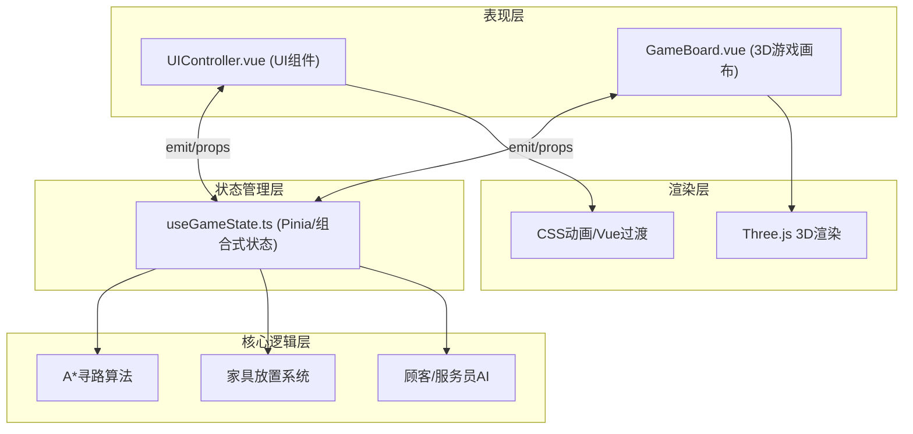

## 1. 架构设计



## 2. 技术栈说明
- **前端框架**: Vue@3.4 + TypeScript@5
- **构建工具**: Vite@5
- **状态管理**: Pinia@2 (配合组合式API封装)
- **路由**: Vue Router@4
- **3D渲染**: Three.js@0.160
- **UI样式**: Tailwind CSS@3 + CSS Variables (主题色系统)
- **初始化工具**: vite-init

## 3. 路由定义
| 路由 | 用途 |
|------|------|
| / | 主游戏界面（包含3D画布+UI叠加层）|

## 4. 数据模型

### 4.1 类型定义

```typescript
// 主题风格
type ThemeType = 'gothic' | 'forest' | 'steampunk'

// 家具类型
type FurnitureType = 'floor' | 'wall' | 'table' | 'bar' | 'decoration'

interface Furniture {
  id: string
  type: FurnitureType
  name: string
  gridX: number
  gridY: number
  rotation: number
  theme: ThemeType
}

// 食材与料理
interface Ingredient {
  id: string
  name: string
  emoji: string
  stock: number
}

interface Dish {
  id: string
  name: string
  ingredients: string[]
  cookTime: number
  price: number
}

// 顾客与订单
interface Customer {
  id: string
  name: string
  appearance: { color: string; hat: string }
  tableId: string | null
  waitTime: number
  maxWaitTime: number
  satisfaction: number
  orderedDishId: string | null
  status: 'waiting' | 'eating' | 'angry' | 'left'
}

// 服务员
interface Waiter {
  id: string
  name: string
  position: { x: number; y: number }
  targetPosition: { x: number; y: number }
  path: { x: number; y: number }[]
  carryingOrderId: string | null
}

// 后厨订单
interface KitchenOrder {
  id: string
  dishId: string
  tableId: string
  progress: number
  status: 'queued' | 'cooking' | 'ready' | 'served'
}
```

### 4.2 数据流向
1. **用户输入 → GameBoard.vue**：鼠标拖拽事件 → 更新家具预览位置
2. **放置确认 → useGameState.ts**：commit家具到网格状态 → 触发Three.js场景更新
3. **菜单编辑 → UIController.vue**：表单提交 → 更新dishes数组
4. **游戏循环 → useGameState.ts**：定时器更新顾客等待时间、后厨进度、服务员移动
5. **状态变更 → 视图响应**：Pinia响应式更新 → Vue UI重渲染 + Three.js场景更新

## 5. 核心模块划分

| 模块 | 文件 | 职责 |
|------|------|------|
| 游戏状态管理 | src/composables/useGameState.ts | 金币、食材、顾客、订单、家具等全局状态 |
| 3D场景 | src/components/GameBoard.vue | Three.js初始化、网格渲染、家具渲染、角色动画 |
| UI控制 | src/components/UIController.vue | 资源栏、工具栏、菜单编辑器、弹层 |
| 寻路算法 | src/utils/astar.ts | A*网格寻路算法实现 |
| 主题系统 | src/utils/themes.ts | 三种主题的颜色、材质配置 |
| 随机生成 | src/utils/random.ts | 顾客名称、外形随机生成器 |
