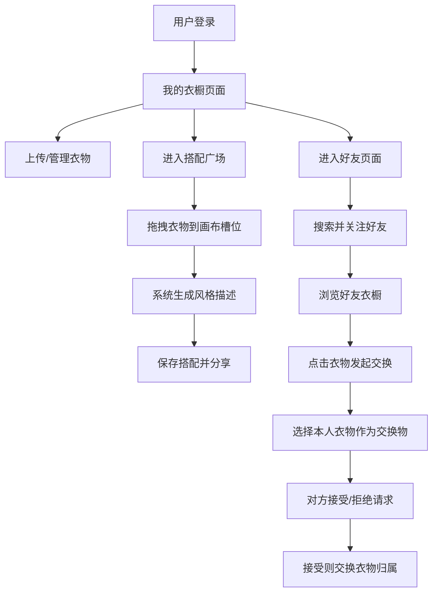

## 1. 产品概述

衣橱共享与社交穿搭平台，面向时尚爱好者和环保理念践行者，解决衣物闲置、穿搭灵感匮乏以及熟人之间衣物交换需求。通过虚拟衣橱管理、智能搭配推荐和社交分享功能，打造温暖慵懒的线上穿搭社区。

- 核心目的：让闲置衣物流动起来，让穿搭灵感不再稀缺
- 目标用户：关注可持续时尚、喜欢分享穿搭的年轻用户群体
- 市场价值：连接闲置衣物与需求用户，降低穿搭成本，倡导环保理念

## 2. 核心功能

### 2.1 用户角色

| 角色 | 注册方式 | 核心权限 |
|------|----------|----------|
| 普通用户 | 用户名+密码注册 | 管理个人衣橱、创建搭配、搜索好友、发起/响应交换请求 |

### 2.2 功能模块

1. **我的衣橱页面**：衣物网格展示、分类区域（上衣/下装/鞋子/配饰）、上传衣物表单、拖拽排序
2. **搭配广场页面**：搭配画布（四个槽位）、拖拽衣物搭配、自动风格描述生成、横向滚动搭配卡片
3. **好友页面**：实时模糊搜索、好友关注、好友主页仪表盘、衣橱/搭配/交换请求选项卡
4. **交换请求页面**：发起交换请求、交换物选择、请求通知、接受/拒绝、交换历史记录

### 2.3 页面详情

| 页面名称 | 模块名称 | 功能描述 |
|-----------|-------------|---------------------|
| 我的衣橱 | 衣物网格 | 按类别分区展示所有衣物，浅色分割线隔开，支持拖拽排序 |
| 我的衣橱 | 上传表单 | 弹窗表单，图片裁剪预览压缩，名称、类别、标签输入 |
| 我的衣橱 | 衣物卡片 | 圆形缩略图+旋转淡入动画，风格渐变色标签，季节图标标签，悬停上浮阴影 |
| 搭配广场 | 搭配画布 | 四个槽位（上装/下装/鞋子/配饰），拖拽衣物放置，弹跳对齐动画 |
| 搭配广场 | 风格生成 | 根据衣物标签自动生成风格描述文本，支持手动编辑 |
| 搭配广场 | 搭配卡片 | 横向滚动展示，预览图+风格标签，点击查看大图详情 |
| 好友页面 | 搜索模块 | 实时模糊匹配搜索框，卡片列表展示搜索结果 |
| 好友页面 | 好友主页 | 顶部数据仪表盘（类别统计、风格词云），三个选项卡水平滑动切换 |
| 交换请求 | 请求对话框 | 从本人衣橱选择交换物，缩略图列表、选中高亮打勾 |
| 交换请求 | 请求管理 | 接收通知、接受/拒绝操作、交换历史记录 |

## 3. 核心流程

用户登录后进入我的衣橱页面，可上传和管理衣物。在搭配广场从衣橱拖拽衣物到画布槽位创建搭配，系统自动生成风格描述。用户可搜索并关注好友，查看好友衣橱和搭配。在好友衣橱中点击衣物发起交换请求，选择自己的衣物作为交换物，对方接受后系统自动完成衣物归属交换。

## 4. 用户界面设计

### 4.1 设计风格

- **主色调**：摩卡棕（#8B6F47）和米白色（#FAF6F0），营造温暖慵懒的衣橱氛围
- **按钮风格**：圆角按钮，摩卡棕底色，悬停加深，点击时水波纹扩散效果
- **字体**：标题使用优雅衬线字体（如 Noto Serif SC），正文使用圆润无衬线字体（如 Noto Sans SC）
- **布局风格**：左侧220px导航栏 + 右侧主内容区的两栏结构，卡片式设计，统一圆角12px
- **图标风格**：使用 Lucide 线性图标，风格统一简洁
- **动效**：页面淡入、卡片从底部滑入、悬停上浮阴影、水平滑动切换、弹跳放置动画

### 4.2 页面设计概览

| 页面名称 | 模块名称 | UI元素 |
|-----------|-------------|-------------|
| 我的衣橱 | 衣物网格 | 米白背景、摩卡棕分割线、卡片白底12px圆角、圆形缩略图旋转淡入 |
| 我的衣橱 | 上传表单 | 半透明遮罩弹窗、图片裁剪预览区、标签渐变色选择器 |
| 搭配广场 | 搭配画布 | 四个虚线框槽位、拖拽半透明虚影、放置弹跳动画 |
| 搭配广场 | 搭配卡片 | 横向滚动容器、卡片阴影悬停上浮、风格标签渐变色 |
| 好友页面 | 搜索结果 | 实时匹配高亮、卡片列表、关注按钮 |
| 好友页面 | 好友主页 | 顶部仪表盘统计图表、选项卡水平滑动切换动画 |
| 交换请求 | 选择列表 | 缩略图网格、选中高亮边框、打勾标记 |

### 4.3 响应式设计

- **桌面端优先**：两栏布局，导航栏固定220px宽度
- **移动端适配**（<768px）：导航栏收缩为顶部汉堡菜单，卡片单列布局宽度自适应
- **触控优化**：按钮和点击区域最小44px，支持触摸滑动操作

## 5. 性能约束

- 衣橱页面首次加载显示骨架屏（占位卡片脉冲动画）
- 图片使用懒加载，加载失败显示占位图和提示文字
- 页面渲染帧率不低于55fps
- 每次API请求响应时间不超过500ms
