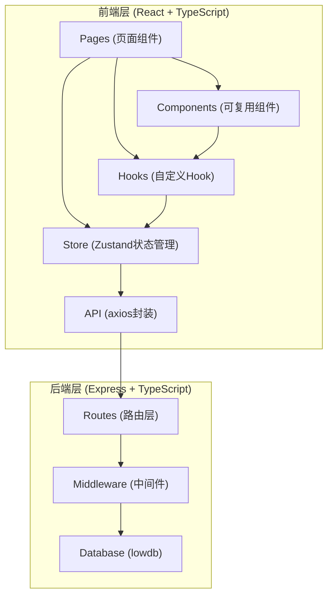
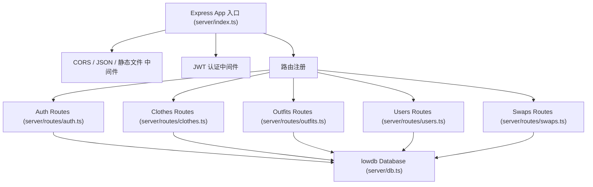
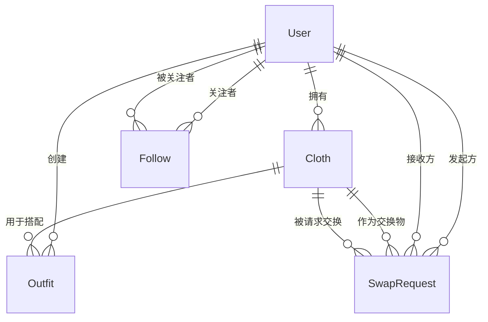

## 1. 架构设计



## 2. 技术说明

- **前端**：React@18 + TypeScript + Vite + TailwindCSS@3 + Zustand + Axios + React Router DOM@6
- **后端**：Express@4 + TypeScript + lowdb + multer + sharp + bcryptjs + jsonwebtoken + uuid + cors
- **构建工具**：Vite（前端开发构建）+ ts-node / tsx（后端开发运行）
- **数据库**：lowdb（JSON文件数据库，轻量级本地持久化）
- **图片处理**：multer（上传）+ sharp（裁剪压缩）
- **图标库**：lucide-react

## 3. 路由定义

### 前端路由

| 路由 | 页面组件 | 用途 |
|-------|---------|------|
| `/` | ClosetPage | 我的衣橱首页 |
| `/closet` | ClosetPage | 我的衣橱页面 |
| `/outfits` | OutfitsPage | 搭配广场页面 |
| `/friends` | FriendsPage | 好友搜索与列表页面 |
| `/friends/:id` | FriendProfilePage | 好友主页 |
| `/swaps` | SwapsPage | 交换请求管理页面 |
| `/login` | LoginPage | 登录页面 |
| `/register` | RegisterPage | 注册页面 |

### 后端API路由

| 路由方法 | 路径 | 用途 |
|---------|------|------|
| POST | `/api/auth/register` | 用户注册 |
| POST | `/api/auth/login` | 用户登录 |
| GET | `/api/clothes` | 获取当前用户衣物列表 |
| POST | `/api/clothes` | 上传新衣物（含图片） |
| PUT | `/api/clothes/:id` | 更新衣物信息 |
| DELETE | `/api/clothes/:id` | 删除衣物 |
| PATCH | `/api/clothes/reorder` | 衣物拖拽排序 |
| GET | `/api/outfits` | 获取搭配列表 |
| POST | `/api/outfits` | 创建新搭配 |
| GET | `/api/outfits/:id` | 获取搭配详情 |
| DELETE | `/api/outfits/:id` | 删除搭配 |
| GET | `/api/users/search` | 搜索用户 |
| GET | `/api/users/:id` | 获取用户详情 |
| POST | `/api/users/:id/follow` | 关注用户 |
| DELETE | `/api/users/:id/follow` | 取消关注 |
| GET | `/api/users/:id/clothes` | 获取用户公开衣橱 |
| GET | `/api/users/:id/outfits` | 获取用户公开搭配 |
| GET | `/api/swaps` | 获取交换请求列表 |
| POST | `/api/swaps` | 发起交换请求 |
| PATCH | `/api/swaps/:id/accept` | 接受交换请求 |
| PATCH | `/api/swaps/:id/reject` | 拒绝交换请求 |

## 4. API类型定义

```typescript
// 用户
interface User {
  id: string;
  username: string;
  password: string;
  avatar?: string;
  bio?: string;
  createdAt: string;
}

interface PublicUser {
  id: string;
  username: string;
  avatar?: string;
  bio?: string;
  createdAt: string;
}

// 衣物
type ClothCategory = 'top' | 'bottom' | 'shoes' | 'accessory';
type ClothStyle = '通勤' | '休闲' | '约会' | '运动' | '正式' | '复古' | '街头';
type ClothSeason = '春' | '夏' | '秋' | '冬' | '四季';

interface Cloth {
  id: string;
  userId: string;
  name: string;
  category: ClothCategory;
  imageUrl: string;
  styles: ClothStyle[];
  seasons: ClothSeason[];
  order: number;
  createdAt: string;
}

// 搭配
interface Outfit {
  id: string;
  userId: string;
  name: string;
  description: string;
  topId?: string;
  bottomId?: string;
  shoesId?: string;
  accessoryId?: string;
  styleTags: string[];
  createdAt: string;
}

// 交换请求
type SwapStatus = 'pending' | 'accepted' | 'rejected';

interface SwapRequest {
  id: string;
  fromUserId: string;
  toUserId: string;
  offeredClothId: string;
  requestedClothId: string;
  status: SwapStatus;
  createdAt: string;
  updatedAt: string;
}

// 关注关系
interface Follow {
  followerId: string;
  followingId: string;
  createdAt: string;
}
```

## 5. 服务端架构图



## 6. 数据模型

### 6.1 ER图



### 6.2 lowdb 数据结构

```json
{
  "users": [
    {
      "id": "uuid",
      "username": "string",
      "password": "bcrypt-hash",
      "avatar": "string",
      "bio": "string",
      "createdAt": "ISO-8601"
    }
  ],
  "clothes": [
    {
      "id": "uuid",
      "userId": "uuid",
      "name": "string",
      "category": "top|bottom|shoes|accessory",
      "imageUrl": "string",
      "styles": ["通勤", "休闲"],
      "seasons": ["春", "秋"],
      "order": 0,
      "createdAt": "ISO-8601"
    }
  ],
  "outfits": [
    {
      "id": "uuid",
      "userId": "uuid",
      "name": "string",
      "description": "string",
      "topId": "uuid",
      "bottomId": "uuid",
      "shoesId": "uuid",
      "accessoryId": "uuid",
      "styleTags": ["简约", "通勤"],
      "createdAt": "ISO-8601"
    }
  ],
  "follows": [
    {
      "followerId": "uuid",
      "followingId": "uuid",
      "createdAt": "ISO-8601"
    }
  ],
  "swapRequests": [
    {
      "id": "uuid",
      "fromUserId": "uuid",
      "toUserId": "uuid",
      "offeredClothId": "uuid",
      "requestedClothId": "uuid",
      "status": "pending|accepted|rejected",
      "createdAt": "ISO-8601",
      "updatedAt": "ISO-8601"
    }
  ]
}
```

## 7. 项目文件结构与调用关系

```
auto89/
├── package.json              # 前后端统一依赖与脚本
├── vite.config.ts            # Vite配置 + API代理
├── tsconfig.json             # TypeScript严格模式配置
├── index.html                # 前端入口HTML
├── src/                      # 前端代码
│   ├── main.tsx              # React入口，渲染App并挂载Provider
│   ├── App.tsx               # 路由配置组件
│   ├── api/
│   │   └── index.ts          # axios实例封装（请求/响应拦截）
│   ├── components/
│   │   ├── ClothCard.tsx     # 衣物卡片（接收clothes对象和onSwap回调）
│   │   ├── OutfitCard.tsx    # 搭配卡片组件
│   │   ├── FriendCard.tsx    # 好友卡片组件
│   │   ├── Navbar.tsx        # 导航栏组件
│   │   ├── Modal.tsx         # 通用弹窗组件
│   │   └── Skeleton.tsx      # 骨架屏组件
│   ├── pages/
│   │   ├── ClosetPage.tsx    # 我的衣橱（useEffect从/api/clothes获取数据）
│   │   ├── OutfitsPage.tsx   # 搭配广场（调用/api/outfits接口）
│   │   ├── FriendsPage.tsx   # 好友列表与搜索
│   │   ├── FriendProfilePage.tsx # 好友主页
│   │   ├── SwapsPage.tsx     # 交换请求管理
│   │   ├── LoginPage.tsx     # 登录页面
│   │   └── RegisterPage.tsx  # 注册页面
│   ├── store/
│   │   └── useStore.ts       # Zustand全局状态管理
│   ├── hooks/
│   │   ├── useDragDrop.ts    # 拖拽Hook
│   │   └── useImageUpload.ts # 图片上传Hook
│   ├── types/
│   │   └── index.ts          # TypeScript类型定义
│   └── utils/
│       └── styleGenerator.ts # 风格描述生成算法
├── server/                   # 后端代码
│   ├── index.ts              # Express入口，连接lowdb，注册路由
│   ├── db.ts                 # lowdb实例与初始化
│   ├── middleware/
│   │   └── auth.ts           # JWT认证中间件
│   ├── routes/
│   │   ├── auth.ts           # 认证路由
│   │   ├── clothes.ts        # 衣物CRUD路由（操作clothes集合）
│   │   ├── outfits.ts        # 搭配路由（操作outfits集合，自动计算推荐风格）
│   │   ├── users.ts          # 用户相关路由
│   │   └── swaps.ts          # 交换请求路由
│   └── uploads/              # 上传图片存储目录
└── .trae/
    └── documents/
        ├── PRD.md
        └── TECH_ARCHITECTURE.md
```

### 数据流方向

1. **用户操作** → React组件 → Zustand Store → API封装层（axios拦截）→ Express路由 → lowdb
2. **数据返回** → lowdb → Express路由响应 → axios响应拦截 → Zustand Store → React组件渲染
3. **衣物CRUD数据流**：ClosetPage → useEffect → GET /api/clothes → clothes路由 → lowdb
4. **搭配创建数据流**：OutfitsPage → 拖拽衣物到画布 → POST /api/outfits → outfits路由（调用风格生成算法）→ lowdb
5. **交换请求数据流**：FriendProfilePage → 点击衣物 → 选择交换物 → POST /api/swaps → swaps路由 → lowdb
